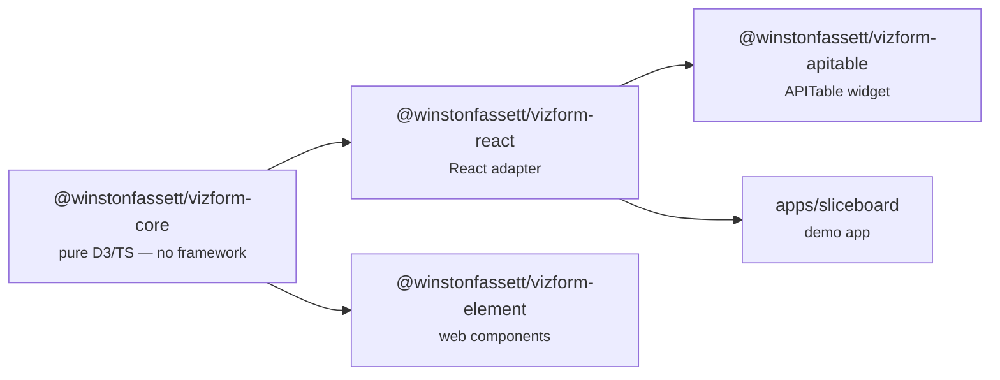

# vizform

D3-based proportional and hierarchical visualization library — framework-agnostic core with React and web-component adapters, plus an [APITable](https://aitable.ai) widget integration.

**Live demo:** [sliceboard.netlify.app](https://sliceboard.netlify.app)

## Packages



| Package | Description |
|---|---|
| [`vizform-core`](packages/vizform-core) | Visualization engine. Pure D3 + TypeScript, zero framework deps. |
| [`vizform-react`](packages/vizform-react) | React adapter. Exports `<Viz>` (flat) and `<HViz>` (hierarchical). |
| [`vizform-element`](packages/vizform-element) | Vanilla custom elements — `<vizform-viz>` and `<vizform-hviz>`. |
| [`vizform-apitable`](packages/vizform-apitable) | APITable widget wrapping `vizform-react`. |
| [`apps/sliceboard`](apps/sliceboard) | Multi-board demo: editable table + live viz with 6 modes. |

## Visualization modes

**Flat** (single-level data): `treemap` · `radial` · `bands`

| treemap | radial | bands |
|---|---|---|
|  |  |  |

**Hierarchical** (nested data): `h-treemap` · `h-icicle` · `h-radial`

| h-treemap | h-icicle | h-radial |
|---|---|---|
|  |  |  |

## Quick start

```sh
npm install @winstonfassett/vizform-react @winstonfassett/vizform-core
```

```tsx
import { Viz } from '@winstonfassett/vizform-react'

const goals = [
  { id: 'a', name: 'Alpha', color: '#e06c75', measurements: { value: 40 }, archived: false, tags: [], urgent: false, important: false, createdAt: '', updatedAt: '' },
  { id: 'b', name: 'Beta',  color: '#61afef', measurements: { value: 60 }, archived: false, tags: [], urgent: false, important: false, createdAt: '', updatedAt: '' },
]

<Viz goals={goals} mode="treemap" activeUnit="value" unitKind="size" />
```

For hierarchical data, use `<HViz>` with a `GoalTree` — see [`vizform-react`](packages/vizform-react/README.md).

## Monorepo layout

```
packages/
  vizform-core/       # D3 rendering engine
  vizform-react/      # React components
  vizform-element/    # Custom elements
  vizform-apitable/   # APITable widget
apps/
  sliceboard/         # Demo app (Netlify)
inspo/                # gitignored — reference/scratch material
```

## Development

```sh
npm install
npm run build        # builds core → react → sliceboard in order
```

To develop a specific package:

```sh
npm run dev -w packages/vizform-core    # watch mode
npm run dev -w apps/sliceboard          # Vite dev server
```

## License

MIT
