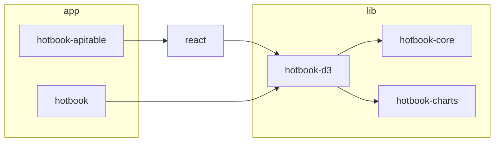

# hotbook

D3-based proportional and hierarchical visualization library — framework-agnostic core with React and web-component adapters, plus an [APITable](https://aitable.ai) widget integration.

**Live demo:** [hotbook-build.netlify.app](https://hotbook-build.netlify.app)

## Packages



| Package | Description |
|---|---|
| [`hotbook-core`](packages/hotbook-core) | Core data structures and utilities. Framework-agnostic. |
| [`hotbook-charts`](packages/hotbook-charts) | Chart type definitions and metadata. |
| [`hotbook-d3`](packages/hotbook-d3) | Pure D3 + TypeScript visualization engine, zero framework deps. |
| [`hotbook-apitable`](packages/hotbook-apitable) | APITable widget wrapping `hotbook-react-d3`. |
| [`apps/hotbook`](apps/hotbook) | Multi-board demo: editable table + live viz with multiple chart types. |

## Visualization modes

**Flat** (single-level data): `treemap` · `radial` · `bands`

| treemap | radial | bands |
|---|---|---|
|  |  |  |

**Hierarchical** (nested data): `h-treemap` · `h-icicle` · `h-radial`

| h-treemap | h-icicle | h-radial |
|---|---|---|
|  |  |  |

## Quick start

```sh
npm install @hotbook/react @hotbook/core
```

```tsx
import { Viz } from '@hotbook/react'

const goals = [
  { id: 'a', name: 'Alpha', color: '#e06c75', measurements: { value: 40 }, archived: false, tags: [], urgent: false, important: false, createdAt: '', updatedAt: '' },
  { id: 'b', name: 'Beta',  color: '#61afef', measurements: { value: 60 }, archived: false, tags: [], urgent: false, important: false, createdAt: '', updatedAt: '' },
]

<Viz goals={goals} mode="treemap" activeUnit="value" unitKind="size" />
```

## Monorepo layout

```
packages/
  hotbook-core/       # Core data structures
  hotbook-charts/     # Chart definitions
  hotbook-d3/ # D3 rendering engine
  hotbook-apitable/   # APITable widget
apps/
  hotbook/         # Demo app (Netlify)
  docs/               # Documentation site
inspo/                # gitignored — reference/scratch material
```

## Development

```sh
npm install
npm run build        # builds core → react → hotbook in order
```

To develop a specific package:

```sh
npm run dev -w packages/hotbook-d3  # watch mode
npm run dev -w apps/hotbook              # Vite dev server
npm run dev -w apps/docs                    # Docs site dev server
```

### Chart demos

The hotbook app hosts a `/demos` surface (hash route: `#/demos`) that renders
each chart in isolation against a small checked-in fixture — no tile plumbing,
no persistence, no config UI. Use it as the canonical testing surface when
developing or debugging a single chart.

```sh
npm run dev -w apps/hotbook
# then visit /#/demos
```

Fixtures live in [`apps/hotbook/src/demos/fixtures/`](apps/hotbook/src/demos/fixtures).

## License

MIT
