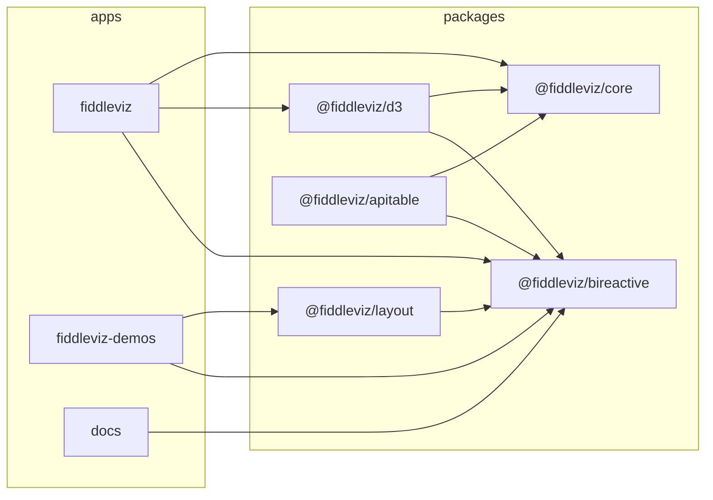

# fiddleviz

Experimental proportional and hierarchical visualization kit. It leans on [bireactive](https://github.com/WinstonFassett/bireactive) for fine-grained reactivity, uses a small set of D3 modules for layout and scales, and takes heavy inspiration from [LayerCharts](https://github.com/techniq/layercharts). React has been stripped out of the core packages; the surfaces are framework-agnostic custom elements.

This is an experiment. The APIs, package names, and overall direction will change.

**Live demo:** [fiddleviz-build.netlify.app](https://fiddleviz-build.netlify.app)

## Packages



| Package | Description |
|---|---|
| [`@fiddleviz/core`](packages/core) | Shared types, data model, state machine, and edit primitives. |
| [`@fiddleviz/bireactive`](packages/bireactive) | Fine-grained reactive surfaces for charts, graphs, and tables. |
| [`@fiddleviz/d3`](packages/d3) | D3-backed rendering surfaces and tile binders. |
| [`@fiddleviz/layout`](packages/layout) | Bireactive 2D graph layout primitives (state machines, flow diagrams, etc.). |
| [`@fiddleviz/apitable`](packages/apitable) | APITable widget adapter. Currently stale and not actively maintained. |

### Dependency contract

`bireactive` is a required peer dependency of `@fiddleviz/bireactive` (`^0.3.4`).
Consuming apps must install `bireactive` themselves; `@fiddleviz/bireactive` does not bundle it.
This prevents duplicate custom element registrations and broken reactive cell identity.

## Monorepo layout

```
packages/
  core/         # Shared types and data model
  bireactive/   # Reactive chart/table/graph surfaces
  d3/           # D3 rendering engine
  layout/       # Bireactive 2D layout
  apitable/     # APITable widget (stale)
apps/
  fiddleviz/      # Main demo app (Netlify)
  demos/        # Consolidated single-page chart demos
  docs/         # Documentation site (Astro)
```

## Development

```sh
npm install
npm run build        # builds the full docs site with demos + fiddleviz app
```

To develop a specific app:

```sh
npm run dev                  # fiddleviz app + demos
npm run dev:fiddleviz          # fiddleviz app
npm run dev:demos            # consolidated demos page
npm run dev:docs             # Astro docs site
```

To build a single package:

```sh
npm run build -w packages/bireactive
npm run build -w packages/d3
```

### Demos

`npm run dev:demos` serves the chart demos at `/demos/`.

## License

MIT
