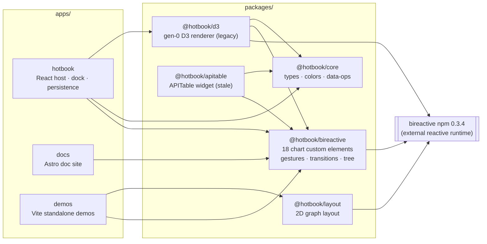
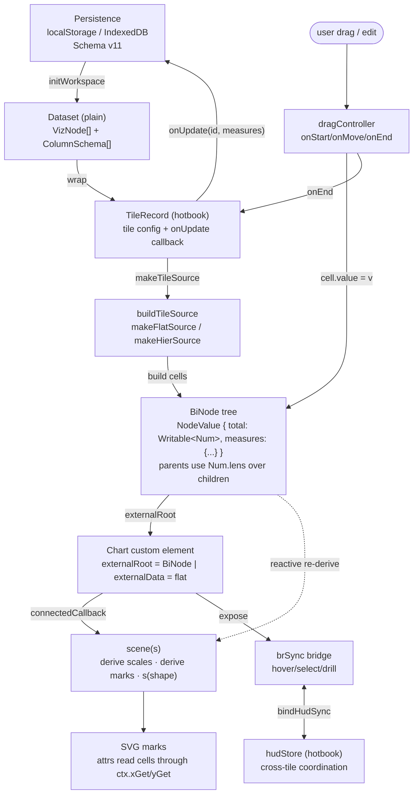
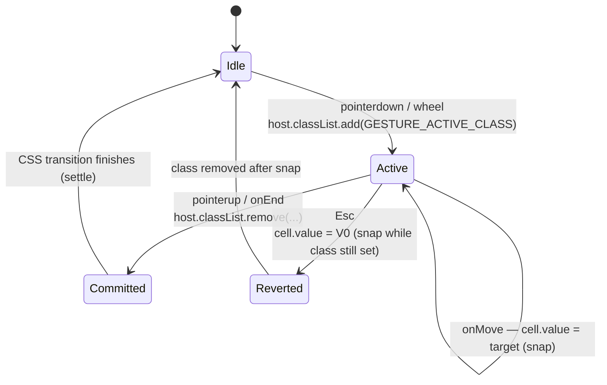
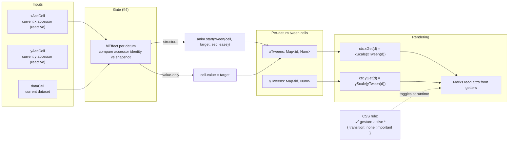
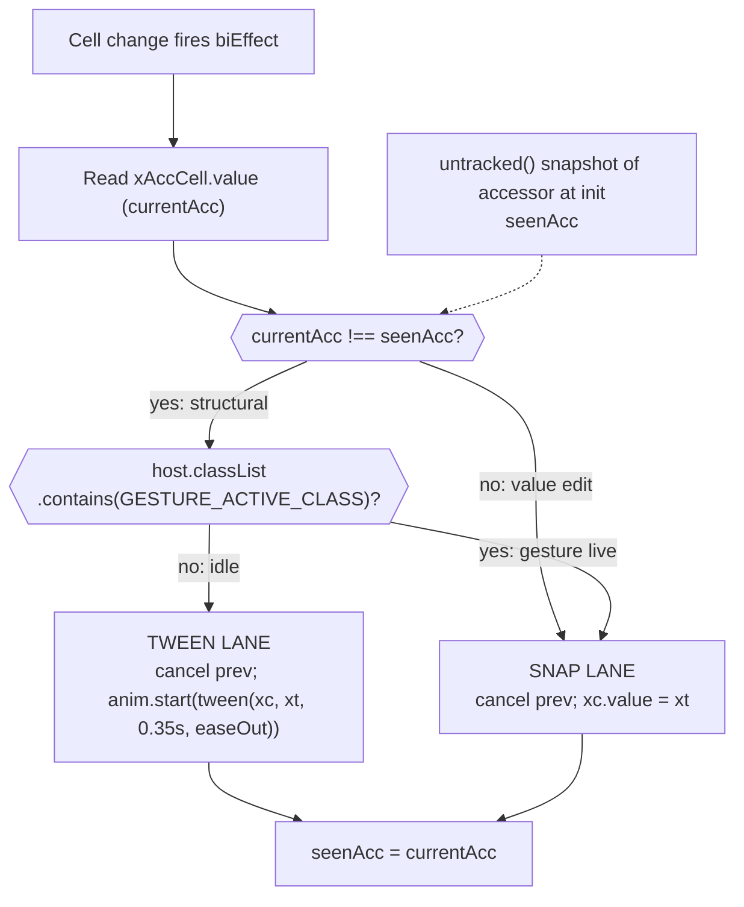
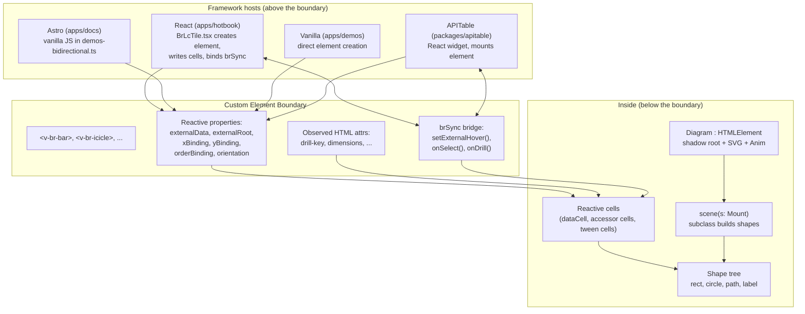
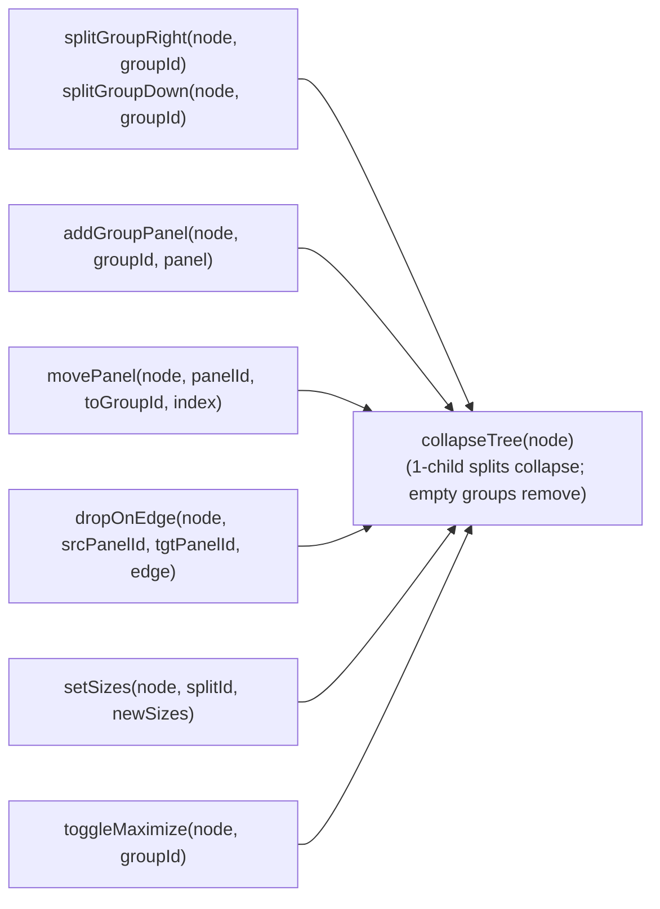
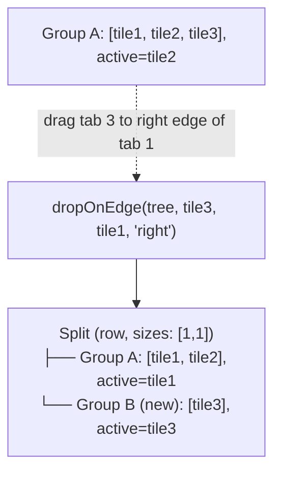

# Vizform Architecture

> **Status:** Reference doc. Grounds every other architecture conversation.
> **Audience:** Anyone touching packages, apps, or wiring.
> **Companion reading:** `wiki/rebuild-tech-design.md` (design), `wiki/retro-2026-07.md` (current gaps), `wiki/viewer-architecture.md` (planned), `wiki/dockview-spec.md` (behavior), `wiki/transitions-decision.md` (why CSS), `wiki/bireactive-surface-audit.md` (substrate).

Vizform (repo name `hotbook`) is a bidirectional reactive visualization kit. The vision, in one line: **give a chart reactive data, get bidirectional edits back — no events, no stores, no wiring.** Every layer in this doc exists to make that sentence true.

The distinguishing move is that charts do **not** own their data. They receive a tree (or list) of reactive cells and build scales and marks *from those cells*. A drag writes to the cell. A treetable reading the same tree sees the change instantly. No diffing. No event wiring.

---

## 1. Package graph



### Layer rules

- **`core` has no deps.** Pure TypeScript, MIT. Types (`VizNode`, `ColumnSchema`, `Dataset`), colors, data-ops. Any package may depend on it.
- **`bireactive` is the canonical surface.** All 18 chart custom elements live here (bar, line, area, scatter, pie, radar, concentric-arc, gauge, pack, treemap, icicle, sunburst, sankey, budget-tree, gantt, tree-chart, treetable). It consumes the external `bireactive` npm package (v0.3.4+) for reactive primitives and re-exports what surfaces need.
- **`d3` is gen-0.** Direct D3 rendering. Kept alive by one dying import in hotbook. Slated for deletion (see retro-2026-07).
- **`layout` is a peer to `bireactive`.** Graph layout engine used by demos; not consumed by hotbook or apitable today.
- **`apitable` is AGPL and stale.** Isolated widget adapter, not in the main dependency path.
- **Apps are peers.** hotbook, docs, demos never import each other. They only reach into `packages/`.

### Entry points

| Package | Entry | Consumers |
|---|---|---|
| `@hotbook/core` | `src/index.ts` | bireactive/d3/hotbook/apitable |
| `@hotbook/bireactive` | dist ESM + `charts/*`, `lib/*` | hotbook, docs, demos, apitable |
| `@hotbook/d3` | dist ESM (tile-binder) | hotbook (one remaining site) |
| `@hotbook/layout` | `src/index.ts` | demos only |
| `@hotbook/apitable` | `src/index.tsx` | external widget host |

---

## 2. Data flow — dataset → cells → chart → edits back

The pipeline is unidirectional in *shape* (persistence flows in, edits flow out) but **bidirectional in state** (a cell written by one surface is read by every surface).



### Steps in prose

1. **Load.** `Persistence.initWorkspace()` returns a plain `Dataset` — no cells yet.
2. **Wrap.** hotbook creates a `TileRecord` per tile: dataset reference + tile config + `onUpdate` mutation callback.
3. **Build reactive tree.** `buildTileSource(tile, dataset)` calls `makeFlatSource` or `makeHierSource`. Every leaf gets a `Writable<Num>` for its `total` and each measure. Parents get **`Num.lens(children.map(c => c.value.total), fwd, backward)`** — a bidirectional lens. The forward lens sums children; the backward lens (invoked when someone writes the parent) redistributes proportionally.
4. **Mount.** The chart custom element gets `externalRoot = biNode` (hier) or `externalData = flatArray` (flat) set *before* it's appended. `connectedCallback` triggers `scene(s)`, which builds derived scales and marks.
5. **Render.** Marks read through `ctx.xGet(d)` / `ctx.yGet(d)`. Under the hood that's `xScale.value(tweenX(d).value)` — a **tween cell**, not a raw value. See §3.
6. **User drags.** `dragController.onMove` writes directly to the cell: `node.value.total.value = newValue`. Reactive effects fire; other charts on the same tree update instantly.
7. **Settle.** On `onEnd`, the gesture-active class is removed. CSS transitions animate the settle (250 ms `easeInOut`).
8. **Persist.** `tilerec.onUpdate(id, measures)` is called on release, which calls `saveWorkspace()`.

### Gesture lifecycle state machine



The single class toggle (`vf-gesture-active`) is the entire suppression mechanism. See §3.

---

## 3. Tween layer

Two rules govern animation:

- **Binding change → tween.** If you swap `xBinding` from `"measure1"` to `"measure2"`, marks glide to their new positions.
- **Value edit → snap.** If the same accessor produces a new value (either because data changed or the user is dragging), marks snap. During a live gesture we never tween.

The mechanism lives in `packages/bireactive/src/lib/chart-context.ts`. It has three cooperating parts.



### Timing tokens

All durations live in `packages/bireactive/src/lib/runtime-config.ts` as live bireactive cells:

```
motionMs     = 300 ms   (all layout/fade transitions: drill, config, value-commit, enter/exit)
hoverMs      = 100 ms   (micro-feedback: hover/focus stroke, opacity)
separation   =   1 px   (visual gap between hierarchical marks)
```

No multipliers. Each cell is independently tunable via the tweaks pane.
See `wiki/transition-timing.md` for the canonical reference.

### Why CSS, not JS timeline

See `wiki/transitions-decision.md`. The short form: SVG geometry attributes animate natively in modern browsers, zero per-frame JS cost, cheap interruption, and reduced-motion becomes a one-line CSS override. The trade is that stagger requires per-element `transition-delay` — worth it.

---

## 4. Gate model

A **gate** is a reactive conditional that routes a change through one of two lanes: **tween** (structural binding change) or **snap** (value edit).

The gate is *inside* the chart context, sitting between the accessor cells and the tween cells. It exists because animation semantics depend on the *reason* for a change, not the change itself.



### Properties

- **Fires per datum, per axis** (x and y independently).
- **Structural detection** uses `untracked()` so reading the snapshot doesn't create a dependency edge — otherwise the gate would fire on every update.
- **Gesture wins over structural.** Even if the binding changed, a live gesture forces snap. This makes drag → immediate release → binding change animate cleanly instead of racing.
- **Cleanup is automatic.** The `biEffect` owns the cancel closure; when the datum unmounts, cancellation runs.

The gate is why every chart in the kit gets tween-on-binding-change without any per-chart code. It replaces per-chart special-cases that lived in gen-0.

---

## 5. Custom-element interop boundary

The custom element is **the** interop point. Above it, framework hosts (React, Astro, vanilla, APITable) work in whatever style they like. Below it, no framework code runs — only bireactive cells and DOM.



### Contract in five points

1. **Set data before append.** `chart.externalData = [...]` (or `externalRoot = biNode`) *then* `container.appendChild(chart)`. `connectedCallback` fires `scene(s)` which reads whatever is already on the property cells.
2. **Reactive properties, not events.** `chart.xBinding = "measure2"` writes a cell. The gate (§4) picks it up. No `dispatchEvent`, no `set` observers.
3. **Observed attributes sync to cells.** `syncAttrSignal()` binds an HTML attribute to a cell so `chart.setAttribute("drill-key", "region")` works from HTML too.
4. **Cross-tile sync via `brSync`, not events.** The bridge object exposes `setExternalHover(id)`, `onSelect(cb)`, etc. Hotbook's `bindHudSync()` reads/writes it with echo suppression to avoid feedback loops.
5. **Element state survives reconnect.** All state lives in cells that are element properties, not in the shadow tree. Removing and reinserting the element does not reset it.

### Base class

```
Diagram extends HTMLElement
├── shadow: ShadowRoot
├── anim: Anim         (IntersectionObserver-gated RAF)
├── svg: SVGSVGElement
├── chromeLayer: HTMLElement  (HTML over SVG for breadcrumb, toolbar)
├── root: Shape        (scene-graph root)
├── s: Mount           (callable: s(shape) adds to root)
├── scene(s): void     (subclass override)
├── connectedCallback / disconnectedCallback / attributeChangedCallback
└── view(box), fit()
```

All 18 charts extend `Diagram` and override `scene(s)`.

---

## 6. Dockview split model

The dock is a tree of two node kinds — **splits** (flexbox row/col with sizes) and **groups** (tab groups with N panels, one active). Every operation is a pure function that returns a new tree. See `wiki/dockview-spec.md` for the behavioral contract.

### Node shape

```
DockNode = DockSplit | DockGroup

DockSplit
├── kind: 'split'
├── id
├── direction: 'row' | 'col'
├── sizes: number[]     (flex weights, one per child)
└── children: DockNode[]

DockGroup
├── kind: 'group'
├── id
├── panels: DockPanel[]
└── activeId: string | null   (which panel's tab is visible)

DockPanel
├── id
└── tileId
```

### Operation surface



Every mutation returns a fresh tree, then runs through `collapseTree` for structural invariants (1-child splits promote their child; empty groups vanish; empty root becomes an empty-state group).

### Split via drop-on-edge



### Reactive host

`DockView` is itself a custom element (`sb-dock-view`). It owns two cells:

- `_dockCell: Writable<Cell<DockNode | null>>` — the tree.
- `_tilesCell: Writable<Cell<TileRecord[]>>` — tile records with data + callbacks.

Mutations are cell writes: `dockView.externalDock = newTree`. Effects then:
1. **Reconcile tiles** — unmount panels no longer in the tree; mount new ones into their group's container.
2. **Fire events** — `dockchange` (tree mutation), `tilechange` (config change). Hotbook catches these and calls `saveWorkspace()`.

### Persistence

The tree is stored in the dashboard schema:

```
Dashboard
├── dockTree?: DockNode | null    (null = single group with all tiles)
└── drills?: Record<string, string | null>  (drill scope per drillKey)
```

On load, tileIds in `dockTree` that no longer exist in the dataset are silently removed. Lazy reconciliation, no migration required.

### Where it lives

Only `apps/hotbook` uses the dock today. Primitives are in `apps/hotbook/src/dock.ts`; the custom element is `apps/hotbook/src/DockView.ts`. It hosts chart custom elements directly — no React wrapping between the dock and a chart.

---

## Cross-cutting: reactive substrate

Everything above stands on `bireactive` (external npm package, v0.3.4+). The relevant primitives:

| Primitive | Role |
|---|---|
| `cell<T>(v)` | Writable signal. |
| `derive<T>(fn)` | Computed signal, lazy, multi-parent. |
| `effect(fn)` / `biEffect(fn)` | Observation; re-runs on dep change. |
| `batch(fn)` | Coalesce multiple writes into one flush. |
| `untracked(fn)` | Read cells without registering deps (used by the gate). |
| `num(v)` / `Num.lens(children, fwd, back)` | Numeric cell with bidirectional aggregate lens. Foundation of hier trees. |
| `Coll<E>`, `SortView`, `FilterView`, `GroupView` | Reactive collections. Used for hier reorder / kanban. |
| `TreeNode<T>` | Reactive tree; `BiNode = TreeNode<NodeValue>` in hotbook. |
| `tween(cell, target, sec, ease)` / `Spring` / `Anim` | Animation controllers. |
| Shapes (`rect`, `circle`, `path`, `line`, `label`) | SVG scene-graph primitives that compose into `Diagram`. |

`packages/bireactive` re-exports what surfaces need and adds hotbook-specific tree constructors (`leaf`, `group`), gesture controllers (`wheelController`, `dragController`), and the transition tokens.

---

## Known deltas from `wiki/rebuild-tech-design.md`

The rebuild design specifies more than what's built. Current gaps, per `wiki/retro-2026-07.md`:

| Item | Designed | Now |
|---|---|---|
| `@hotbook/data` layer (incremental reconcile) | Own package, `fromDataset(ds, view)` incremental patch | Inline in `apps/hotbook/src/tile-sources.ts` |
| Unified flat + hier data model | Cells all the way down, one code path | Two sources: `makeFlatSource`, `makeHierSource` |
| Tile spec migration | `xField` / `orderBinding` / `sortDir` | Backward-compat aliases; migration pending |
| `Viewer` primitive (fit / pan / zoom / show / label-layer) | Full contract in `viewer-architecture.md` | Only reactive `viewBox` fit in sankey |
| Element interface stable at construction | brSync available on `connectedCallback` | Exponential-backoff polling workaround |
| Gen-0 cleanup | Delete `@hotbook/d3` + `hotbook-react-d3` | One legacy import remains in `tile-sources.ts` |

---

## Navigation reference

| Task | Start here |
|---|---|
| Add a chart type | `packages/bireactive/src/charts/bar-chart.ts` — copy, adapt, export from `index.ts`. |
| Change tween / scale behavior | `packages/bireactive/src/lib/chart-context.ts`. |
| Change transition timing | `packages/bireactive/src/lib/runtime-config.ts` (`motionMs`, `hoverMs`, `separation`). |
| Wire a new tile kind | `apps/hotbook/src/tile-sources.ts` (`TAGS` array + builder). |
| Dock tree ops | `apps/hotbook/src/dock.ts` (pure) + `DockView.ts` (element). |
| Add an Astro demo | `apps/docs/src/demos-bidirectional.ts` (vanilla JS). |
| Persistence schema | `apps/hotbook/src/persistence/schema/v11.ts` (+ `migrate.ts`). |
| Cross-tile hover/select | `apps/hotbook/src/viz/br/bindTile.ts` (`bindHudSync`). |
| APITable widget | `packages/apitable/src/index.tsx`. |
