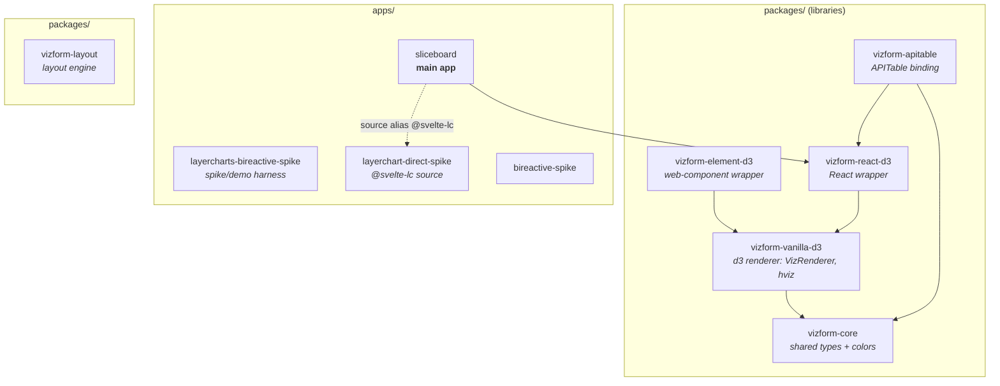
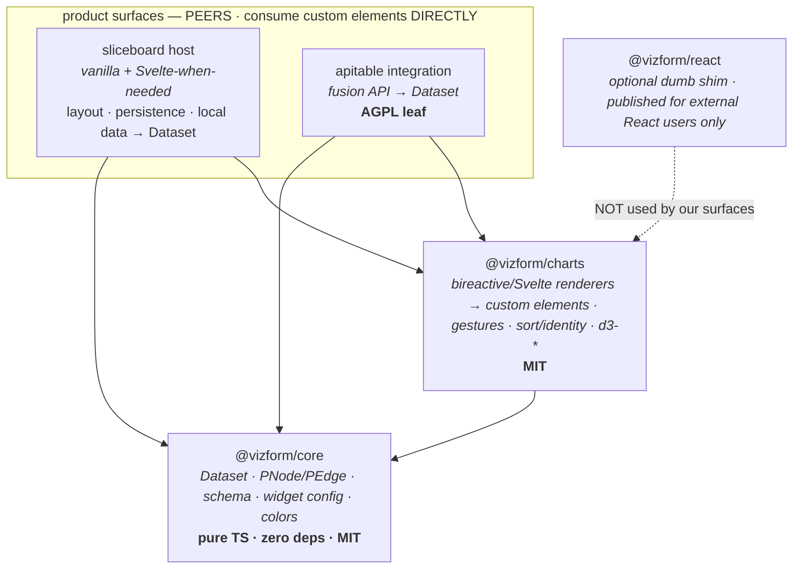

# Vizform — workspace dependency map

> `node scripts/depgraph.mjs` prints a paste-able mermaid graph from the live
> package.json files; `--write` splices a plain auto-version into the block below
> (the curated labels/grouping here are hand-maintained — re-apply styling after).
> Last hand-verified: 2026-06-27 (after merge of agent prelaunch fixes).

npm workspaces: `packages/*` + `apps/*`. Internal deps use `"*"` (workspace-local).

## Graph

Solid arrows = real `package.json` dependencies. Dotted arrows = **vite source
aliases** in `apps/sliceboard/vite.config.ts` — sliceboard imports the svelte spike
app's `src/` directly (`@svelte-lc`) for no-build live HMR; it is
*not* a workspace package dep. (The `@winstonfassett/vizform-charts` package is a
real workspace dep — no alias needed.)

## The package split (post-rename nuance)

`vizform-core` was **split, not renamed**:

- The d3 renderer guts (`VizRenderer`, `hviz/*`, `viz/*`) moved to **`vizform-vanilla-d3`**.
- A thin **`vizform-core`** survives holding only `colors.ts`, `types.ts`, `index.ts`
  — framework-agnostic contracts (`PNode`, `PEdge`, `ColumnSchema`, color helpers).

The `-d3` suffix marks "the d3/vanilla rendering approach," leaving the
Svelte/LayerChart approach free to be a sibling rather than a fork.

`packages/vizform-react/` is a **stale empty dir** (only an untracked `dist/`) —
safe to delete.

## Packages

| Package | Role | Internal deps | Notable external |
|---|---|---|---|
| `vizform-core` | Shared types + colors | — | (none) |
| `vizform-vanilla-d3` | d3 renderer | core | `d3-drag/ease/hierarchy/interpolate/scale/selection/shape/transition` |
| `vizform-element-d3` | Web-component wrapper | vanilla-d3 | — |
| `vizform-react-d3` | React wrapper | vanilla-d3 | `react >=17` |
| `vizform-apitable` | APITable binding | core, react-d3 | `react ^17` |
| `vizform-layout` | Graph layout engine experiments | — | `bireactive`, `d3-force/hierarchy` |

## Apps

| App (dir) | package name | Internal / alias | Notable external |
|---|---|---|---|
| `sliceboard` | sliceboard | react-d3 + `@webdev/vite`; `vizform-charts`; alias `@svelte-lc` | `bireactive ^0.3.4`, `d3 ^7`, `react ^18.3` |
| `vanilla-bireactive-layercharts-spike` | layercharts-bireactive-spike | `vizform-charts` (workspace dep) | `bireactive`, `d3-array/hierarchy/sankey/scale/scale-chromatic/shape` |
| `svelte-layerchart-spike` | layerchart-direct-spike | — (consumed as `@svelte-lc`) | `bireactive`, `d3-hierarchy/sankey`, `layerchart ^1`, `svelte ^5` |
| `vanilla-bireactive-spike` | bireactive-spike | — | `bireactive`, `d3-hierarchy` |

## ⚠️ Version conflicts & packaging smells

These don't bite in the workspace (hoisting + source resolution paper over them)
but **will** bite on publish/consume:

1. **`vizform-apitable` renders React with no `react` peerDependency.** It pins
   `react@^17.0.2` + `@types/react@^17` in *devDeps* only, while the rest of the
   tree is React 18. A React-18 consumer works only transitively through
   `react-d3`'s `peer react>=17`; apitable's own JSX types are React 17.
   **Fix:** declare `peerDependencies: { react: ">=17" }`, drop the hard dev pin,
   bump types to 18 — mirror `react-d3`.
2. **`react-d3` is the correct pattern** (peer `react>=17`, react in devDeps only).
   Copy it everywhere React appears.
3. **bireactive is app-only.** None of the publishable `vizform-*-d3` packages
   depend on it. The actual bireactive charts (BR-LC) live inside the *spike apps*
   and are consumed by vite source-alias — **not packaged.** If the bireactive
   charts are the product, they're currently unshippable.
4. **d3 dual-style.** sliceboard pulls full `d3@^7` (large); `vanilla-d3` uses
   granular `d3-*@^3` / `d3-scale@^4`. Compatible (d3@7 re-exports these) but
   inconsistent — pick granular everywhere to keep bundles lean.
5. **`*` internal version specifier** is workspace-only. For publish, switch to
   the workspace protocol / real semver ranges.
6. **`packages/vizform-react/`** stale empty dir — delete.

## Target architecture (if we did it over)

Goal: a sensibly-packaged, **releasable** library centered on the bireactive
charts (the canon direction). Two design constraints drive the whole shape:

1. **Licensing firewall.** APITable is **AGPL-3.0** — anything that imports
   apitable code inherits AGPL. So deps point *down* into a permissive (MIT) core,
   and the apitable integration sits at a **leaf nothing else imports**. The two
   product surfaces (sliceboard, apitable) are **peers** — same widgets from a
   user's view, neither built from the other; they share the library down-stack,
   never sideways.
2. **Custom elements are the interop boundary — no host framework in the spine.**
   The charts emit custom elements that own their own DOM lifecycle. Surfaces
   mount them directly (`createElement` + `.externalData` + `gesturecommit`). No
   React/Svelte sits *between* a surface and a chart. (See the React rationale
   below — this is why.)

Key moves vs today:

- **Extract the bireactive charts out of the spike apps** into `@vizform/charts`.
  Single most important step — the real product is currently trapped in
  `apps/*-spike/src` behind vite aliases, hence unshippable.
- **`core` is pure TS** (Dataset/PNode/PEdge/schema + widget config + colors).
  No React, no d3, no bireactive. This is the MIT firewall.
- **`d3-*` lives only in `charts`**, granular, not a top-level `d3` meta dep.
- **No framework in any surface's dep path.** Charts are custom elements; the host
  mounts them directly. `bireactive` and Svelte are *authoring paths inside
  `charts`* that both emit custom elements — not wrapper layers above them.
- **sliceboard migrates off React → vanilla + Svelte (Svelte only where component
  ergonomics earn it).** The viz layer never knew it was inside a framework, so
  the host shell can change with zero impact on charts.
- **`@vizform/react` is optional and off to the side** — a paper-thin shim for
  *external* React consumers, depended on by nothing in our spine. Likely
  generated. AVOID internally.
- **Bindings/surfaces depend on `core` (+ `charts`) only** — never on each other,
  so neither a renderer nor an AGPL choice leaks across.
- **`bireactive` becomes a real, pinned dependency of `charts`** (today it's only
  ever an app dep).

### What logic lives in each layer (concrete — current files → layer)

| Layer | Owns | Current code today | Must NOT contain |
|---|---|---|---|
| **`@vizform/core`** (pure TS, zero deps) | Data shapes; the **view spec** type; the **sort/group/filter transform** (pure fns); color | `vizform-core/src/types.ts` (`PNode`,`PEdge`,`ColumnSchema`,`Dataset`); a `DataView`/`TileSpec` type (today sliceboard's `tile` in `persistence.ts`); `applyView`=`applyGroupBy`+`colorByGroup`+sort+reindex (today **inline in `App.tsx`** as `sortedNodes`); `colors.ts` (`PALETTE`,`colorFor`) | DOM, d3, bireactive, React |
| **`@vizform/charts`** (bireactive + d3 → custom elements) | Layout math; gesture mechanics; hit-test; reactive draw; edit emission | `demos/*` chart classes (`MdBarChartLC`…`MdBudgetTree`); `lib/*`: `chart-context` (scale substrate), `axis`,`area`,`spline` (path math), `cartesian-gestures`,`gestures`,`interaction` (singleton wheel/drag + `applyDelta` redistribute), `esc-contract`, `host-size` (RO→fill), `hud-bridge` (id-based hover/select contract), `tree` (BiNode build), `sankey-layout` (pure solver) | sort *policy*, which dataset, tile arrangement, persistence |
| **surface** (sliceboard; later apitable) | Data **source**→Dataset; `tile.kind`→element **dispatch**; view-edit **UI**; view **persistence**; cross-tile HUD; tile **layout** | `persistence.ts` (localStorage→Dataset), the `if (tile.kind===…)` ladder in `App.tsx`, sort/groupBy/measure/depth pickers, `hudStore`, `react-grid-layout`, **`BrLcCharts.tsx` React wrappers (throwaway — die with React)** | chart internals, layout math, gesture mechanics |

**The runtime seam (the contract every surface obeys):**

1. surface: data source → `Dataset` *(core shape)*
2. surface: `applyView(Dataset, view)` → ordered `PNode[]` *(core pure fn — this is where sort/group/filter happen)*
3. surface: `element.externalData = nodes`; mount the custom element *(charts)*
4. chart: draws nodes **in given order, keyed by id**; on user edit → `dispatchEvent('gesturecommit')` / `onUpdate`
5. surface: catch edit → write back to source → persist

The "sortable data view" = **`DataView` type + `applyView` fn (both core)** + dumb
chart element (charts) + sort control & storage (surface). The chart never sorts
([[project_sort_identity_architecture]]); the surface owns only the control and
where the choice is saved. That split is what lets sliceboard and apitable share
the view logic — both call `applyView`, differing only in data source + storage.

> **Demo/seed data is not chart code.** `portfolio.ts` (hard-coded
> holdings) is fixture data — it stays in the demo app / a fixtures path, **not**
> in the shipped `@vizform/charts`.

### Why React comes out of the spine

Every React pain in this repo is React fighting an element that already owns its
lifecycle: self-edit remounts (the `selfSig` suppression in `useBrElement`),
`dedupe: ['react']` so a second instance doesn't null-crash hooks, StrictMode
double-mounts, mid-gesture remounts breaking wheel editing. Moving the boundary
to the **custom element** deletes that whole class of bug — and lets the
`selfSig` / dedupe / remount-suppression machinery be *removed*, not ported.

### Still open

- **Widget/tile/data-view definitions:** in `core`, or a `@vizform/widgets`
  package? (Lean: config *types* in core, tile→chart *dispatch* in charts.)
- **How fat is the shared "data-view"?** Does a tile carry sort/filter/group/
  persistence shared across surfaces, or does each surface own that? Decides how
  much logic lives in the library vs. per-surface.

Open calls: keep the legacy `vizform-vanilla-d3` / `-react-d3` gen-1 chain as a
deprecated path or retire it; whether `element` or `svelte` is the canonical
public surface; npm scope (`@vizform/*` vs `@winstonfassett/*`).

## No-build live dev (why edits ripple instantly)

1. The `vizform-*-d3` packages expose a `node` export condition → `./src/index.ts`,
   so sliceboard resolves them to **TS source**, not built `dist`.
2. `@winstonfassett/vizform-charts` also exposes a `node` export condition → `./src/index.ts` for the same reason. The `@svelte-lc` alias still points at the svelte spike's `src/`.
3. `dedupe: ['react','react-dom']` forces a single React copy across all
   source-resolved packages (else a second instance crashes hooks).

Net: edit any package or spike `src/` → HMR into sliceboard, no rebuild.
