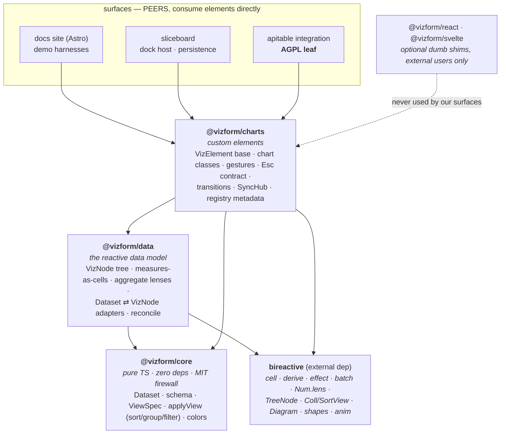
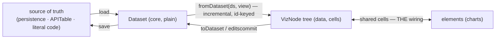
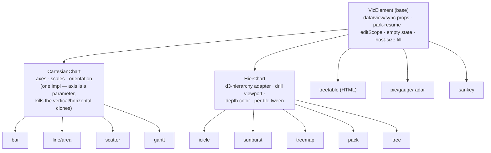
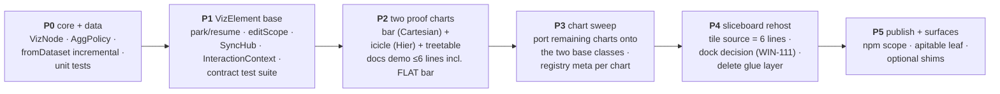

# Vizform Rebuild — Tech Design

> Greenfield design for achieving the original vision: **reusable bireactive components —
> share a reactive dataset, get bidirectional charts, zero wiring.**
> Grounded in the 2026-07-03 architecture review: the vision is proven (Icicle ↔ Treetable
> demo = 6 lines of wiring), but the element interface is shallow — four missing contracts
> forced ~560 lines of compensation glue into every host. This doc designs the deep version.

---

## 1. Vision & non-goals

**Vision.** A chart is a custom element. Its entire wiring contract is: *give it reactive
data*. Edits flow both ways through shared cells — drag the chart, the table moves; edit
the table, the chart moves. No events to subscribe, no stores to bridge, no lifecycle
choreography. A host (docs page, sliceboard, APITable surface, someone else's app) mounts
elements and owns *policy* (which data, what sort, what layout); elements own *mechanics*
(rendering, gestures, transitions, hit-testing).

**Non-goals.**
- Not a general chart library. North star is allocation/direct-manipulation tooling
  ([[project_north_star]]); charts exist to serve that, breadth is opportunistic.
- No framework in the spine. React/Svelte adapters are optional leaves, never load-bearing.
- No backward compatibility with gen-1 (`vizform-vanilla-d3`) or the Svelte spike. Rebuild
  means those retire; port *knowledge* (gesture model, Esc contract, transitions doc), not code.

**The one-sentence test for every design decision:** *could the docs demo wire this chart
in ≤6 lines, and could sliceboard host it with zero chart-specific glue?* If either answer
is no, the complexity is in the wrong layer.

---

## 2. Root-cause constraints (what the rebuild must fix)

From the review — these are the four holes that generated all consumer glue, plus the split
data model. Each becomes a hard requirement below.

| # | Hole today | Symptom it caused | Rebuild requirement |
|---|---|---|---|
| 1 | No reconcile — `externalRoot` frozen at `scene()`, `dataCell` can't change cardinality | `applyData` diffing, `shapeKey` rebuild heuristics, hidden-not-removed tabs | **Data settable at any time; element reconciles by id** |
| 2 | No edit origin — element writes the same cell the host writes; `gesturecommit` has no payload | `lastRef` echo-suppression shadow maps, store round-trips | **Edits are distinguishable and carry payloads** |
| 3 | No ready signal — `brSync` duck-typed onto host lazily inside `scene()` | Exponential-backoff polling to wire hover/select | **Full interface available at construction** |
| 4 | No lifecycle survival — `scene()` reruns per connect, state wiped on DOM move | `display:none` tab hacks, keep-alive reverts, remount storms | **Element state survives disconnect/reconnect** |
| 5 | Two data models — hier BiNode-with-cells vs flat plain arrays (+ pie hybrid) | Bar demo fakes cell-sharing; sort solved two ways; `mutateDatum` privates | **One data model: cells all the way down** |

---

## 3. Layers



Dependency rules:
- **`core` imports nothing.** It is the MIT firewall and the shared vocabulary
  (`Dataset`, `PNode`-successor, `ViewSpec`, `applyView`). No DOM, no d3, no bireactive.
- **`data` is where bireactive enters.** It owns the reactive tree and re-exports the
  bireactive primitives consumers need (`num`, `effect`, `batch`) — a consumer never
  needs a direct `bireactive` import. (Fixes: package couldn't stand alone.)
- **`charts` owns d3-\*** (granular, never meta `d3`), all rendering, all gestures.
- **Surfaces depend down-stack only, never sideways.** APITable stays an AGPL leaf.
- Elements register themselves via an exported `defineAll()` / per-chart `define()` —
  tag names are package-owned constants, not consumer inventions.

---

## 4. The data model (`@vizform/data`)

**One model. Everything is a tree of nodes whose measures are cells.** A flat chart is a
one-level tree. This deletes the flat/hier split, the pie hybrid, private `mutateDatum`,
and the entire class of "which property does this chart take" knowledge.

```ts
// @vizform/data
import { Num, Writable, TreeNode } from "bireactive";

export interface NodeData {
  id: string;
  label: string;
  color?: string;                              // resolvable via core color policy
  measures: Record<string, Writable<Num>>;     // ALL numeric values live here
  meta?: Record<string, unknown>;              // dates, tags — non-edited fields
}

export type VizNode = TreeNode<NodeData>;

// Constructors
export function leaf(id: string, label: string, measures: Record<string, number>): VizNode;
export function group(id: string, label: string, children: VizNode[],
                      agg?: AggPolicy): VizNode;   // default: sum + proportional redistribute
export function list(id: string, rows: RowInit[]): VizNode;  // flat = one-level tree

// The bidirectional magic, named as policy not accident:
export type AggPolicy = "sum-redistribute" | "sum-readonly" | "mean" | CustomLens;

// Structure is reactive too (fixes reconcile at the data layer):
//   node.children is a Coll<VizNode> — insert/remove/reorder are cell writes,
//   charts react to structure changes like any other dep.
```

Key decisions:
- **`measures` is the only edit surface.** Charts write `node.data.measures[key].value`
  during gestures. Group measures are `Num.lens` aggregates (sum-forward,
  redistribute-back) exactly as today's `group()` — but the policy is a named,
  swappable parameter, because "drag a parent" semantics differ per domain.
- **Children as `Coll`.** bireactive already ships `Coll`/`SortView` with rank-insertion
  `move()` ([[bireactive-surface-audit]] — stop reinventing). Reorder/insert/remove become
  reactive writes the element simply observes. This is what makes reconcile (hole #1)
  mostly *disappear* rather than get implemented: cardinality changes are just deps.
- **`Dataset ⇄ VizNode` adapters live here.** `fromDataset(ds, view)` builds/updates a
  VizNode tree from core's plain `Dataset` + `ViewSpec`; `toDataset` snapshots back.
  Surfaces that own plain data (persistence, APITable fusion API) call these; surfaces
  that are fully reactive (docs demos) build `leaf`/`group` directly. **`fromDataset` is
  incremental**: called again with new data it patches cells in place by id — this is the
  reconcile function, written once, in the data layer, not per-host.



---

## 5. The element contract (`@vizform/charts`)

The heart of the rebuild. One base class, one interface, every chart implements it fully
or isn't exported.

```ts
// VizElement — the whole contract a host must know
export abstract class VizElement extends HTMLElement {
  // ── data (hole #1, #5) ────────────────────────────────────────────────
  // Settable at ANY time, before or after mount. Element reconciles.
  // Structure changes arrive through the tree's own reactivity (Coll children).
  data: VizNode | null;                 // property, reactive internally
  view: ElementView;                    // measureKey(s), orientation, depth, drillId…
                                        // plain reactive config object; NO sort policy —
                                        // order comes pre-applied in the tree (SortView)

  // ── edit flow (hole #2) ──────────────────────────────────────────────
  // During a gesture the element writes measures through a tagged scope:
  //   editScope.write(cell, v)  →  host effects can ask "did I cause this?"
  // Committed gestures dispatch a REAL payload:
  dispatchEvent(new CustomEvent<EditCommit>("editcommit", { detail }));
  // EditCommit = { edits: {nodeId, measure, from, to}[], gesture: "drag"|"wheel"|"key" }
  // Cancelled gestures revert cells via snapshot (Esc contract) and dispatch "editcancel".

  // ── sync (hole #3) ───────────────────────────────────────────────────
  // Cross-element hover/select/drill = shared cells, injected, available immediately.
  sync: SyncHub | null;                 // { hoverId: Cell<string|null>, selectIds: Cell<Set>,
                                        //   drillId: Cell<string|null> } — settable pre-mount,
                                        //   defaultable to a page-global hub
  // ── lifecycle (hole #4) ──────────────────────────────────────────────
  // connectedCallback mounts DOM; disconnectedCallback PARKS (retains scene + cells,
  // pauses raf/observers); reconnect resumes. dispose() is the only real teardown.
  dispose(): void;
}
```

Contract guarantees (these are the tests — see §9):

1. **Order of operations never matters.** `el.data = tree` before or after `appendChild`,
   `sync` before or after `data` — all valid. No "set before append" folklore.
2. **Edits are origin-tagged.** A host effect watching cells can distinguish "the user
   dragged this chart" from "someone else wrote the cell" via the edit scope. Echo
   suppression, `lastRef` maps, quantize-and-compare — all dead.
3. **`editcommit` carries the full delta.** Hosts that persist (sliceboard, APITable)
   subscribe to one event with real data; hosts that don't (docs demos) ignore it and
   cells are already correct.
4. **Park, don't die.** Tab switches and dock moves are disconnect/reconnect — element
   resumes with state intact. The dock host needs no `display:none` hacks and no
   keep-alive machinery. Explicit `dispose()` for real teardown.
5. **Gestures are internal.** Wheel/drag/Esc wiring happens inside the element via an
   injectable `InteractionContext` (default: one shared page instance — preserves the
   singleton coordination that makes cross-chart gestures sane, kills the
   module-singleton bundling hazard). `gestureActive` is a readable cell on the element,
   not an `(as any)` boolean. Esc contract stays centralized
   ([[project_esc_contract_centralized]]) and moves wholly inside the package.
6. **Empty is empty.** No `portfolio()` fallback. Un-wired element renders an empty state.
   Fixture data ships in `@vizform/charts/fixtures` for demos only.
7. **Interaction principles are element law.** Scale stability, speculative-until-commit,
   freeze-during-gesture, reduced-motion split (docs/interaction-principles.md) are
   implemented once in the base + gesture kit — never re-litigated per chart or per host.

### Motion policy — transitions earn their place or die

Stance shift from today's code: **value-settle animation is out by default.** The review
of WIN-94 and hands-on feel agree — tweening a value toward where the user already put it
reads as lag, not polish. Motion is classified into three classes with hard defaults:

| Class | Examples | Default | Why |
|---|---|---|---|
| **Reactive feedback** — geometry tracking an active gesture | drag a bar, wheel a value, drag icicle edge | **NO animation. Write-through, same frame.** | Direct manipulation is 1:1 (principles #1–3). Any easing between hand and pixel = sluggish. This includes *sibling* marks resized by a redistribute lens mid-gesture — they track live too. |
| **Structural transitions** — the layout MEANING changed | sort change, commit-time reorder (principle #7), drill in/out, node enter/exit, orientation flip, cross-view morph | **YES — animated, interruptible.** | Without motion the user loses object identity ("where did my datum go"). This is the transition class worth keeping and polishing. |
| **Remote value changes** — a cell changed and this chart wasn't the gesture source | table edit moves the bar, cross-tile edit | **Immediate by default; short tween opt-in per surface.** | The pointer isn't on this chart, so a brief tween *can* aid tracking — but it's a courtesy, not a default. If in doubt, instant. |

Rules carried forward unchanged: one timing token everything derives from (principle #10 —
no scattered ms values), every transition interruptible from current visual position
(#11, no snap-back), reduced-motion suppresses structural/autonomous motion but never
reactive feedback (#9).

Implementation consequence: the element's render path is **two-lane** — a synchronous
write-through lane for gesture-sourced cell changes (edit-origin tagging from hole #2
is what makes this distinction implementable at all), and a transition lane that only
engages on structural deps (order, membership, drill, mode). `settleTransition` as a
blanket wrapper on value updates does not survive the rebuild.



- **Registry metadata is part of the chart class** (static `meta`): tag name, label,
  capabilities (`drillable`, `multiMeasure`, `orientable`, `editable`), config schema for
  pickers. One declaration per chart replaces today's 6–8 touch-points
  (two TAG registries + two builder copies + config schemas).
- Charts whose data can't be wired externally don't ship. Sankey gets a real
  `data` input or stays in fixtures. Maturity gating (`experimental`) hides, not exports.

---

## 6. Surfaces

### 6.1 Wiring cost budget (the acceptance criteria)

```ts
// docs demo — the ENTIRE wiring, any chart, flat or hier:
const root = group("root", "Portfolio", [
  group("eng", "Engineering", [leaf("fe","Frontend",{total:50}), leaf("be","Backend",{total:70})]),
  group("mkt", "Marketing",   [leaf("content","Content",{total:40}), leaf("social","Social",{total:40})]),
]);
document.querySelector("vf-icicle")!.data = root;
document.querySelector("vf-treetable")!.data = root;
// done — hover/select sync via default page SyncHub, edits flow through shared cells
```

Note charts can now be **declared in HTML** (tags are package-registered) and wired with
one property assignment each. That's the vision, mechanically enforced.

### 6.2 Sliceboard (dock host)

Becomes policy-only. Per tile:

```ts
// the whole "tile source" — replaces bindTile.ts (599) + tile-sources.ts (373)
//                          + BrLcCharts.tsx (504)
const nodes  = applyView(dataset, tile.view);        // core: sort/group/filter, pure
const tree   = fromDataset(nodes, tile.view);        // data: incremental, id-keyed
const el     = createChart(tile.kind);               // charts: registry lookup
el.view = tile.view; el.sync = boardHub; el.data = tree;
el.addEventListener("editcommit", e => store.commit(e.detail));  // persist
```

- **Sort/identity architecture holds** ([[project_sort_identity_architecture]]): sort
  lives in the surface (`applyView` + `SortView`), charts render given order keyed by id,
  freeze+commit re-sort keys off `editcommit`.
- **Dock layout engine is a separate module with an event boundary** (WIN-111 stands:
  evaluate `dockview-core` vs evolved `DockView.ts`; either way it's bireactive-free and
  chart-ignorant — it hosts elements that park/resume, which is what makes the choice low-stakes).
- Drill state: one place — `SyncHub.drillId` cells per scope, persisted by the surface.
  Not tri-located across hudStore/element-prop/dash.drills.

### 6.3 Docs site (Astro)

- One Astro page per example, one vanilla `.ts` harness per example (matchina/ui26
  example-architecture style, per WIN-110). No shared SPA shell to rot.
- Examples are *also the acceptance tests* — each harness must stay within the wiring
  budget of §6.1. A demo that needs glue is a failing test of the library.

---

## 7. Packages & repo layout

```
packages/
  vizform-core/        # pure TS: Dataset, ViewSpec, applyView, colors     (MIT firewall)
  vizform-data/        # VizNode, leaf/group/list, AggPolicy, fromDataset  (bireactive enters)
  vizform-charts/      # VizElement, chart classes, gestures, SyncHub, registry, fixtures/
  vizform-react/       # optional shim (generated if possible)             (leaf)
  vizform-svelte/      # optional shim                                     (leaf)
apps/
  docs/                # Astro site: landing + per-example harness pages
  sliceboard/          # dock host (policy only)
  apitable/            # AGPL leaf surface
```

### Per-package spec

| Package | License | Deps | Peer deps | Public exports (the WHOLE surface) |
|---|---|---|---|---|
| **`@vizform/core`** | MIT | *(none)* | — | `Dataset`, `Row`, `Schema`, `ViewSpec`, `applyView()`, `PALETTE`, `colorFor()`, `resolveColors()` |
| **`@vizform/data`** | MIT | `core`, `bireactive` (pinned) | — | `VizNode`, `NodeData`, `leaf()`, `group()`, `list()`, `AggPolicy`, `fromDataset()`, `toDataset()`, tree walkers (`walk`, `leaves`, `byId`, `parentIndex`); **re-exports** `num`, `Num`, `cell`, `effect`, `batch`, `Writable` from bireactive |
| **`@vizform/charts`** | MIT | `core`, `data`, `bireactive`, granular `d3-*` | — | `VizElement`, `CartesianChart`, `HierChart`, all chart classes + static `meta`, `define()`/`defineAll()`, tag-name constants, `createChart()`, `SyncHub`, `createSyncHub()`, `InteractionContext`, event types (`EditCommit`, `EditCancel`), `ElementView`; subpath `./fixtures` (portfolio, gantt tasks, sankey flows) |
| **`@vizform/react`** | MIT | — | `react >=17`, `charts` | one dumb `<Chart kind=… data=… />` shim |
| **`@vizform/svelte`** | MIT | — | `svelte >=5`, `charts` | same, Svelte flavor |
| **apitable surface** | AGPL | `core`, `data`, `charts` | — | app, not a library; nothing imports it |

Export rules:
- **The table above is exhaustive by design** — if a consumer needs an import that isn't
  listed, that's an interface bug, not a missing export. (Today's failure: `NodeValue`,
  tag names, row types, tree walkers all unexported → `as any` everywhere.)
- **`data` re-exports the bireactive primitives** consumers need so no surface takes a
  direct `bireactive` dependency; version skew is contained in one place.
- **Every package ships types + `exports` map with a `node` source condition** (keep the
  no-build live-dev flow: edit `src/` → HMR in any app, no rebuild).
- **Fixtures are a subpath export**, never a fallback inside chart code.

Retired, not ported: `vizform-vanilla-d3`, `vizform-element-d3`, `vizform-react-d3`
(incl. `HTreetable.tsx` and the `onRender`/`getRoot` React-wrapper API on treetable),
`svelte-layerchart-spike`, all `*-spike` apps, `BrLcCharts.tsx`, `bindTile.ts`,
`hud-bridge.ts` (superseded by SyncHub), zombie React `Icicle/Sunburst/Treemap.tsx`.
Knowledge ports via docs: interaction-principles, transitions-decision, Esc contract,
per-tile treemap tween ([[project_treemap_per_tile_tween]]), drill-internal-zoom
([[project_drill_internal_zoom]]).

Packaging hygiene (from dependencies.md, unchanged): granular `d3-*` only; real semver
for internal deps at publish; `bireactive` a pinned real dependency of `data`/`charts`;
keep the `node`-condition source exports for no-build live dev.

---

## 8. Build order

Rebuild in dependency order, with the docs demo as the running acceptance gate at every step.



- **P2 is the go/no-go gate.** If bar↔table can't hit the 6-line budget with real cells
  (the thing today's demo fakes), the element contract is wrong — fix it before P3.
  Two charts on two base classes = the second adapter that makes every seam real.
- **P3 is parallelizable** (agent-friendly): each chart is an isolated port onto a frozen
  base-class interface — exactly the shape that avoided the add-then-revert churn the
  history shows, because agents patch behind the seam instead of inventing host glue.
- Sliceboard stays on the old stack until P4; no long dual-generation period *inside* the
  new packages (the history's core lesson: never two live generations in one surface).

---

## 9. Testing

**The interface is the test surface.** Three tiers:

1. **Data tier (pure, fast):** AggPolicy lens math (sum/redistribute edge cases: zero
   totals, negative, quantization), `fromDataset` incremental reconcile (id add/remove/
   reorder/patch), `applyView` sort/group/filter.
2. **Element contract suite (jsdom/happy-dom + real browser):** ONE parametrized suite
   run against EVERY exported chart — set-data-after-mount, cardinality change, park/
   resume across DOM move, edit-origin tagging, `editcommit` payload shape, Esc revert
   snapshot, empty state, reduced-motion split. A chart ships only if the suite passes.
3. **Gesture/e2e (Playwright, real mouse — [[feedback_use_webapp_testing_not_synthetic]]):**
   drag/wheel/Esc against the docs harness pages; shadow-DOM piercing per
   [[project_brlc_shadow_dom]]. Docs examples double as the fixtures.

---

## 10. Risks & open questions

1. **Lifecycle: constructor-scope state + pure scene (park/resume demoted).**
   `Diagram.scene()` runs per-connect and disconnect disposes the scene graph — see
   **Appendix A**. The primary answer is the pattern in Appendix A §"The actual pattern":
   all durable cells (data, drill, selection, measure, scroll) live at constructor scope;
   `scene()` is a pure reactive projection (no `peek()` snapshots, `forEach` for structure).
   Then reconnect-rebuild is lossless and park/resume becomes a perf optimization to add
   only if the rebuild hitch is measurable on large scenes. Validate the pattern in P1.
2. **`Coll` children vs plain arrays.** Reactive structure is the elegant answer to
   reconcile, but d3-hierarchy layouts want snapshots. Pattern: `derive(() => layout(snapshot(tree)))`
   — cost of re-snapshot on structural change needs a perf check with ~1k nodes in P0.
3. **Edit-origin mechanism.** Options: bireactive `setCellWriteHook` instrumentation,
   a wrapping `EditScope` object, or write-through-lens tagging. Pick the one that
   survives `batch()`.
4. **How fat is `ElementView`?** measureKey(s), orientation, depth, drill live on the
   element; sort/filter/group stay in the surface. Scatter needs xKey+yKey
   ([[project_scatter_dual_measure]]) — multi-measure view must be first-class from P1.
5. **npm scope** — `@vizform/*` vs `@winstonfassett/*`. Cosmetic; decide at P5.
6. **Scope discipline.** Five eras in eight weeks happened by adding consumers instead of
   deepening interfaces. The counter-rule for this rebuild: **no new surface until the
   docs-demo budget holds for the current one.**

---

## Appendix A — Park/resume vs `Diagram`'s scene-per-connect, unpacked

**The mechanism today.** Every chart extends bireactive's `Diagram`. Its lifecycle,
verbatim from the shipped source (`bireactive/dist/web/diagram.js`):

- `connectedCallback()` (line 98) — fired by the *browser* every time the element is
  inserted into the DOM — disposes any previous root and calls `this.scene(this.s)`.
  `scene()` is where a chart builds **everything**: reads `this.data`, creates scale/layout
  cells and derives, mounts every SVG shape, attaches gestures, starts effects.
  The doc-comment says it plainly: *"Runs once per connect."*
- `disconnectedCallback()` (line 118) — fired every time the element is *removed* from
  the DOM — calls `this.root?.dispose()`. **The entire scene graph is destroyed.**

**Why "removed from the DOM" is the trap.** It doesn't only mean "the user closed the
chart." The browser fires disconnect/connect on *any reparenting*: a dock host moving a
panel into another group, a tab strip detaching an inactive tab, drag-and-drop of a tile,
even `container.append(el)` on an element that's already elsewhere. Each of those
bulldozes the chart and rebuilds it from zero. Concretely lost on every move:

- drill position, selection, hover — any element-internal state
- in-flight transitions (mid-tween → hard snap on rebuild)
- gesture state (a drag across a dock re-layout dies)
- scroll position (treetable)
- and the rebuild re-runs layout + mounts hundreds of shapes — a visible hitch

**The evidence this hurts.** Sliceboard keeps inactive tabs mounted with `display:none`
instead of unmounting (DockView's hidden-not-removed logic) purely to dodge this. Git
history shows keep-alive tab caching added (`796bdaa`) and reverted (`25841c8`) — a
symptom-level fight with the lifecycle. Every host pays this tax its own way.

**What park/resume means instead.**

| | disconnect | reconnect | real teardown |
|---|---|---|---|
| **Today (`Diagram`)** | `root.dispose()` — scene graph destroyed | `scene()` reruns — full rebuild from current `data` | (same as disconnect) |
| **Rebuild (`VizElement`)** | **PARK**: keep scene graph, cells, subscriptions; pause raf loop + ResizeObserver | **RESUME**: unpause; re-measure size once | explicit `dispose()` only |

Park = the element treats DOM membership as *visibility*, not *existence*. Disconnect
pauses the expensive ongoing work (animation frames, observers — so a parked element
costs ~nothing); everything else stays alive. Reconnect resumes in the same visual state,
same frame. Destruction becomes an explicit host decision (`dispose()`), not a side
effect of moving a node. With that, a dock host can reparent panels freely with zero
keep-alive machinery — hole #4 closes at the element, not in every host.

**Why it's the P1 risk.** Park/resume contradicts `Diagram`'s built-in
dispose-on-disconnect. Two viable paths:

1. **Upstream**: propose a `Diagram` option (e.g. `retainOnDisconnect`) or a
   park/resume hook pair to the bireactive author (aligns with surface-audit open
   question #3 about upstreaming extensions).
2. **Own the lifecycle**: `VizElement extends HTMLElement` directly, owning
   shadow root + connected/disconnected, and uses bireactive's `Mount`/`Anim`/shape
   machinery internally rather than inheriting `Diagram`'s lifecycle.

Path 2 is fully in our control and is the default if upstream stalls; the cost is
re-owning ~100 lines of scaffold (shadow mount, viewBox, style adoption) that `Diagram`
currently provides. Decide before writing any chart on top (P1), because every chart
class inherits whichever answer we pick.

### Why bireactive itself doesn't hit this

Checked against `inspo/bireactive` (125 site elements). Bireactive's own elements live in
a regime where dispose-on-disconnect is *correct*:

1. **Self-contained data.** No site element takes external data — zero `externalRoot`-style
   inputs anywhere. md-kanban seeds its own private `#tasks: Arr<Card>` on connect.
   `scene()` is a pure function from nothing → rebuild on reconnect is lossless by
   construction.
2. **Static documents, not app shells.** Elements are parsed into long-form articles once
   and never reparented. Disconnect ⇒ page teardown ⇒ disposing everything is right.
3. **Resource management happens at the raf layer, not the DOM layer.** `Diagram` gates its
   rAF loop on an IntersectionObserver (`rootMargin: "200px"`), so offscreen figures sleep.
   That's the park/resume an *article* needs; a *dock* needs it across DOM moves instead.

Vizform inverts both load-bearing assumptions simultaneously: data is injected and shared
(the vision), hosts are dynamic (dock/tabs reparent constantly). Even then, the failure is
not data loss — shared cells live outside the element and survive — it's **view state**
(drill, selection, scroll, in-flight gesture/tween) plus the rebuild hitch. Hence the pain
concentrates in sliceboard while the docs demos (documents — bireactive's home regime)
feel fine. Framing for upstream: not "your lifecycle is broken" but "extend `Diagram` into
a second regime" — which is also the argument for defaulting to path 2 (own the lifecycle).

### The actual pattern — external data, the bireactive way

The problem isn't `Diagram`'s lifecycle; it's that today's charts **snapshot reactive data
inside `scene()`** (`rows0 = data.peek()` in bar-chart, one-time `nodeById` index maps in
icicle). The moment you snapshot, you've opted out of bireactive — late data, cardinality
changes, and reconnects all break from that one decision. The fix is two rules:

**Rule 1 — durable state lives at constructor scope.** The constructor runs once per
element *lifetime*; `scene()` runs once per *connect*. Every cell that must survive a DOM
move — the data cell, drill, selection, measure key, scrollTop — is a constructor-created
field. Nothing in `Diagram` prevents this; the current charts just create everything
inside `scene()`, so `root.dispose()` takes it all down.

**Rule 2 — `scene()` is a pure reactive projection of those cells.** No `peek()`, no
one-time index maps (index maps are `derive`s). Structure is mounted with bireactive's
own structural-lifecycle helpers — `forEach`/`each`/`when`/`network` exist exactly so the
set of shapes tracks a reactive collection.

```ts
class VfIcicle extends Diagram {
  // constructor scope — survives every disconnect/reconnect
  readonly data    = cell<VizNode | null>(null);
  readonly drillId = cell<string | null>(null);
  readonly measure = str("total");
  sync: SyncHub = pageHub;

  protected scene(s: Mount) {
    // pure projection — rebuildable with zero correctness cost
    const layout = derive(() => partition(snapshotTree(this.data.value)));
    forEach(() => nodesOf(layout.value), n => s(rectFor(n)));
    attachGestures(this, { drill: this.drillId, sync: this.sync });
  }
}
```

Consequences:
- **Scene-per-connect stops being a bug.** Reconnect re-runs `scene()`, which reads the
  same constructor-scope cells and reproduces the identical chart — data, drill, selection
  intact, because none of it lived in the disposed scope.
- **Holes #1 and #4 mostly dissolve** into this one pattern: `el.data.value = tree` works
  before or after mount; add/remove rows is just `forEach` reacting.
- **Park/resume demotes to an optimization.** What a reconnect-rebuild still costs:
  the rebuild hitch on large scenes, and in-flight tweens/gestures being cut (a dock move
  mid-drag arguably *should* cancel the gesture). Adopt the pattern first, measure the
  hitch, add park/resume only if visible.

---

## Appendix B — Gap assessment: current state vs this design (2026-07-03)

| Design element | Status | Evidence / what's missing |
|---|---|---|
| `@vizform/core` | **~60%** | `vizform-core` has PNode/Dataset/schema/colors, zero deps. Missing: `applyView` (inline in `tile-sources.ts:104-115`), real `ViewSpec` type (today: persistence's `tile`). |
| `@vizform/data` | **~25%** | Kernel exists: `charts/src/lib/tree.ts` leaf/group + sum-redistribute lens. Missing: `list()`, named `AggPolicy`, `Coll` children, `fromDataset` incremental (exists wrongly as `bindTile.applyData`, per-host). Fold in sliceboard's duplicate `buildBiTree` (119 lines). |
| Chart mechanics (render/gesture/transition) | **~70% — PORTS** | ~7k LOC of d3 adapters, drill tweens, wheel/drag + `applyDelta`, Esc contract, `useHostSize`, touch. Survives as implementation behind the new interface. |
| **Element contract (VizElement)** | **~10% — THE WORK** | No chart follows constructor-scope-cells + pure-scene (all `peek()` in `scene()`). No edit origin, no `editcommit` payload, no injectable SyncHub, `portfolio()` fallback everywhere, two data models (bar/line plain arrays, pie hybrid). Bar carries ~300-line orientation clone. |
| Registry / define() | **~30%** | `metadata.ts` maturity exists; config schemas app-side; two duplicated TAG registries; no `define()`/tag constants. |
| Motion policy | **removal work** | Gesture tracking already write-through; blanket `settleTransition` on values must die (WIN-94). |
| Contract test suite | **0%** | Nothing tests elements through their interface. |
| Docs surface | **~70%** | Current branch IS the Astro+vanilla-harness shape; bar demo's fake wiring is the known failing case. |
| Sliceboard rehost | **mostly deletion** | ~2,800+ lines scheduled to die: bindTile (599), tile-sources (373), BrLcCharts (504), app tree.ts (119), hud retry/echo, gen-1 chain, Svelte spike, zombie React charts. Dock decision (WIN-111) open but low-stakes post-P1. |
| apitable surface | **furthest** | Still on gen-1 React chain. |

Phase read: **P0 ~70% done · P1 ~10% (the real work) · P2–P3 = conversions of
already-correct rendering · P4 = mostly deletion.** Rebuild is plausibly net-negative LOC.
The gap is not "build a chart library" — it's "the library never had its interface
written down and enforced."
