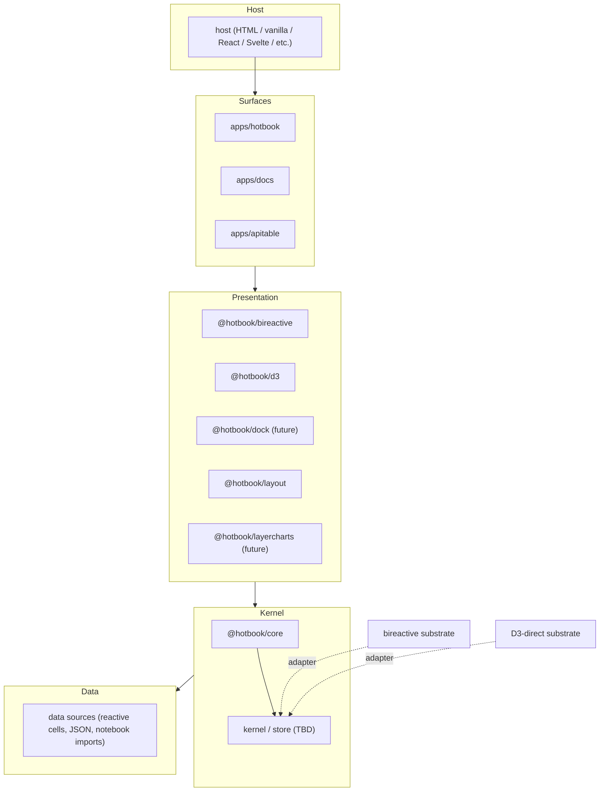
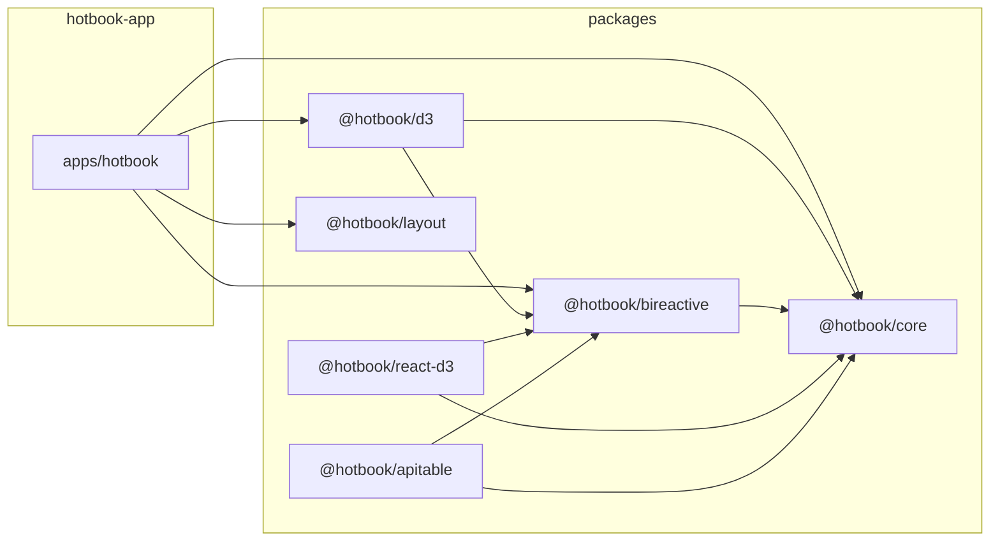
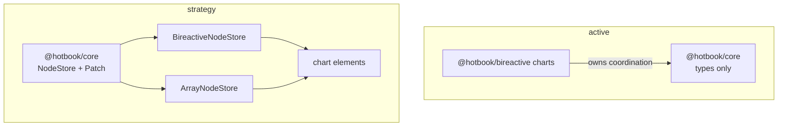
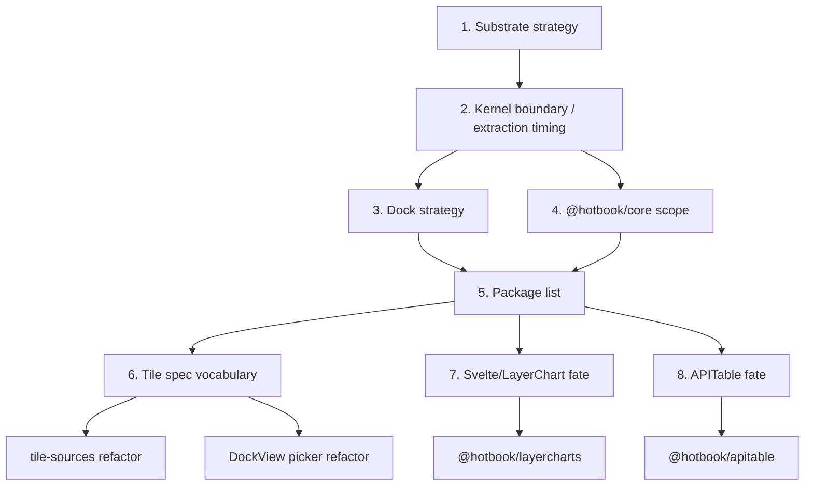
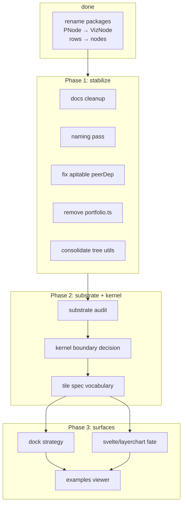
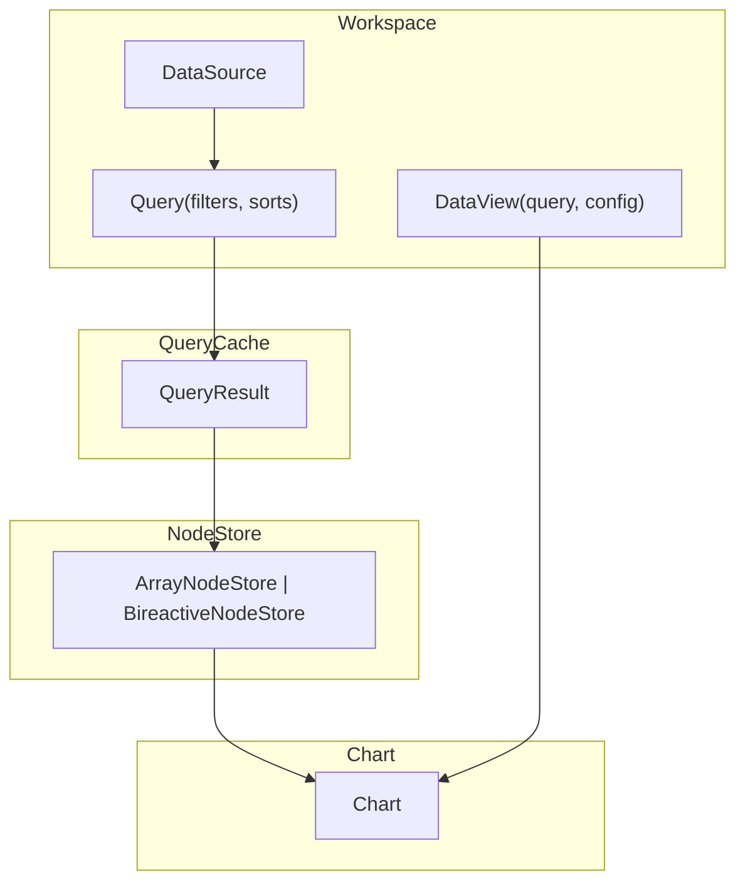

# reorg-whiteboard

Architecture whiteboard for the `hotbook` reorg. Outline / bullets / diagrams only. This is a living doc for iteration.

---

## 1. Target layers



Dependency rule: **down only**. Surfaces depend on presentation packages. Presentation packages depend on the kernel interface. Backends (bireactive, D3-direct) are injected by the host, not imported by presentation packages.

---

## 2. Current package graph



Notes:
- `@hotbook/d3` depends on `@hotbook/bireactive` because the tile-binder uses `bireactive` primitives.
- `@hotbook/react-d3` may be dead (zero consumers) — needs verification.

---

## 3. NodeStore strategy pattern

The substrate question is really: **what is the interface for holding node values and updating them?** Everything else is a strategy implementation.

### Generic types (no imports)

```ts
interface NodeLike {
  id: string
  parentId: string | null
  index?: number
  name: string
  color?: string
  measures: Record<string, number>
  dims?: Record<string, string>
}

interface NodePatch {
  op: 'setMeasure'
  nodeId: string
  key: string
  value: number
  origin?: unknown
}

interface NodesPatch<N = NodeLike> {
  op: 'setNodes'
  nodes: N[]
  origin?: unknown
}

type Patch<N = NodeLike> = NodePatch | NodesPatch<N>

interface NodeStore<N = NodeLike> {
  getNodes(): N[]
  applyPatch(patch: Patch<N>): void
  subscribe(listener: () => void): () => void
  batch?<R>(fn: () => R): R
}
```

A chart, tile, or layout component just consumes a `NodeStore`:

```ts
interface Chart<N = NodeLike> {
  mount(store: NodeStore<N>, container: HTMLElement): void
  dispose(): void
}
```

### Strategy implementations

| Strategy | What it is | How `applyPatch` works | How it notifies |
|---|---|---|---|
| `ArrayNodeStore` | The row-based store. A mutable `N[]` array. | `setMeasure` mutates `node.measures[key]`; `setNodes` replaces the array. | `subscribe(listener)` fires after every patch. |
| `BireactiveNodeStore` | Adapter. Holds a `bireactive` lens tree (internal). | `setMeasure` writes the leaf `Writable<Num>`; `setNodes` rebuilds the tree. | `subscribe` is `bireactive` `effect(...)`; children get fine-grained updates. |
| `YjsNodeStore` | Adapter over a `Y.Doc` with `Y.Map`/`Y.Array`. | `setMeasure` updates a shared map; `setNodes` replaces a shared array. | `doc.on('update', ...)` emits binary patches. |
| `SvelteNodeStore` | Adapter. Holds `$state` or `createSignal` for the array. | `setMeasure` updates the signal; `setNodes` replaces it. | `subscribe` is `$effect` or `effect()`. |
| `ObservableNodeStore` | Adapter over an Observable `Module` cell. | `setMeasure` redefines a named cell; `setNodes` redefines the dataset cell. | `module.value('nodes')` is async/generator. |

### D3-direct vs coarse store

`D3-direct` **is** the `ArrayNodeStore` strategy, just with the chart as the only consumer. The D3 chart subscribes and calls `update(store.getNodes())` itself:

```ts
const store = new ArrayNodeStore(nodes)
const chart = new PackChart(container)

store.subscribe(() => chart.update(store.getNodes()))
```

The "coarse store" is the same `ArrayNodeStore` consumed by a React/Svelte host. There is no separate D3 strategy type — just a different consumer. So the algebraic reduction is just:

- **fine-grained**: `BireactiveNodeStore` (cell graph)
- **coarse-grained**: `ArrayNodeStore` (row array)
- **CRDT/sync**: `YjsNodeStore` / `AutomergeNodeStore` / `ObservableNodeStore`
- **framework-native**: `SvelteNodeStore` / `SolidNodeStore` / `PreactNodeStore`

### Where does the kernel live?

The kernel can be the thing that owns a `NodeStore` and decides how patches get applied:

```ts
interface Kernel<N = NodeLike> {
  store: NodeStore<N>
  // applies a patch, possibly after transforming it (e.g. conservation)
  dispatch(patch: Patch<N>): void
  // read the current doc
  getNodes(): N[]
  // observe changes
  subscribe(listener: () => void): () => void
}
```

Conservation can be a **patch transformer** before the patch reaches `store.applyPatch`:

```ts
function withConservation<N extends NodeLike>(kernel: Kernel<N>): Kernel<N> {
  return {
    ...kernel,
    dispatch: (patch) => {
      const patches = expandConservation(patch, kernel.getNodes())
      for (const p of patches) kernel.store.applyPatch(p)
      // single notification
    },
  }
}
```

`bireactive` does this internally with `Num.lens`. `ArrayNodeStore` needs the kernel to compute it.

### Patch vs value

The `Patch` type is the lingua franca. Every `set`/`dispatch`/`update` reduces to a patch:

- `setCell(id, key, value)` → `{ op: 'setMeasure', nodeId, key, value }`
- `setNodes(nodes)` → `{ op: 'setNodes', nodes }`
- `chart.update(nodes)` → `{ op: 'setNodes', nodes }` (the D3 chart receives a `setNodes` patch)
- `bireactive` `Writable<Num>.value = ...` → `{ op: 'setMeasure', ... }` at the source

This is the braid / Yjs doc API shape: a document with a stream of typed patches.

### What about matchina?

`matchina` is a state-machine utility, not a `NodeStore` strategy. It could wrap the kernel lifecycle (`idle` → `active` → `parked` → `disposed`) or wrap the patch dispatch, but it is not a substrate.

### Open question

Do we want the kernel to own the `NodeStore` instance, or does the surface pass a `NodeStore` into the chart? The former is one source of truth; the latter lets different tiles use different substrates in the same surface.

---

## 4. Kernel boundary

Two competing frames:

### A. Active plan (`reorg-2026-07.md`)
- Keep coordination inside `@hotbook/bireactive` for now.
- Extract a named kernel package only when a second surface (e.g. graph layout, dock) needs the interface.
- Path: lift existing code, not greenfield.

### B. Flexblox / matchina frame
- Build `@hotbook/core` as a substrate-agnostic kernel with `NodeStore` / `Patch` interfaces.
- Wire `@hotbook/bireactive` and `@hotbook/d3` as `NodeStore` strategies.
- Path: design then conform.



Decision needed: which frame? A first, then B later? Or B now with `NodeStore` as the abstraction?

---

## 5. Open decisions (blocking DAG)



### Top decisions

1. **Substrate strategy** — `BireactiveNodeStore` first, `ArrayNodeStore` as first-class, or mixed? Is `NodeStore` the right abstraction?
2. **Kernel boundary** — keep coordination in `@hotbook/bireactive` or extract a `NodeStore`/`Patch` kernel to `@hotbook/core` now?
3. **Dock strategy** — adopt `dockview-core` or build fresh? Single-page or stacked pages?
4. **Core scope** — types/colors only, or `NodeStore` + `Patch` + conservation transformer?
5. **Package list** — which `@hotbook/*` packages exist? Do we need `@hotbook/dock`, `@hotbook/ui`, `@hotbook/layercharts`, `@hotbook/observable-runtime`?
6. **Tile spec vocabulary** — `measureKey`/`sortBy`/`xKey`/`yKey` vs `xField`/`valueField`/`sortDir`?
7. **Svelte/LayerChart fate** — keep alias, promote to package, or remove?
8. **APITable fate** — keep or drop?
9. **Package scope** — `@hotbook/*` vs `@vizform/*` vs `@winstonfassett/*`?
10. **Test infrastructure** — Vitest for kernel/charts, Playwright for gestures? When?

---

## 6. Plan DAG (high-level)



This DAG is draft only. It depends on the substrate/kernel decision.

---

## 7. Data views / query layer

Long-term, a `hotbook` is a **workbook** of modules / pages / sections. The top-level view is an ordered list. A workspace declares **data sources** and **data views**. The viewer renders `views` and binds each to a data source.

### Core types

```ts
interface Filter {
  field: string
  op: 'eq' | 'neq' | 'in' | 'gt' | 'lt' | 'contains'
  value: unknown
}

interface Sort {
  field: string      // measure key, dim key, '_index', or '_value'
  dir: 'asc' | 'desc'
}

interface Dimension {
  field: string      // a dim key or measure key
}

interface Query {
  sourceId: string
  filters: Filter[]
  sorts: Sort[]

  // Structural grouping for hierarchical levels.
  // Raw nodes are preserved; synthetic group nodes may be added above them.
  levelBy?: Dimension[]

  // Destructive aggregation.
  // Raw nodes are collapsed into one aggregated node per dimension combination.
  aggregateBy?: Dimension[]

  // canonical cache key
  key(): string
}

interface DataSource {
  id: string
  getNodes(): Promise<NodeLike[]> | NodeLike[]
}

interface ViewConfig {
  kind: 'bar' | 'line' | 'pack' | 'table' | ...
  measureKey: string
  xField?: string
  sortDir?: 'asc' | 'desc'
  // chart-specific options
}

interface DataView {
  id: string
  query: Query
  config: ViewConfig
}

interface Workspace {
  dataSources: DataSource[]
  views: DataView[]
}
```

### Viewer flow



The viewer:

1. Resolves `view.query.sourceId` to a `DataSource`.
2. Computes `query.key()` for the cache.
3. Runs the query: `applyQuery(await dataSource.getNodes(), query)`.
4. Materializes a `NodeStore` from the result.
5. Mounts the chart with the store and the view config.

### TanStack Query as the app reactivity layer

The app shell can use **TanStack Query** (or any `queryKey`/`queryFn` cache) for the data-view layer:

- `queryKey` = `query.key()` (canonical stringified query).
- `queryFn` = `() => applyQuery(dataSource.getNodes(), query)`.
- `useQuery(queryKey, queryFn)` returns the result.
- The `NodeStore` is a thin adapter that subscribes to the query result:

```ts
function createQueryNodeStore<N = NodeLike>(query: Query, dataSource: DataSource): NodeStore<N> {
  const q = useQuery({ queryKey: [query.key()], queryFn: () => applyQuery(dataSource.getNodes(), query) })
  const store = new ArrayNodeStore<N>(q.data ?? [])

  // when query result changes, apply a setNodes patch
  watch(q.data, (nodes) => store.applyPatch({ op: 'setNodes', nodes }))

  return store
}
```

### Bireactive query views

A `BireactiveQuery` is a keyed, ref-counted `BireactiveNodeStore` per query:

```ts
interface BireactiveQuery<N = NodeLike> {
  queryKey: string
  store: BireactiveNodeStore<N>
  refCount: number
  addRef(): void
  release(): void  // disposes when refCount hits 0
}
```

The viewer caches `BireactiveQuery` instances by `query.key()`. Multiple charts with the same query share the same `BireactiveNodeStore`. When the last chart unmounts, the store is disposed. This gives cross-view sync for free because they share the same cell graph.

### Query result as a view

A `DataView` is not a `NodeStore` — it is a **query + config**. The same query can be rendered as a bar chart, a pack, or a table. The `NodeStore` is the query result; the chart is the renderer. The `ViewConfig` picks the `measureKey` / `xField` / `sortDir` and tells the chart how to read the `NodeStore`.

Grouping and aggregation live in the `Query`:

- `levelBy` → structural grouping. Raw nodes are kept, but synthetic group nodes are added (e.g. group by `status` for a tree or pack). The view controls how many levels are visible.
- `aggregateBy` → destructive aggregation. Raw nodes are collapsed to one node per dimension combination (e.g. sum by `group`). The original rows are lost.

For simplicity, the same `sorts` apply to the output of `levelBy` / `aggregateBy` and to the final view. The view implementor decides how many levels to display and how to render them.

This replaces the current `measureKey` dance with: `DataSource` → `Query` (filter / sort / levelBy / aggregateBy) → `NodeStore` → `Chart` (render with config).

### Query-to-NodeStore pipeline

```ts
async function runQuery<N extends NodeLike>(dataSource: DataSource, query: Query): Promise<N[]> {
  const nodes = await dataSource.getNodes()

  const filtered = applyFilters(nodes, query.filters)
  const sorted = applySorts(filtered, query.sorts)

  if (query.aggregateBy) {
    return aggregateBy(sorted, query.aggregateBy, query.sorts)
  }

  if (query.levelBy) {
    return levelBy(sorted, query.levelBy, query.sorts)
  }

  return sorted
}
```

Both `aggregateBy` and `levelBy` produce `NodeLike[]` trees, but the difference is whether the raw nodes are present under the synthetic groups.

---

## 8. Notes / scratch

- `@hotbook/d3` currently depends on `@hotbook/bireactive` because the tile-binder uses `bireactive` primitives. If we want a pure D3-direct substrate, the `ArrayNodeStore` + `D3Chart` consumer pattern removes the need for `bireactive` in the D3 path.
- `apps/hotbook` has `persistence/` and `store/` — these are host-level, not kernel-level. The kernel should be ephemeral.
- `matchina` is a typed state-machine library. It is not installed yet. It is a lifecycle utility, not a `NodeStore` strategy.
- The `bireactive` version in `package.json` is `^0.3.5` in root but `^0.3.4` in packages. Align.
