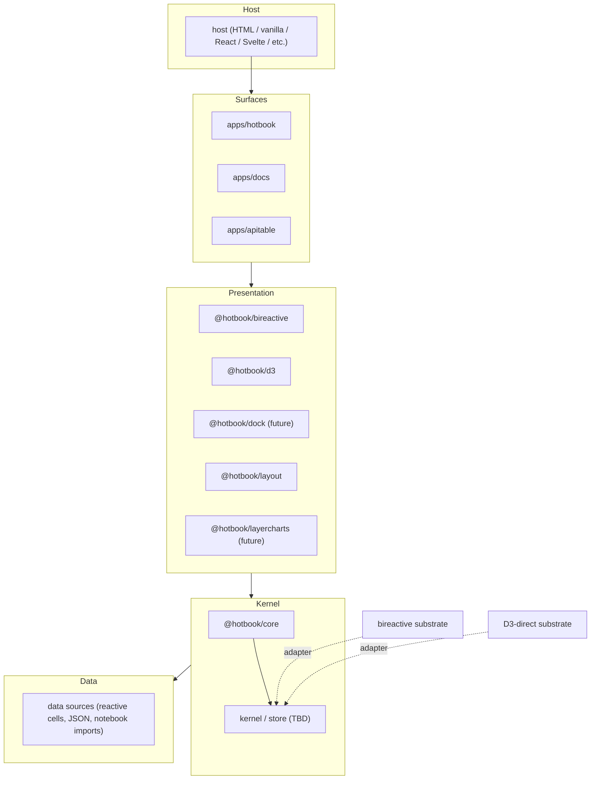
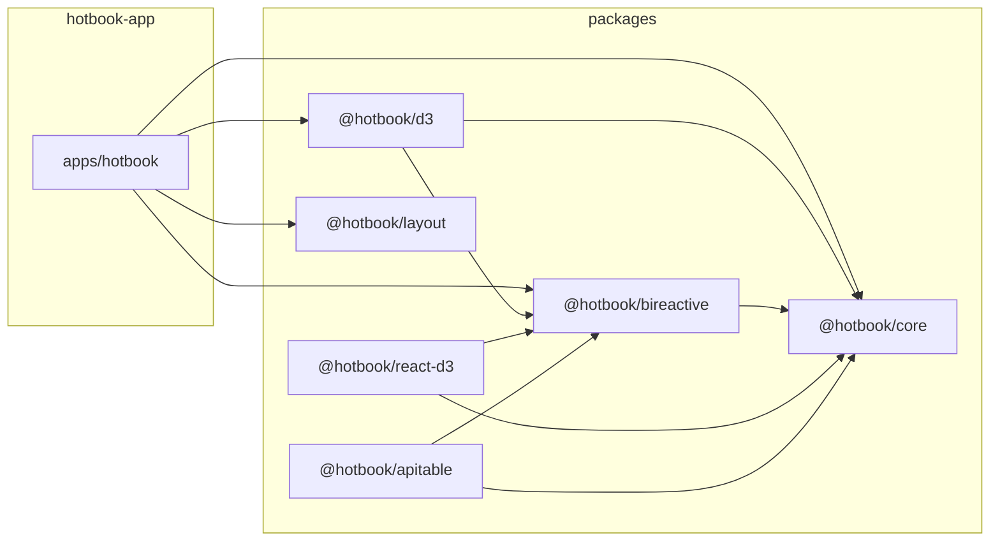
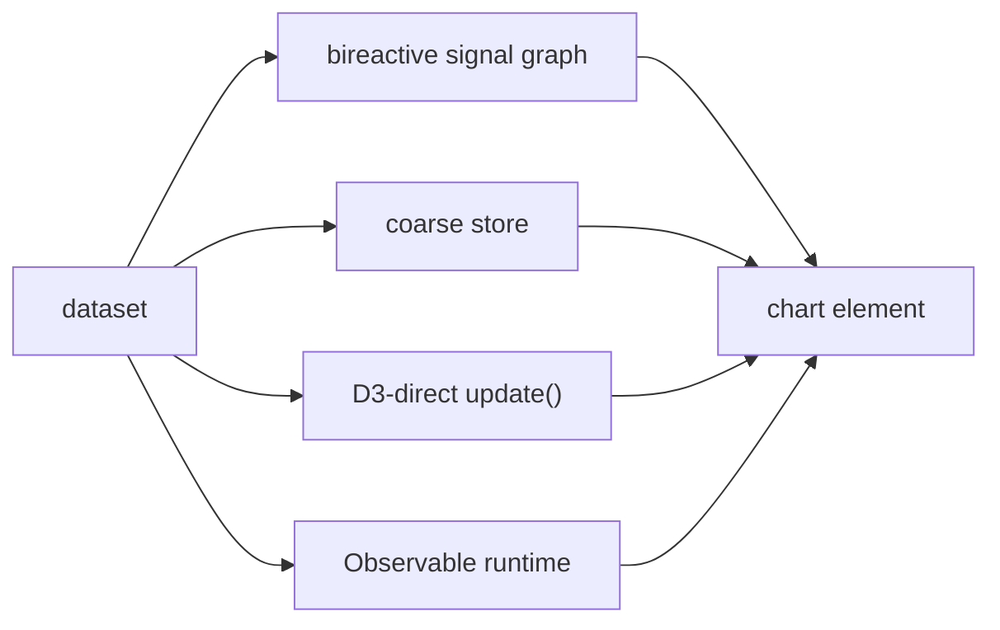
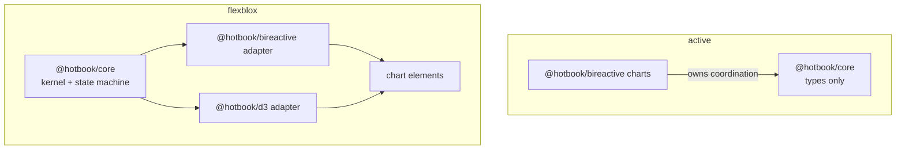
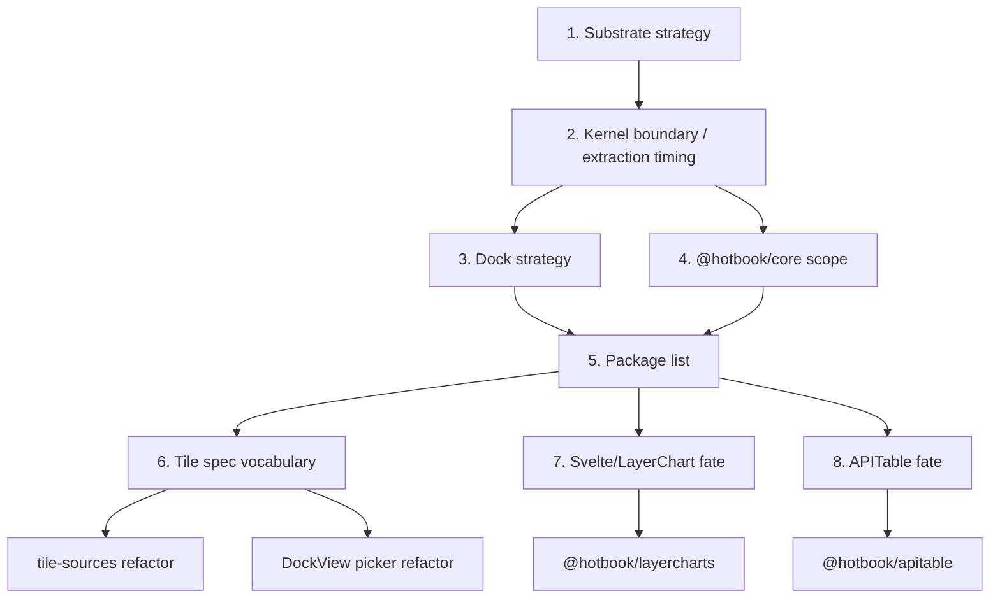
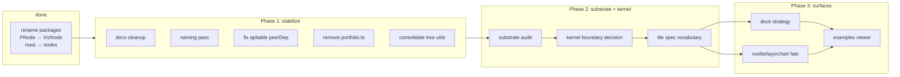

# reorg-whiteboard

Architecture whiteboard for the `hotbook` reorg. Outline / bullets / diagrams only. This is a living doc for iteration.

---

## 1. Target layers

Dependency rule: **down only**. Surfaces depend on presentation packages. Presentation packages depend on the kernel interface. Backends (bireactive, D3-direct) are injected by the host, not imported by presentation packages.

---

## 2. Current package graph

Notes:
- `@hotbook/d3` depends on `@hotbook/bireactive` because the tile-binder uses `bireactive` primitives.
- `@hotbook/react-d3` may be dead (zero consumers) — needs verification.

---

## 3. Substrate spectrum

| Substrate | Where today | What changes | Who diffs | Conservation | Notes |
|---|---|---|---|---|---|
| **Fine-grained signals** | `@hotbook/bireactive` | cell values | substrate (bireactive) | native multi-parent lens | best for multi-view sync |
| **Coarse whole-value** | `Workspace` store in `apps/hotbook` | whole dataset | consumer diffs | manual fallback | simple mental model |
| **D3-direct** | `@hotbook/d3` / gen-0 | explicit `update(data)` | D3 enter/update/exit | manual | no substrate sync bugs |
| **Framework-native** | Svelte layerchart spike | Svelte runes | framework | manual fallback | not portable |
| **Observable runtime** | (research only) | named cells | runtime | manual | conceptually adjacent, not a substrate adapter |

Open question: is `bireactive` the default, or do we support D3-direct as an equal path? Mixed is most likely.

---

## 4. Kernel boundary

Two competing frames:

### A. Active plan (`reorg-2026-07.md`)
- Keep coordination inside `@hotbook/bireactive` for now.
- Extract a named kernel package only when a second surface (e.g. graph layout, dock) needs the interface.
- Path: lift existing code, not greenfield.

### B. Flexblox / matchina frame
- Build `@hotbook/core` as a substrate-agnostic kernel with `Signal`/`Store` interfaces.
- Add `matchina` state machine for lifecycle.
- Wire `@hotbook/bireactive` and `@hotbook/d3` as kernel adapters.
- Path: design then conform.

Decision needed: which frame? Mix? A first, then B later?

---

## 5. Open decisions (blocking DAG)

### Top decisions

1. **Substrate strategy** — bireactive first? D3-direct equal? matchina as lifecycle backend? Mixed?
2. **Kernel boundary** — keep coordination in `@hotbook/bireactive` or extract to `@hotbook/core` now?
3. **Dock strategy** — adopt `dockview-core` or build fresh? Single-page or stacked pages?
4. **Core scope** — types/colors only, or state machine + edit primitives?
5. **Package list** — which `@hotbook/*` packages exist? Do we need `@hotbook/dock`, `@hotbook/ui`, `@hotbook/layercharts`, `@hotbook/observable-runtime`?
6. **Tile spec vocabulary** — `measureKey`/`sortBy`/`xKey`/`yKey` vs `xField`/`valueField`/`sortDir`?
7. **Svelte/LayerChart fate** — keep alias, promote to package, or remove?
8. **APITable fate** — keep or drop?
9. **Package scope** — `@hotbook/*` vs `@vizform/*` vs `@winstonfassett/*`?
10. **Test infrastructure** — Vitest for kernel/charts, Playwright for gestures? When?

---

## 6. Plan DAG (high-level)

This DAG is draft only. It depends on the substrate/kernel decision.

---

## 7. Notes / scratch

- `@hotbook/d3` currently depends on `@hotbook/bireactive` because the tile-binder uses `bireactive` primitives. If we want a pure D3-direct substrate, the tile-binder needs to be split or the dependency inverted.
- `apps/hotbook` has `persistence/` and `store/` — these are host-level, not kernel-level. The kernel should be ephemeral.
- `matchina` is a typed state-machine library. It is not installed yet. If we adopt it, it would be a backend adapter, not a hard dependency of `@hotbook/core`.
- The `bireactive` version in `package.json` is `^0.3.5` in root but `^0.3.4` in packages. Align.
