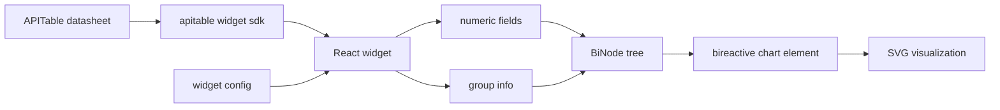

# @hotbook/apitable

APITable widget adapter that renders a datasheet view as a hotbook visualization. It supports flat modes (treemap, bands, pie, arc) and hierarchical modes (h-treemap, h-icicle, h-sunburst) based on the active view's grouping. It is currently stale and not actively maintained.

## Overview

The package is a single React widget that bridges the APITable SDK to `@hotbook/bireactive` chart components. It reads the datasheet, builds a `BiNode` tree, registers the appropriate `bireactive` custom element, and mounts it inside the widget.

## Architecture



- The widget reads the active view's records, fields, and group info from `@apitable/widget-sdk`.
- Numeric fields (Number, Currency, Percent, Rating) become the value measure.
- If the view has groups, the widget builds a hierarchical `BiNode` tree; otherwise it builds a single-level tree.
- The widget registers APITable-specific custom elements (`v-apitable-*`) backed by `MdBarChartLC`, `MdPieChartLC`, `MdTreemapLC`, etc., and mounts the element for the selected mode.
- `widget.config.json` defines the package id, host, and entry.

## How to use it

- Configure `widget.config.json` with the host, spaceId, and packageId.
- Run `npm run start` to develop locally with HMR.
- Run `npm run build` to release to APITable with `widget-cli release`.
- The first release to a new `packageId` must be run interactively; `--ci` does not bypass the prompt.

## Dependencies

- `react >=17` peer dependency (APITable widget SDK constraint).
- `@apitable/widget-sdk` and `@apitable/widget-cli`.
- `@hotbook/core` and `@hotbook/bireactive` from the workspace.

## Development

```sh
npm install
npm run start   # widget-cli start — dev server with HMR
npm run build   # widget-cli release — bundle and upload to APITable
```

For the full release recipe (token, spaceId, host, self-hosted vs. aitable.ai differences), see the root repo README.

## License

AGPL-3.0
