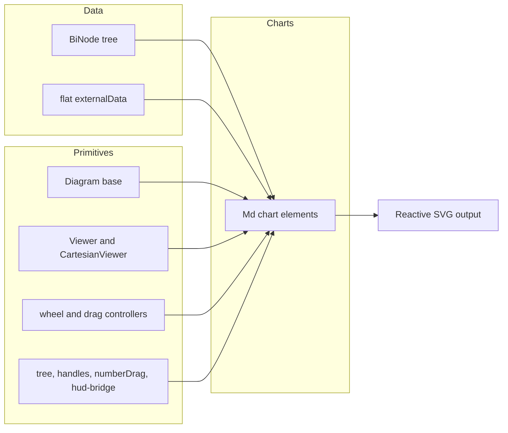

# @fiddleviz/bireactive

Fine-grained reactive chart and graph custom elements built on [bireactive](https://github.com/WinstonFassett/bireactive) and D3. Each chart is a framework-agnostic web component that renders to SVG, owns its own lifecycle, and updates incrementally when the data changes.

## Overview

This package exposes two layers:

1. **Ready-to-use chart components** — bar, line, area, scatter, pie, radar, treemap, icicle, sunburst, pack, sankey, gantt, gauge, treetable, tree, and more.
2. **Rendering primitives** — the `Diagram` base class, `Viewer`/`CartesianViewer` for pan/zoom/fit, gesture controllers, `group`/`leaf` tree helpers, handles, `numberDrag`, and chart metadata.

`CHART_METADATA` tracks each chart's maturity (`experimental`, `candidate`, `released`) so you know which surfaces are stable.

## Architecture



- **Charts** are standalone custom elements. Hierarchical charts consume a `BiNode` tree; flat charts consume `externalData`.
- **Diagram** is the base class: it provides the SVG, shadow root, viewBox, animation clock, and lifecycle hooks.
- **Viewer / CartesianViewer** are viewport objects for pan/zoom/fit. `Viewer` uses viewBox transforms; `CartesianViewer` owns D3 scales and axes for Cartesian charts.
- **Interaction primitives** (`wheelController`, `dragController`, `numberDrag`, `handles`, `hud-bridge`) are the building blocks for drag-to-edit, drag-to-reorder, pan/zoom, and cross-tile hover.
- **Tree helpers** (`group`, `leaf`, `leaves`) build reactive `BiNode` trees where group totals are derived lenses over children.

## How to use it

- Register a chart element and add it to the DOM. For hierarchical charts, build a `BiNode` tree with `group`/`leaf` and set it as `externalRoot`. For flat charts, set `externalData`.
- The chart renders itself and updates reactively when data or display properties change.
- Use `Viewer` for diagrams that need pan/zoom/fit without scale recomputation; use `CartesianViewer` for line/scatter/area/bars where axes and grids need to rescale.
- Extend `Diagram` and compose the interaction primitives when authoring a new chart.
- Check `CHART_METADATA` and `getChartMaturity` before depending on a chart marked `experimental`.

## Dependencies

- `bireactive` is a required peer dependency (`^0.3.4`). It must be installed by the consuming app so the custom element registry and reactive cell identity are shared.
- Uses D3 modules for scales, axes, shapes, hierarchy, and zoom.

## Development

```sh
npm install
npm run build   # vite build — dist/fiddleviz-charts.js, .umd.cjs, index.d.ts
npm run watch   # vite build --watch
```

The published package only ships `dist/`.

## License

MIT
