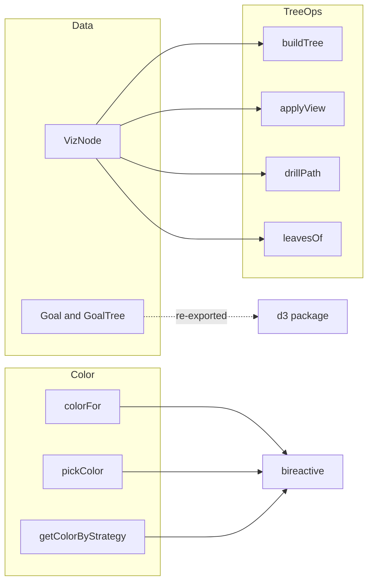

# @fiddleviz/core

Shared data model, types, color palette, and tree operations for the fiddleviz visualization packages. This is a source-only, runtime-light package that `@fiddleviz/d3`, `@fiddleviz/bireactive`, and `@fiddleviz/apitable` build on.

## Overview

The package defines three things:

1. **Domain types** — the shape of data that flows through charts, including `VizNode`, `Goal`, `GoalTree`, `ViewMode`, `FlatMode`, `HierMode`, and view schemas.
2. **Color system** — palettes and strategies for assigning stable, distinguishable colors.
3. **Tree operations** — converting flat rows into hierarchical structures, grouping rows, walking drill paths, and finding leaves.

## Architecture



- `VizNode` is the generic tabular row: `id`, `parentId`, `name`, `measures`, `dims`, and optional color. `Goal` and `GoalTree` are the older D3-specific datatypes.
- `colorFor` returns a stable color from an identity string; `pickColor` returns a palette color by index; `getColorByStrategy` selects by index, value, identity, or a single fixed color.
- `buildTree` turns a flat `VizNode` array into a `d3-hierarchy` tree rooted at `__root__`. `applyView` inserts virtual group parents for a `groupBy` dimension. `drillPath` walks a parent chain for breadcrumbs. `leavesOf` returns all leaf nodes.

## How to use it

- Model flat data as `VizNode` records and hierarchical data as `GoalTree`.
- Use `colorFor` when you want the same identity to always get the same color; use `getColorByStrategy` when the color should depend on a value or index.
- Use `buildTree` before handing data to `d3-hierarchy`; use `applyView` when the user groups by a dimension; use `drillPath` to render breadcrumbs; use `leavesOf` to get terminal nodes.
- This package has no runtime output; import the types and functions directly from `@fiddleviz/core`.

## Development

This package has no build script. TypeScript is configured with `noEmit` and `allowImportingTsExtensions`.

```sh
npm install
npx tsc -p packages/core/tsconfig.json  # type-check only
```

## License

MIT
