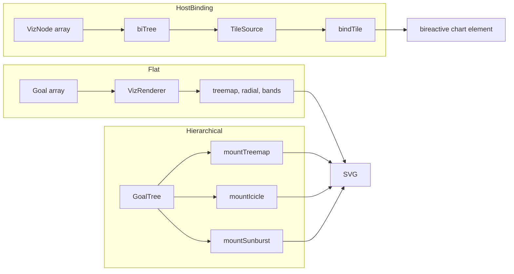

# @hotbook/d3

Pure D3 + TypeScript rendering engine for proportional and hierarchical visualizations. It has no framework dependencies and renders to SVG inside a container. It is used directly by `@hotbook/bireactive` and the host apps for lower-level rendering and reactive tile binding.

## Overview

The package is split into three rendering surfaces:

1. **Flat visualizations** (`VizRenderer`) — treemap, radial, and bands from a `Goal` array.
2. **Hierarchical visualizations** (`mountTreemap`, `mountIcicle`, `mountSunburst`) — from a `GoalTree`.
3. **Reactive host glue** (`tile-binder`, `biTree`) — connecting a reactive store to a `bireactive` custom chart element.

## Architecture



- **Flat rendering** uses `VizRenderer` to compute geometry and morph shapes between the three modes. It supports drag-to-edit and drag-to-reorder.
- **Hierarchical rendering** uses `d3-hierarchy` to compute layout and returns a mounted object with `destroy()`.
- **Host binding** converts `VizNode` arrays into `bireactive` `BiNode` trees with `biTree`, wraps them in a `TileSource`, and then `bindTile` mounts the `bireactive` element and wires hover/select/edit back to the store.
- `colors.ts` and `types.ts` re-export the shared palette and domain types from `@hotbook/core`.

## How to use it

- For flat data, create a `VizRenderer` with a `Goal` array and a `FlatMode` (`treemap`, `radial`, `bands`).
- For hierarchical data, call `mountTreemap`, `mountIcicle`, or `mountSunburst` with a `GoalTree`.
- For reactive dashboards, build a `TileSource` and use `bindTile` to keep a `bireactive` chart element in sync with your store.
- Use `biLeaf`/`biGroup`/`buildBiTree` when you want a reactive `BiNode` tree from a flat `VizNode` array.

## Development

```sh
npm install
npm run build      # vite build — dist/hotbook-d3.js, .umd.cjs, index.d.ts
npm run watch      # vite build --watch
npm run test       # vitest run
npm run test:watch # vitest
```

The published package only ships `dist/`.

## License

MIT
