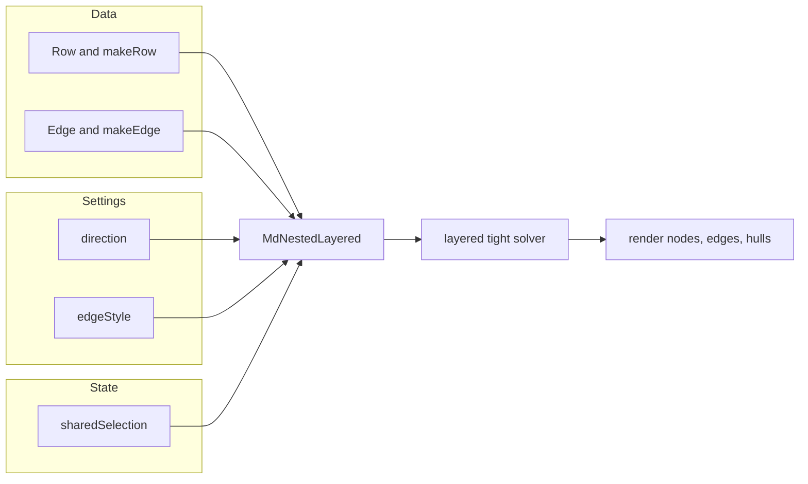

# @hotbook/layout

Bireactive 2D graph layout primitives for nested, layered diagrams such as state machines and flow charts. It is experimental and used by the `demos` app.

## Overview

The package provides a single layout component, `MdNestedLayered`, and a small data model for describing compound graphs: nodes with containment (`Row`), edges between nodes (`Edge`), and shared cells for layout direction, edge style, and selection.

## Architecture



- `Row` is a tabular node with a writable `parentId`, `index`, and `name`. A row with children is a group; a leaf has no children.
- `Edge` is a connection between two node IDs, independent of containment.
- `MdNestedLayered` recursively solves the layout: each group runs its own layered solve, treating child groups as opaque rectangles sized by their inner extent.
- `direction` and `edgeStyle` are shared `bireactive` cells, so toolbars and side panels can drive the layout without props.
- `sharedSelection` is a shared cell for the currently selected node, group, or edge.

## How to use it

- Create `Row` records for nodes and `Edge` records for connections. Set `parentId` to build nested groups.
- Mount `MdNestedLayered` and feed it the rows and edges.
- Control `direction` (`TB` / `LR`) and `edgeStyle` (`straight` / `curved` / `elbow`) via the shared cells.
- Read/write `sharedSelection` to highlight or select elements from a toolbar or inspector.

## Development

This package has no build scripts. TypeScript is compiled in-place by the workspace tooling.

```sh
npm install
npx tsc -p packages/layout/tsconfig.json
```

## License

MIT
