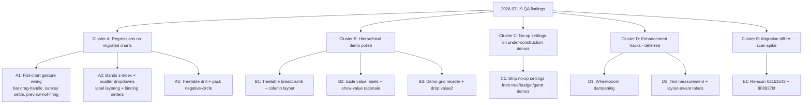

# Post-migration QA — regression clusters & work plan

**Branch:** `feat/gesture-transition-contract`
**QA session:** 2026-07-19 (dictated), after commits `621b1b42` (migrate all flat charts off `Diagram` → `CartesianChartBase` / `RadialChartBase`) and `908827bf` (bugfixes).
**Scope:** vizform only. WIN-350 (the migration) is `done`; this is the regression sweep after trusting agents to build out the migration.

The goal of this doc is **grouping, not atomizing**. We cluster the QA findings into work areas that can be handed to one agent thread each, so we can move in parallel without agents stepping on each other. Tickets get filed per cluster once you sign off on the shape.

---

## TL;DR

- **7 regressions** concentrated on the migrated flat charts (bar, bands, scatter, sankey) and the migrated hierarchical treetable. Most are already root-caused in code — see Cluster A.
- **3 hierarchical-demo cleanups** (treetable drill/breadcrumb/columns; icicle value labels; demo grid reorder + drop `value2`) — Cluster B.
- **3 settings-cleanup demos** (tree-chart, budget-tree, gantt expose no-op settings) — Cluster C, trivial.
- **2 enhancements** (wheel-zoom dampening; text-measurement + layout-aware labels) — Cluster D, deferred tracks.
- **1 spike** (re-scan the agent-built migration diff for unsurfaced regressions) — Cluster E.

Recommended parallelization: **3 sub-agents** to start, on Clusters A1, A2, A3 below. They touch disjoint files. Defer B/C/D/E until A is green.

---

## Cluster map

---

## Cluster A — Regressions on migrated charts (blockers)

All of these worked yesterday afternoon before the migration commits. All are root-caused below except the pack negative-circle (needs repro).

### A1 — Flat-chart gesture wiring

**Symptoms (from QA):**
1. **Bar chart: drag-handle and drag-reorder stopped working.** The handle is still rendered visually (hover the bar end → circle appears), but pointer-drag on it does nothing. Sort by order/value, orientation, and wheel-zoom still work.
2. **Sankey: weird settle lag while dragging nodes.** Lanes update in real time, but there's a settle tween lagging behind — feels like the old settle transitions snuck back in. We had agreed settle only fires on autonomous post-commit/updated, never during a live gesture (interaction-principles #8, transitions-decision.md "gesture suppression contract").
3. **Charts don't re-render during drag preview — only on release.** Winston's hunch: treetable isn't publishing preview events. Affects most charts, not just one.

**Root cause (bar):** `packages/bireactive/src/charts/bar-chart.ts:527-536` — `_composeBehaviors()` declares `const dragBehaviors: any[] = []` (empty) and never pushes anything into it. The migration TODO comment says "drag-resize and reorder behaviors will be added as custom cartesian behaviors" — the agent never landed them. The handle is rendered at lines 471-490 but has no pointer-drag listener wired to a behavior. Also: bar-chart.ts is **not** in the list of files using `GESTURE_ACTIVE_CLASS` / `setGestureActive` (grep confirmed), so even if drag were wired, gesture-suppression CSS wouldn't fire.

**Root cause (sankey settle):** `packages/bireactive/src/lib/sankey.ts:281-321` — the sort-change tween runs `host.anim.start(tween(entry.offsetCell, 0, motion.motionMs.value / 1000, easeOut))` on every sort change, gated on `!host.classList.contains(GESTURE_ACTIVE_CLASS)`. But the per-node drag itself (lines 764, 850) doesn't toggle `GESTURE_ACTIVE_CLASS` on the host during the drag — only the sort-change path checks it. So a live node-drag isn't suppressing the sort-settle tween, and the lanes chase the tween. Need to wire `setGestureActive(true)` in the drag `snapshot` and `false` in `onEnd` for both source-grip and target-grip drag configs.

**Root cause (preview not firing):** Needs confirmation. Treetable's `numberDrag` wiring (`treetable-chart.ts:271-292`) calls `this._dataView?.draft(...)` only in `onStart` — there is no `onUpdate`/`onMove` publishing intermediate draft values. The `numberDrag` `set` callback writes `measureValue.value = v` directly (line 273), which mutates the BiNode measure cell, but doesn't push a draft event for cross-view subscribers. So charts subscribed to the kernel's draft stream see nothing until `onEnd` → `commit()`. Fix: add an `onUpdate` (or hook into `set`) that calls `this._dataView?.draft({ nodeId, value: v, source: "table-cell", intent: "edit" })` on each move. Confirm against `data-view.ts` draft semantics first — may need a `preview` flag.

**Files touched:**
- `packages/bireactive/src/charts/bar-chart.ts` — wire drag-handle + drag-reorder behaviors, add `setGestureActive` calls, add `GESTURE_SUPPRESSION_CSS` to styles.
- `packages/bireactive/src/lib/sankey.ts` — add `setGestureActive` to source-grip and target-grip drag configs (lines ~764, ~850).
- `packages/bireactive/src/hierarchical/treetable-chart.ts` — publish draft on each `numberDrag` move, not just on start.
- Possibly `packages/bireactive/src/lib/data-view.ts` — confirm draft API supports live preview updates.

**Verification:** bar drag-handle works (drag bar end → value changes live, siblings frozen); bar drag-reorder works (drag bar body → slides horizontally, no value change, commits on release); sankey node drag has no settle lag (lanes snap to pointer, settle fires only on release); treetable cell drag updates all subscribed charts live (icicle/sunburst/treemap/pack render the draft value during the gesture, not on release).

**Open question for the engineer (me):** Is there a shared `cartesianDragBehavior` / `cartesianReorderBehavior` that bar should compose, or do we hand-roll it like the old `Diagram`-based bar did? Check `packages/bireactive/src/lib/cartesian-gestures.ts` and `reorder-gesture.ts` before deciding.

### A2 — Bands z-index + scatter dropdowns

**Symptoms:**
1. **Bands: text and value labels not showing.** Z-index issue — when switching measure to `value2`, you can see the labels appear during the transition and then get covered. So the labels render but end up under the mark layer.
2. **Scatter: x-axis and y-axis dropdowns do nothing.** Changing them has no effect.

**Root cause (scatter):** `packages/bireactive/src/charts/scatter-chart.ts:54-65` — the `xBinding` / `yBinding` setters store the name in `_xBindingName` / `_yBindingName` but always assign `(d) => d.x` / `(d) => d.y` to the binding cell, regardless of `v`. So the dropdown updates the name string but the actual accessor never changes. Fix: map the name to the correct accessor — likely `(d) => d.measures?.[v] ?? d[v]` or a schema-driven lookup. Check how other charts resolve `measureKey` → accessor (e.g. `data-models.ts:93-111` does `valueBinding: measureKey`).

**Root cause (bands):** Bands is `MdBandsChartLC extends MdBarChartLC` with `orientation: 'horizontal'`, `colorMode: 'palette'`, `labelMode: 'inside'`, `valueMode: 'inside'` (`apps/demos/src/main.ts:33-35`). The label z-index issue is in `bar-chart.ts`'s label rendering — when `labelMode: 'inside'` and `valueMode: 'inside'`, both the name label and value label are rendered into the same layer as the bar rects, but the rect paint order covers them. Needs inspection of the label append order in `bar-chart.ts` (likely lines ~380-470 where labels are drawn). Fix: either append labels after rects in the same `<g>`, or move labels to a dedicated top `<g>` with higher z. The "labels appear during transition then get covered" symptom strongly suggests paint order, not CSS z-index — SVG paints in document order.

**Files touched:**
- `packages/bireactive/src/charts/scatter-chart.ts` — fix xBinding/yBinding setters to resolve name → accessor.
- `packages/bireactive/src/charts/bar-chart.ts` — fix label paint order for inside-label mode (affects both bar and bands).

**Verification:** scatter x/y dropdowns re-render the chart with the selected measure on change; bands shows both name and value labels persistently (not just during transitions).

**Open question for the engineer (me):** Should the scatter accessor lookup go through the chart schema (`getChartSchema`) like `data-models.ts` does, or read from `d.measures[v]` directly? Schema-driven is more consistent but adds a lookup dependency.

### A3 — Treetable drill-into-collapsed + pack negative-circle

**Symptoms:**
1. **Treetable: double-click into a collapsed node → empty.** Drill into "health" when collapsed → table shows nothing. Drill into "health" when expanded → shows children. Pop out works (via drill channel), but there's no in-chart breadcrumb to pop up.
2. **Pack: "negative value is not valid in an SVG circle element" logged 5× on icicle drill → pop back to portfolio.** Repro: load page → drill into insurance (2 levels down) in icicle → pop back to portfolio → console shows 5 circle-negative errors. Pack has 4 top-level circles; the 5th is unclear (maybe the root disc or a handle).

**Root cause (treetable):** `packages/bireactive/src/hierarchical/treetable-chart.ts:55-80` — `flattenRows` walks from `effectiveRoot = findNode(root, drillId)`. At `walk(effectiveRoot, 0)` it skips the effective root (`if (depth > 0)`). Then for children: `if (hasKids && !collapsed.has(node.id) && withinDepth)` — but this checks `collapsed.has(node.id)` on the **parent** (the drilled node), not the child. If the drilled node is in the collapsed set, its children never render. Fix: when `drillId` is set, treat the drilled node as expanded regardless of `_collapsedCell` — either skip the collapsed check for the effective root, or remove the drilled id from the collapsed set on drill.

**Root cause (pack negative-circle):** Needs repro. `pack-geometry.ts:137` clamps `r = Math.max(0, lr.value.r)`, so the disc itself can't go negative. The error likely comes from a different `<circle>` — candidates: (a) the focus/hover stroke-width scaling producing a negative `r` somewhere, (b) a handle circle on a pack node, (c) sunburst center disc, (d) a gauge/concentric-arc circle reacting to a cross-view sync event from the icicle drill. The "5× on pop back to portfolio" pattern is the clue — count what subscribes to the icicle drill channel and renders a circle. Could also be a stale layout entry for a node that no longer exists in the map after pop.

**Files touched:**
- `packages/bireactive/src/hierarchical/treetable-chart.ts` — treat drilled node as expanded.
- `packages/bireactive/src/hierarchical/pack-chart.ts` or `pack-geometry.ts` — TBD pending repro.

**Verification:** treetable drill into collapsed node shows children; no negative-circle errors in console after icicle drill → pop out.

**Open question for the engineer (me):** On the pack error — should I repro in the browser first (webdev-mcp / agent-browser) to capture the exact stack, or is a code-only trace enough? The error is a console warning, not a throw, so the stack may not point at the call site. Browser repro is safer.

---

## Cluster B — Hierarchical demo polish (medium)

### B1 — Treetable: breadcrumb + column layout

**Symptoms:**
1. No way to pop up out of treetable after drilling in. Need a breadcrumb.
2. Column layout is poor — value columns take too much space, name column is squeezed. Removing `value2` helps a lot, but the name column should carry more weight on its own.

**Approach:**
- Breadcrumb: check if the shared hierarchical breadcrumb component (used by icicle/sunburst/treemap/pack via `showBreadcrumb`) is reusable on the HTML treetable surface. WIN-353 already flags treetable as architecturally different (HTML vs SVG). If reusable, wire it; if not, build a thin HTML breadcrumb that reads the same `_drillId` + drill channel.
- Column layout: defer the text-measurement-driven auto-sizing to Cluster D2. For now, hardcode a saner column width ratio (e.g. name = `1fr`, each value = `min-content` or a fixed `80px`) so the name column always has room. The real fix is layout-aware (D2).

**Files touched:**
- `packages/bireactive/src/hierarchical/treetable-chart.ts` — breadcrumb wiring + column width.
- Possibly `packages/bireactive/src/hierarchical/breadcrumb.ts` (or wherever the shared breadcrumb lives) — confirm reusability.

**Verification:** drill into treetable → breadcrumb appears at top → click a crumb → pops to that level. Name column is always visible and readable.

### B2 — Icicle value labels + show-value rationale

**Symptom:** Icicle in the hierarchical family demo is not showing values. Tree table is inconsistent — "BRK" has room for a value but doesn't show one. The rationale for when to show a value isn't clear across charts.

**Approach:** Audit the value-label visibility threshold logic across icicle, treemap, pack, sunburst, treetable. Standardize: a node shows its value when (a) it has enough rendered room (width × height above a threshold) AND (b) it's a leaf or a configured "show values at depth N" rule. This ties into D2 (text measurement) — without measurement we can only use geometric area as a proxy. For now, fix the icicle regression (values not showing at all) and document the threshold rule.

**Files touched:** `packages/bireactive/src/hierarchical/icicle-chart.ts` + the value-label rendering path.

**Verification:** icicle shows values on tiles that have room; threshold rule is consistent across the 4 hierarchical SVG charts (or documented differences).

### B3 — Demo grid reorder + drop value2

**Symptoms:**
1. Move treemap above icicle in the hierarchical family demo, so treemap is next to pack and icicle is next to sunburst (radial).
2. Drop `value2` from the hierarchical family demo — it has no business being there.

**Files touched:** `apps/demos/src/main.ts:253-307` (the `mountHierFamily` function) + the data model for the icicle demo.

**Verification:** demo grid is in the new order; no `value2` column in the hierarchical family treetable or measure dropdown.

---

## Cluster C — No-op settings on under-construction demos (trivial)

**Symptoms:**
1. **Tree-chart:** root, breadcrumb, measure settings shown but do nothing. Tree doesn't have a meaningful "measure" (it's a dendrogram).
2. **Budget-tree:** measure, sort, depth, breadcrumb all no-op.
3. **Gantt:** measure start/end is nonsensical (changing it back doesn't revert).

**Approach:** These are all `underConstruction: true` demos. Strip the settings that don't apply. The settings UI is driven by the chart schema (`getChartSchema`) — either remove the no-op fields from the schema, or filter them in the controls panel. Simplest: filter in `apps/demos/src/layout/controls.ts` based on a per-demo allowlist.

**Files touched:** `apps/demos/src/layout/controls.ts` + possibly the schema definitions in `@hotbook/core`.

**Verification:** tree-chart shows no settings (or only applicable ones); budget-tree shows no settings; gantt shows no measure setting.

---

## Cluster D — Enhancement tracks (deferred)

### D1 — Wheel-zoom dampening

**Symptom:** Wheel-zoom on bar/bands is too hot / volatile — feels unsafe at the chart scale. On line/area it's modest (feels like scrolling the page). Need chart- and scale-aware dampening.

**Approach:** `packages/bireactive/src/lib/gestures.ts` `wheelController` + `dynamicWheelStep` — the step size is currently chart-agnostic. Make it scale-aware: step = f(chart domain range, mark count, viewport size). Bar has few marks over a large range → small step; line has many marks → larger step. Defer until A is done; it's a feel refinement, not a regression.

### D2 — Text measurement + layout-aware labels

**Symptom:** Icicle shows no value despite having room; BRK has room but no value; treemap labels overflow their tiles. We need text measurement to make layout aware of label dimensions.

**Approach:** New ticket. Use canvas `measureText` (fast, sync) to measure label widths, expose a `measureText(text, font)` util, and have charts use measured width to decide: (a) whether to show a label at all, (b) whether to truncate, (c) column auto-sizing in treetable. This is the parent for B2's threshold rule and B1's column layout. Defer until B is shaped.

---

## Cluster E — Spike: re-scan migration diff

**Goal:** Re-scan commits `621b1b42` and `908827bf` for other regressions not surfaced in today's QA. Winston explicitly noted: "we may want to do just do a review on that stuff" — the agent-built migration commits.

**Approach:** One read-only sub-agent. Diff `621b1b42^..908827bf`, walk every chart file that changed, compare gesture wiring / CSS injection / shadow DOM assumptions / `setGestureActive` calls against the pre-migration `Diagram`-based versions. Report findings as a list, not fixes.

**Defer until A is done** — the spike is more useful once the known regressions are fixed, so it can focus on what's left.

---

## Recommended execution

**Approved decisions (2026-07-19 review):**
- B3 (demo reorder + drop value2) — **do inline now**, trivial.
- C (strip no-op settings) — **do inline now**, strip the settings.
- D1 (wheel dampening) — **follow-up**, deferred.
- E (spike) — **yes, run it**, but not assigned initially. I run it myself later, not a sub-agent.
- Ticketing — **spike on this plan first; ticket only what we don't get to.**

**Engineer questions resolved (code-confirmed):**
1. **Bar drag behavior:** there IS a shared `attachCartesianGestures` in `packages/bireactive/src/lib/cartesian-gestures.ts` — used by scatter, area, gantt, line. Bar doesn't use it (migration gap). Bar should compose it. For reorder, check `packages/bireactive/src/lib/reorder-gesture.ts`.
2. **Scatter accessor:** match the `data-models.ts` pattern — `valueBinding: measureKey` resolved via the chart schema, or read `d.measures[v]` directly. Sub-agent decides based on what other charts do.
3. **Treetable draft publishing:** confirmed — `data-view.ts` has `draft()` (first event) AND `updateDraft()` (subsequent moves). Treetable only calls `draft()` on `onStart`, never calls `updateDraft()` on move. Fix: add an `onUpdate`-equivalent to `numberDrag` that calls `this._dataView?.updateDraft(...)` per move. The `numberDrag` opts currently have `onStart` / `onEnd` but no `onMove` — need to add one, or hook into `set`.
4. **Pack negative-circle:** sub-agent does browser repro first (webdev-mcp), then fix.
5. **Label paint order (bands):** sub-agent confirms by reading `bar-chart.ts` label append path.

**Now (3 parallel sub-agents, disjoint files — clean split):**
- **Agent A1** — `bar-chart.ts` (compose `attachCartesianGestures` for drag-handle + drag-reorder, add `setGestureActive` calls, add `GESTURE_SUPPRESSION_CSS`, fix label paint order for bands' inside-label mode) + `sankey.ts` (add `setGestureActive` to source-grip and target-grip drag configs) + `scatter-chart.ts` (fix xBinding/yBinding setters to resolve name → accessor). All flat-chart regressions in one thread.
- **Agent A2** — `treetable-chart.ts` (drill-collapsed fix: treat drilled node as expanded; draft-publishing fix: call `updateDraft()` on each `numberDrag` move, not just `draft()` on start) + `lib/number-drag.ts` (add `onMove` callback to `NumberDragOpts`) if needed. All treetable regressions in one thread.
- **Agent A3** — pack negative-circle: browser repro first (webdev-mcp) to capture the exact stack and the 5 offending `<circle>` elements, then fix at the source (likely `pack-chart.ts` / `pack-geometry.ts` / a handle or stroke-width scaling path, since `pack-geometry.ts:137` already clamps `r`).

**Inline (me, while sub-agents run):**
- **B3** — `apps/demos/src/main.ts:253-307` `mountHierFamily`: reorder grid (treemap↔icicle swap so treemap is next to pack, icicle next to sunburst), drop `value2` from the hierarchical family demo (data model + treetable column).
- **C** — `apps/demos/src/layout/controls.ts`: strip no-op settings from tree-chart, budget-tree, gantt demos (root/breadcrumb/measure on tree; measure/sort/depth/breadcrumb on budget-tree; measure start/end on gantt).

**After A is green:**
- B1, B2 in parallel (disjoint files).
- D1, D2, E are deferred — I run E myself when A/B/C are done; D1/D2 get ticketed if not reached.

---

## Open questions

### For the product lead (Winston) — resolved 2026-07-19
1. ~~Cluster B vs A sequencing~~ — B3 done inline now; B1/B2 after A.
2. ~~Cluster C~~ — strip the settings.
3. ~~Cluster D1~~ — follow-up, deferred.
4. ~~Spike (E)~~ — yes, run it; not assigned initially; I run it myself.
5. ~~Ticketing~~ — spike on this plan first; ticket only what we don't get to.

### For the engineer (me) — resolved 2026-07-19 by code inspection
1. ~~Bar drag behavior~~ — use shared `attachCartesianGestures` (cartesian-gestures.ts); compose `reorder-gesture.ts` for reorder.
2. ~~Scatter accessor~~ — sub-agent matches `data-models.ts` pattern.
3. ~~Treetable draft publishing~~ — `data-view.ts` has `draft()` + `updateDraft()`; treetable only calls `draft()` on start; fix: call `updateDraft()` per move (add `onMove` to `number-drag.ts` `NumberDragOpts`).
4. ~~Pack negative-circle~~ — browser repro first.
5. ~~Label paint order~~ — sub-agent confirms via `bar-chart.ts` label append path.

---

## Next steps

1. ~~You review this doc in plannotator~~ — done, approved with revisions.
2. ~~I resolve the engineer questions~~ — done.
3. I kick off 3 parallel sub-agents on A1, A2, A3 with the clean file split.
4. Inline: I do B3 (demo reorder + drop value2) and C (strip no-op settings) while the sub-agents run.
5. As A agents complete, I verify in the browser (webdev-mcp) and report back.
6. Once A is green, do B1/B2, then E (spike, myself). Ticket whatever remains.
