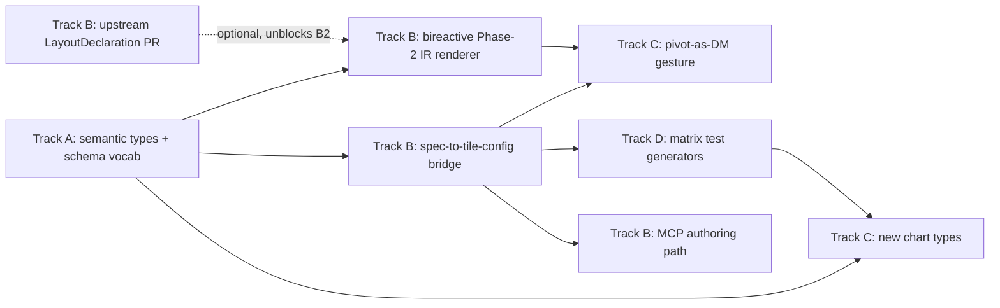

# Flint-chart intake — roadmap

> Status: discussion draft, not a commitment plan. Grouped catalog of ideas
> surfaced by the flint-chart intake (reports 01–06 in `/tmp/win-317/`, this
> repo's `inspo/flint-chart` checkout, and the steel-thread spike). Feeds
> prioritization on the intake ticket — nothing here is scheduled.

## 1. Framing

- We're not adopting flint. Flint is a **compile layer** (spec → static native
  chart config); vizform/bireactive is a **live surface** (reactive cells,
  direct manipulation, tween/transition). They solve different problems and
  compose rather than compete — flint could sit *upstream* of a bireactive
  tile (spec in, live chart out), it can't replace it.
- Optimizing for one steel thread end to end: a chart spec (agent-authored or
  hand-written) → a live, direct-manipulable bireactive chart, with no manual
  glue code in between. Flint's Phase 0/1 (semantic resolution, layout budget)
  is the best candidate for the "spec →" half; bireactive is already the
  "→ live chart" half.
- Slick transitions and shared reactivity are the parts flint explicitly does
  not have (it emits static specs; "chart-type switching" is host-UI
  re-assembly, not animation) and the parts vizform already owns
  (`wiki/transitions-decision.md`, `wiki/interaction-principles.md`). Any flint
  adoption must not regress that — we're not importing flint's non-interactivity.
- Agent-authorable charts is a real, validated need: flint's semantic-type
  vocabulary + MCP tools (`flint_validate_chart`, `flint_get_schema`) are
  built *for* LLM authors, and are more mature than anything vizform has today
  for that path (WIN-258's `ChartSchema` is chart-config-shaped, not
  encoding/channel-shaped).
- This work sits net-new alongside WIN-258 (chart schema/config), not against
  it — Track A explicitly proposes folding flint vocabulary into the WIN-258
  schema design rather than starting a parallel schema system.

## 2. Catalog

Verdict key: **Steal** = copy the idea, not the code. **Adopt** = take the
flint package/output as a dependency. **Build** = net-new vizform work,
flint-inspired. **Watch** = interesting, not actionable yet.

### Track A — Language & schema

| Item | What | Why | Size | Deps | Verdict |
|---|---|---|---|---|---|
| Semantic types into `ColumnSchema` | Add flint's `t0/t1/aggRole/formatClass/zeroBaseline` dimensions (or a trimmed subset) to `@hotbook/core`'s column/field metadata | Gives every chart consistent aggregation defaults, formatting, and zero-baseline decisions instead of per-chart hardcoding; this is flint's actual load-bearing IP | M | none | Steal |
| Channel/encoding vocabulary → WIN-258 schema | Fold flint's `{field, type: Q/O/N/T, aggregate, sortOrder, scheme}` encoding shape into WIN-258's `config`/`data` schema primitives, so a chart's schema can express "x is temporal, y is quantitative-additive" instead of ad hoc keys | Encoding vocabulary is exactly the missing piece WIN-258 flagged (§4.5 "runtime-resolved enums") — reuse a proven vocabulary instead of inventing one | M | WIN-258 stage 1–2 | Steal |
| Zero-baseline + format-class decisions | Port `computeZeroDecision()`-equivalent logic (additive vs intensive vs signed-additive → zero: true/false/contextual) and `formatClass` → d3-format mapping | Currently ad hoc per chart in bireactive; flint's 3-way zero taxonomy is more correct than a boolean | S | semantic types above | Steal |
| Truncation warnings | Adopt flint's `ChartWarning[]` / cardinality-truncation pattern ("60 categories truncated to 30") as a first-class output of any vizform data-binding step | Vizform has no equivalent surfaced-to-UI overflow signal today; cheap, well-isolated pattern | S | none | Steal |

### Track B — Flint as authoring front-end

| Item | What | Why | Size | Deps | Verdict |
|---|---|---|---|---|---|
| Bireactive backend consumes flint IR | New Phase 2: a bireactive-native `instantiate` step that takes flint's `ChannelSemantics` + `LayoutResult` and produces bireactive bindings/scales instead of a VL/EC/CJS spec | This is the steel thread. Spike (06) confirms Phase 0/1 output is genuinely backend-neutral and sufficient for a from-scratch renderer — the real work is Phase 2 (axis/mark/legend placement), estimated 2–8k LOC by the backends report | L | Track A (semantic types alignment), flint's `declareLayoutMode` gap (see below) | Build |
| Compile flint spec → vizform tile config | Alternative/complementary path: instead of consuming flint's internal IR, compile a flint `ChartAssemblyInput` directly to a vizform tile's `{kind, config}` (WIN-258 shape) — a shallower, spec-level bridge rather than a Phase-2 renderer | Faster to ship, no Phase 2 work; loses flint's layout-budget precision (steps, facet grid) since it re-lays-out inside bireactive anyway | M | WIN-258 config schema | Build |
| MCP/agent authoring path piggybacking flint-chart-mcp | Reuse `flint-mcp`'s tool contract (`compile`, `validate`, `render`, `list`) as the shape for a vizform-equivalent MCP surface, or literally proxy flint-mcp for chart-type/channel recommendation before handing off to whichever Track B bridge exists | Flint's MCP tools are the most mature "agent authors a chart" UX we've seen (validate before compile, schema fetch instead of memorization) — don't reinvent this contract | M | one of the two rows above | Steal |
| Upstream a chart-type-keyed `LayoutDeclaration` registry to flint | File/PR against flint: promote `declareLayoutMode` from per-backend `ChartTemplateDef` to a core, chart-type-keyed registry, so a 4th backend doesn't have to import VL/EC/CJS just to bootstrap layout declarations | This is the one concrete architectural gap the spike hit (06, "Friction"); flint issue #45 (NTChart backend exploration) shows upstream is receptive to backend-shaped contributions | S | none (pure upstream PR) | Steal (contribute upstream) |

### Track C — New charts & transition inspo

| Item | What | Why | Size | Deps | Verdict |
|---|---|---|---|---|---|
| Chart-type gap fill | Add chart types vizform lacks that flint/ECharts have: waterfall, bump, slope, candlestick, violin, streamgraph, ranged dot, connected scatter, ECDF | Flint's ~30-type catalog (01 §6) is a checklist of "obviously missing" chart types; each is its own bireactive Phase-2-equivalent build | L (per type: S–M) | bireactive shape primitives (mostly sufficient already) | Build |
| ECharts-style morphing between chart types | Study ECharts' `universalTransition`/morph patterns and Observable Plot's keyed object constancy for chart-type-to-chart-type transitions (not just orientation flip) | Vizform already does radial↔bands↔treemap morphs (`interaction-principles.md` Rule 13 audit); this generalizes the pattern to more type pairs and documents the technique | M | interaction-principles Rule 13 work in flight | Steal (technique, not code) |
| Flint's pivot orbit as a vizform *interactive* feature | Flint's `PivotSurface`/`getChartPivot()` (flip:x-y, swap:y-color, series:row, type:X) is a static "pick a state id, recompile" menu. Vizform could make the same semantic pivots (flip, swap, series-move) into **animated direct manipulations** — drag-driven, not menu-driven | This is the one place vizform can clearly out-do flint: flint can't animate a pivot (spec, not runtime); bireactive already has the tween substrate to make pivoting itself the direct-manipulation gesture | M | Track A encoding vocabulary (to know what's pivotable) | Build |

### Track D — Quality machinery

| Item | What | Why | Size | Deps | Verdict |
|---|---|---|---|---|---|
| Matrix-driven test generators | Adopt flint's `test-data/index.ts` pattern: declarative matrix rows (axis type × color/size channel × cardinality × flags) synthesize data + expected-shape assertions | Flint has 53 generators covering ~150+ structural cases (03); vizform chart tests are ad hoc per chart today | M | none | Steal |
| Gallery-as-test-suite | Make vizform's demo/gallery examples double as fixtures a test file asserts against (flint: gallery examples ARE `TestCase` fixtures) | Removes the split between "demo I eyeball" and "test I trust"; catches gallery rot for free | M | Track D generators, demos app | Steal |
| Structural parity assertions | For any chart present in multiple vizform surfaces (dockview tile vs demos vs future apitable), assert structural equivalence the way flint asserts EC vs CJS vs VL parity for the same input | Guards against the three-surface drift WIN-258 §2c already flags (no shared consumer) | S | WIN-258 registry | Steal |

### Track E — More inspo intake candidates

One line each on what we'd look for if these get their own intake pass:

- **Mosaic / vgplot** — linked selections at scale (billion-row crossfilter via a reactive selection bus); look for whether the selection-propagation model maps onto bireactive's cell graph for cross-tile brushing.
- **Observable Plot** — keyed object constancy for bar-chart-style transitions; look for how far its declarative mark API could inform a vizform Phase-2 authoring layer without pulling in Observable's runtime.
- **AntV G2** — grammar-of-graphics with a real JSON-serializable spec (05 ranks it Tier 1, above Recharts); look for whether its spec vocabulary is closer to bireactive's binding model than flint's is, since G2 targets SVG/Canvas natively like bireactive does.

## 3. Prioritization

If we only did three things, in order:

1. **Track A: semantic types + zero-baseline/format-class into `ColumnSchema`.**
   Everything else (Track B bridges, Track C morphs) is more correct and less
   ad hoc once this lands, and it's pure addition to WIN-258's in-flight
   schema work — no new package, no new dependency, smallest blast radius.
2. **Track B: compile flint spec → vizform tile config (the shallow bridge),
   not the Phase-2 IR-consuming renderer.** Ships the steel thread
   (spec → live chart) fastest, proves the agent-authoring path end to end,
   and defers the harder/lower-ROI Phase-2 rebuild until we know the shallow
   bridge is insufficient.
3. **Track D: matrix-driven test generators**, seeded on whatever chart types
   Track B's bridge first supports. Cheap, decouples "does this compile"
   correctness from "does this look right" — and directly de-risks Track C's
   chart-type gap-fill work before it starts.

## 4. Non-goals / explicitly not now

- **Becoming an upstream flint backend before Track A schema work lands.**
  Phase 2 for a 4th backend is 2–8k LOC of new axis/mark/legend code per the
  backends report (02); doing that before vizform's own semantic vocabulary
  is settled means building it twice.
- **Porting flint code wholesale.** Flint's compiler internals (`compute-layout.ts`
  at 2000+ lines of elastic-budget/gas-pressure math) are valuable as a
  *reference*, not as vendored code — bireactive's layout needs differ
  (continuous tween state, not one-shot static layout).
- **Adopting flint's truncation-over-scroll behavior.** Flint truncates
  overflow to a budget and warns; vizform's story is scroll/drill (per
  `interaction-principles.md`). Track A adopts the *warning* mechanism, not
  the truncate-and-drop behavior — vizform keeps scroll/drill as the resolve
  path.
- **Chasing every Track E library.** Mosaic/Plot/G2 are Watch-tier — no
  intake ticket for any of them until Track A/B prove out and we have a
  concrete linked-selection or authoring gap they'd close.
- **Rewriting WIN-258's `ChartSchema` around flint's shape.** Track A folds
  flint vocabulary *into* WIN-258's existing `data`/`config` design; it does
  not replace or restart that design.

## 5. Proposed next tickets

1. **Add semantic-type dimensions to `ColumnSchema`/`MeasureDef`.** AC: a
   `Dataset` column can carry `{t0, t1, aggRole, formatClass, zeroBaseline}`
   (flint-derived subset); at least one existing chart (bar) reads
   `zeroBaseline`/`formatClass` instead of a hardcoded default.
2. **Spike: compile a flint `ChartAssemblyInput` to a bar-chart tile config.**
   AC: given a flint spec (field + semantic_types + chartType: "Bar Chart"),
   produce a valid `BarChartSchema.config` object that renders correctly in
   hotbook; document every field that doesn't map cleanly.
3. **Upstream PR to flint: chart-type-keyed `LayoutDeclaration` registry.**
   AC: PR opened against flint-chart addressing the spike's friction note
   (06); references issue #45 as precedent for backend-shaped contributions.
4. **Truncation-warning surface for vizform data binding.** AC: binding a
   dataset with >N categorical values to a chart produces a visible
   `ChartWarning`-equivalent in the tile UI, not a silent drop.
5. **Matrix-driven test generator for one chart family.** AC: a declarative
   matrix (axis type × cardinality × color channel) generates ≥20 synthetic
   test cases for the bar-chart family, asserting structural output shape.
6. **Design spike: pivot-as-direct-manipulation.** AC: a written design (not
   code) for how flip/swap/series-move gestures would work as drag-driven
   interactions on at least one existing bireactive chart, reconciled against
   `interaction-principles.md` rules 2/6/7 (scale stability, speculative
   gestures, deferred reorders).
7. **Gap-fill: waterfall chart.** AC: new bireactive chart type, schema per
   WIN-258 shape, one demo fixture, live-tested in a preview per repo
   Definition of Done.
