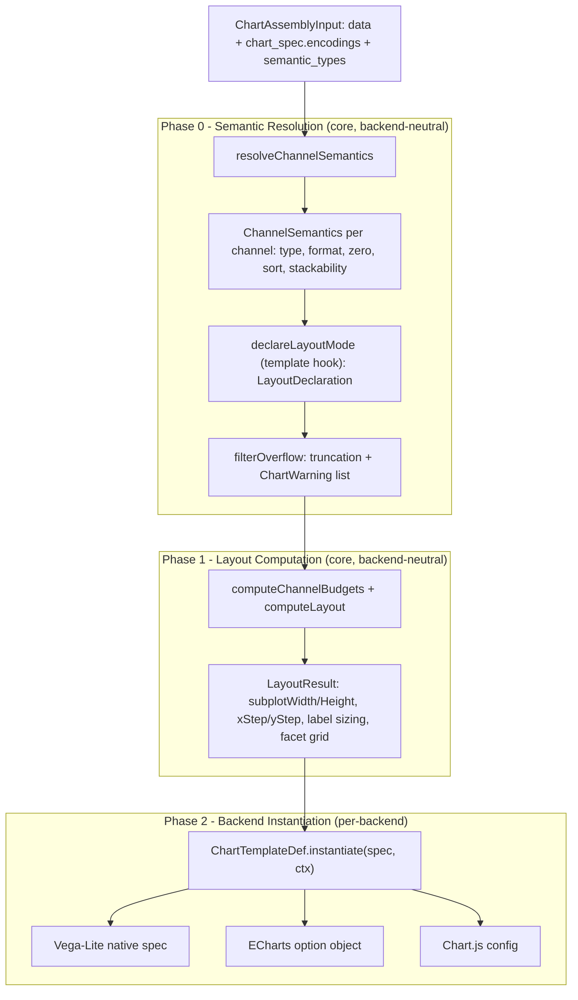
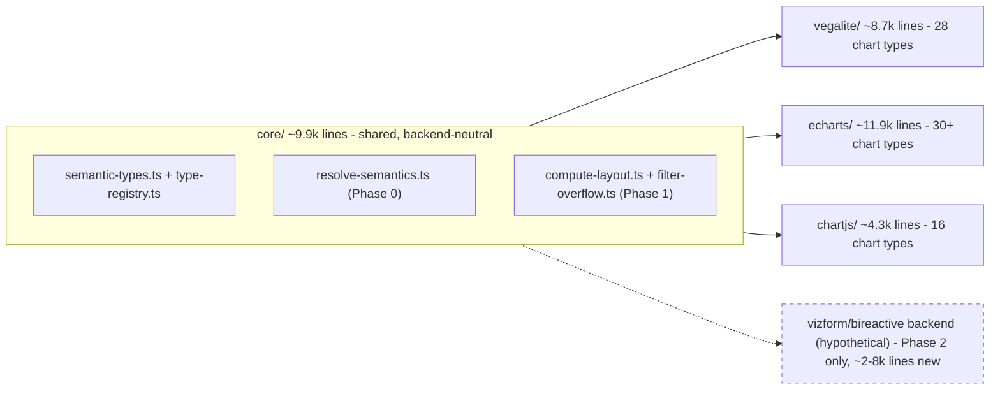
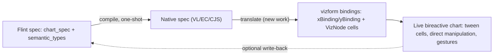

# Flint-chart intake — whiteboard

Informal research dump on Microsoft's [flint-chart](https://github.com/microsoft/flint-chart),
cloned at [`inspo/flint-chart`](../../inspo/flint-chart). Synthesized from 6 research
reports (`/tmp/win-317/01-06`) plus a live spike against the published npm package.
Not a build spec — that's a follow-on doc if we decide to build against this.

---

## 1. TL;DR

- **Flint is a chart *compiler*, not a chart *renderer*.** One JSON spec + per-field
  semantic type annotations (`{ Revenue: "Amount" }`) → three native backend outputs
  (Vega-Lite, ECharts, Chart.js). No rendering happens inside flint itself.
- The crown jewel is the **semantic type registry**: ~70 typed dimensions (`Amount`,
  `YearMonth`, `Percentage`, `Latitude`, …), each carrying 9 orthogonal decision
  properties (zero-baseline, format class, aggregation role, diverging-ness, domain
  shape…). This is the bridge between LLM intent ("plot Revenue") and deterministic
  compiler behavior (no LLM call needed after the field is typed).
- Pipeline is **3 phases, 2 of which are fully backend-neutral**: Phase 0 (semantic
  resolution) and Phase 1 (layout budgeting) produce target-agnostic IR
  (`ChannelSemantics`, `LayoutResult`); only Phase 2 (native spec instantiation) is
  per-backend.
- **We spiked it for real** (`inspo/spikes/flint-steel-thread`, gitignored) — installed
  `flint-chart@0.2.1` from npm, ran a real 12-row bar chart through all 3 backends plus
  the raw core pipeline. Everything worked first try, no source-level workarounds.
  See §6.
- **One real friction point**: `LayoutDeclaration` (needed to compute layout/budgets)
  is sourced from a specific backend's `ChartTemplateDef.declareLayoutMode`, not from
  a backend-neutral chart-type registry. A 4th backend has to borrow one of the three
  existing backends as a "declaration donor." Flint's own docs admit "no formal
  Backend interface — contract is by convention."
- **Flint and vizform solve orthogonal problems.** Flint compiles a *static* spec to a
  *static* native config, once, no runtime, no interactivity, no animation DSL. Vizform
  *is* the runtime: bidirectional reactive cells, direct manipulation, tweened
  transitions. They don't compete — flint could be an authoring/compile front-end that
  feeds vizform's live surface, not a replacement for it.
- Community signal is healthy but modest: 1,488 stars, active (v0.2.1 shipped
  2026-07-13, same day as this research), 3 open issues, 4 open PRs, direction is
  template breadth + backend parity + agent infra (MCP HTTP transport, a11y) — no
  signaled rewrite or major axis shift.
- Testing is **structural, not pixel-based**: matrix-driven generators produce ~1000+
  fixture cases, gallery doubles as the visual regression suite, cross-backend parity
  is asserted structurally (same input → structurally-equivalent output per backend).
- Ships an **MCP server + agent skill** (`flint-mcp`, `agent-skills/flint-chart-author`)
  teaching an LLM the 3-step contract: pick chartType → map channels → annotate
  semantic types. This is closer to "how we'd want vizform to be agent-drivable" than
  anything else we've looked at.

---

## 2. What flint is

Flint takes a small spec — a chart type name, field→channel encodings, and per-field
semantic type annotations — and deterministically compiles it to a native spec for
Vega-Lite, ECharts, or Chart.js. The point: an LLM (or a human) writes ~10 lines of
intent, never touches axis math, color palettes, label rotation, overflow truncation,
or zero-baseline decisions. All of that is derived from the semantic type of each
field plus fixed per-chart-type templates.



Source: [01-flint-compiler-core.md](../../../tmp/win-317/01-flint-compiler-core.md),
[`packages/flint-js/src/core/resolve-semantics.ts`](../../inspo/flint-chart/packages/flint-js/src/core/resolve-semantics.ts),
[`core/compute-layout.ts`](../../inspo/flint-chart/packages/flint-js/src/core/compute-layout.ts).

Key property: re-running Phase 0 alone (e.g. after a field swap) is enough — layout
and instantiation follow deterministically, no LLM call, no re-annotation of the
whole spec.

---

## 3. The semantic type registry (the crown jewel)

~70 semantic types (`Amount`, `Count`, `Percentage`, `YearMonth`, `Latitude`,
`Category`, `Rank`, …) organized into a 6-level lattice (Temporal, Numeric Measures,
Discrete, Geographic, Categorical, Identifier). Every type resolves to a
`TypeRegistryEntry` with **9 orthogonal dimensions**:

| Dimension | Values (examples) | Decides |
|---|---|---|
| `t0` | Temporal / Measure / Discrete / Geographic / Categorical / Identifier | top-level family |
| `t1` | DateTime, Amount, Rank, … | mid-level category |
| `visEncodings` | `['quantitative','ordinal']` | which vis-type(s) this can bind to, primary first |
| `aggRole` | additive / intensive / signed-additive / dimension / identifier | sum vs average vs "don't aggregate" |
| `domainShape` | open / bounded / fixed / cyclic | scale domain behavior (e.g. month = cyclic) |
| `diverging` | none / inherent / conditional | red-green diverging color eligibility |
| `formatClass` | currency / percent / unit-suffix / integer / decimal / plain | number formatting |
| `zeroBaseline` | meaningful / arbitrary / contextual / none | whether the axis must include zero |
| `zeroPad` | numeric fraction | domain padding when zero isn't forced |

Why it matters: this is the actual contract between an LLM's intent ("this column is
Revenue") and every downstream compiler decision (should the y-axis start at 0?
should this be `$1.2M` or `1,234`? should this stack? is this a diverging color
scale?) — with **zero LLM involvement** after the type is chosen. The registry does
the reasoning that would otherwise require a prompt round-trip per decision.

`FieldSemantics` (per-field enrichment) layers on top: inferred `defaultVisType`,
`format`/`tooltipFormat` (d3-format specs), `aggregationDefault`, `canonicalOrder`
(e.g. month name ordering), `cyclic`, `binningSuggested`.

Query surface: `getVisCategory()`, `getRegistryEntry()`, `isMeasureType()`,
`isTimeSeriesType()`, `isCategoricalType()`, plus precomputed sets (`measureTypes`,
`categoricalTypes`, `ordinalTypes`).

Source: [`core/semantic-types.ts`](../../inspo/flint-chart/packages/flint-js/src/core/semantic-types.ts),
[`core/type-registry.ts`](../../inspo/flint-chart/packages/flint-js/src/core/type-registry.ts) (186 lines
for the whole registry — small, dense, load-bearing).

---

## 4. Backend anatomy

Each backend (`vegalite/`, `echarts/`, `chartjs/`) is an identically-shaped directory:
`index.ts` (exports), `assemble.ts` (Phase 2 entry), `instantiate-spec.ts` (decisions
→ native spec), `recommendation.ts`, `templates/` (per-chart-type files + registry).

There is **no formal `Backend` TypeScript interface** — the contract is by convention
(parallel module shape, matching export names: `assembleX`, `xApplyLayoutToSpec`,
`xTemplateDefs`, `xGetTemplateDef`). Confirmed independently by both the backends
report and the spike's friction note.

Code volumes: core ~9,900 lines (shared), Vega-Lite ~8,700 (28 chart types), ECharts
~11,900 (30+ types), Chart.js ~4,300 (16 types). Estimated cost of a from-scratch
4th backend: `assemble.ts` 400–1,500 lines, `instantiate-spec.ts` 1,500–3,000 lines,
templates 200–2,000 lines each depending on chart complexity — **~2,000 lines minimum
for a 5-chart backend, ~8,000 for VL-parity breadth**.

v0.2.1's changelog line — *"Exported backend-neutral banded-axis detection for custom
backends"* — is a direct signal: the maintainers are incrementally promoting
backend-internal helpers to the shared core specifically to make 3rd-party backends
easier. Issue #45 ("NTChart backend exploration") shows this isn't hypothetical either
— someone else is already exploring backend #4.



Source: [02-flint-backends.md](../../../tmp/win-317/02-flint-backends.md).

---

## 5. Flint vs vizform: same problem, different axis

Flint compiles a spec once, to a static native config, with no runtime attached.
Vizform *is* the runtime: `VizNode` trees of writable reactive cells, direct
manipulation (drag a mark → cell updates), CSS-driven tweened transitions
(`wiki/transitions-decision.md`), gesture-aware gates (TWEEN vs SNAP lanes). Neither
subsumes the other — they sit on different sides of "compile" vs "live."



**Where flint stops and vizform starts:**

- Flint: static spec in, static native spec out. No selections, no brushing, no
  crossfilter (explicitly "out of scope" per flint's own docs). No animation DSL —
  each renderer's native defaults apply, nothing unified. Chart-type switching is a
  re-assemble, not a morph.
- Vizform: the spec basically has no "compile" step — bindings are live cells from
  the start. Interaction principles (`wiki/interaction-principles.md`) rank direct
  manipulation as the UI itself, gesture atomicity, animate-from-visual-position —
  concerns flint doesn't model at all.

If we ever wanted flint upstream of vizform: flint = **authoring/compile layer**
(LLM writes a spec, flint resolves semantics + layout), vizform = **live surface**
(the compiled result becomes reactive bindings a user can then grab and drag). The
Phase 0/1 IR (`ChannelSemantics`, `LayoutResult`) is the natural handoff point — see
§6, it's the part of flint that's actually backend-neutral.

**Honest mismatch table:**

| Axis | Flint | Vizform |
|---|---|---|
| Data shape | rowset / long-form, aggregation-oriented (`aggregate`, `stackable`) | `VizNode` tree with writable `measures`/`dims`; hierarchical-native |
| Writability | none — data is a read-only input | measures are `Writable<Num>` — the chart writes back |
| Overflow | truncates + emits `ChartWarning[]` | scrolls, drills, or paginates — never silently drops rows |
| Execution model | one-shot compile per spec/field change | continuous; every gesture is a live cell update |
| Interactivity | tooltips only (a boolean flag); brushing/crossfilter explicitly out of scope | direct manipulation is the primary interaction model |
| Animation | none — native per-renderer defaults, no DSL | first-class: tween cells + CSS transitions with named timing tokens |
| Chart-type switch | re-assemble a new native spec (pivot IDs like `flip:x-y`) | would need to be a live re-bind, no prior art for this yet |

---

## 6. Spike results

Spike: [`inspo/spikes/flint-steel-thread`](../../inspo/spikes/flint-steel-thread)
(gitignored, not committed), `flint-chart@0.2.1` installed from npm (not the cloned
source). Ran a real 12-row `Bar Chart` with `Month: YearMonth`, `Revenue: Amount`
through the full documented surface: `assembleVegaLite`, `assembleECharts`,
`assembleChartjs`, the raw core pipeline (`resolveChannelSemantics` →
`computeChannelBudgets` → `filterOverflow` → `computeLayout`), and the convenience
APIs `getChartOptions` / `getChartPivot`.

**Result: worked end-to-end on the first real run.** All signatures matched the
shipped `.d.ts` files exactly — no reverse engineering, no source-level workarounds.

Sample IR (`ChannelSemantics`, Phase 0 output):

```json
{
  "x": { "field": "Month", "type": "temporal", "sortDirection": "ascending", "temporalFormat": "%b" },
  "y": { "field": "Revenue", "type": "quantitative", "aggregationDefault": "sum", "stackable": "sum" }
}
```

Sample IR (`LayoutResult`, Phase 1 output — fully target-agnostic pixel budget):

```json
{
  "subplotWidth": 416, "subplotHeight": 320,
  "xStep": 32, "yStep": 32,
  "xLabel": { "fontSize": 10, "labelLimit": 100 },
  "stepPadding": 0.1, "truncations": []
}
```

`getChartPivot()` returned a real `PivotSurface` for Bar Chart — a 2-option `View`
pivot (`default`, `flip:x-y`), confirming orientation swap is first-class, not
hand-rolled per host. `getChartOptions()` returned 4 `ChartOption`s (cornerRadius,
independentYAxis, xAxisType, yAxisType) — this is the control-rendering surface a host
properties panel would bind to.

**Packaging is a non-issue**: 0 dependencies, dual ESM/CJS, `dist/` is 2.6M, typed,
worked in a plain ESM Node script with zero transpilation.

**Friction (the one real gap)**: `LayoutDeclaration` — needed by both
`computeChannelBudgets`/`filterOverflow` and `computeLayout` — is sourced from a
specific backend's `ChartTemplateDef.declareLayoutMode` (the spike reached it via
`vlGetTemplateDef('Bar Chart')`), even though the declaration itself carries no
VL/EC/CJS-specific data. A 4th backend has to pick one existing backend as a
"declaration donor" per chart type — a soft dependency that shouldn't need to exist.
Matches the backends report's independent finding: "no formal Backend interface."

**Minor, non-blocking oddity**: the Vega-Lite `x` scale domain for the `YearMonth`
field came back as fractional-day ISO timestamps rather than clean month boundaries
— cosmetic here, worth a closer look if `YearMonth` axes matter to us.

**Feasibility read for a 4th (vizform/bireactive) backend:**
- Phase 0 (`ChannelSemantics`) — high feasibility, fully backend-neutral JSON already.
- Phase 1 (`LayoutResult`) — high feasibility, and the strongest part of the steel
  thread: genuinely target-agnostic pixel-budget primitives, not VL-flavored.
- Phase 0/1 seam (`LayoutDeclaration`) — medium friction, see above.
- Phase 2 (native instantiation) — **100% new work per chart type**, no way around
  it; a bireactive renderer still needs its own axis/mark/legend placement code,
  just fed by `ChannelSemantics` + `LayoutResult` instead of re-deriving them.

Source: [06-spike-findings.md](../../../tmp/win-317/06-spike-findings.md).

---

## 7. Landscape notes

Chart libraries split cleanly into **compile-target-shaped** (JSON/object spec in,
render out — a plausible flint backend) vs **runtime-shaped** (imperative or
component API, requires code generation, not a good compile target):

| Compile-target-shaped (spec-driven) | Runtime-shaped (imperative/component) |
|---|---|
| Vega-Lite (current), ECharts (current), Chart.js (current) | D3 (primitive, not a backend) |
| AntV G2 — grammar-of-graphics, strong Chinese-market adoption, tier-1 candidate | visx (Airbnb) — imperative React+D3, low viability |
| Observable Plot — functional-declarative, medium viability (needs transpile step) | **LayerChart** — Svelte component API, low viability as a *flint* target (would require generating Svelte code) — but this is the library vizform already intaked separately (`wiki/layerchart-intake/`) as a *pattern* source, not a compile target |
| Plotly.js — JSON spec but 1MB bundle, niche (scientific/3D) | Unovis — imperative, framework-agnostic, low viability |
| Recharts — component props are declarative-enough to compile *to* (prop-config gen), tier-2 | Nivo — similar to Recharts, less standardized |

**Prior art for the compile-to-multi-backend idea itself:**
- **Vega-Lite → Vega**: the existence proof — Vega-Lite compiles down to Vega as its
  own IR. Vega itself could theoretically be a lower-level IR flint compiles to
  instead of/alongside Vega-Lite.
- **Mosaic / vgplot** (UW IDL): architectural middle tier, database-backed, real-time
  crossfilter on billion-row datasets via a reactive selection message bus. Different
  axis from flint (interactivity/reactivity, not backend plurality) but the closest
  prior art to "what if flint's IR fed a live, reactive surface" — relevant precedent
  for the flint→vizform composition idea in §5.
- **Microsoft chart-parts**: earlier MS research project, AST-based compiler → SVG/
  Canvas backends — explicitly flint's own intellectual ancestor, no longer actively
  maintained.

**Where to steal transition / direct-manipulation ideas from** (relevant to vizform,
not flint, since flint has no animation DSL):
- **ECharts**: industry-leading morphing/easing, handles 100k+ points via LTTB
  downsampling — reference for large-N tween performance.
- **Observable Plot / D3**: gold-standard enter/update/exit with **object constancy**
  (keyed data tracks the same visual element across state changes) — this is exactly
  the "identity across chart-type switch" problem vizform doesn't have prior art for
  yet (§5 mismatch table, last row).
- **Mosaic**: reactive selection propagation across linked views — pattern to borrow
  if vizform ever needs cross-chart brushing/crossfilter.

Source: [05-chartlib-landscape.md](../../../tmp/win-317/05-chartlib-landscape.md).

---

## 8. Community / testing observations

- **Repo health**: 1,488 stars, 64 forks, actively shipping — v0.2.1 released the same
  day as this research (2026-07-13). 3 open issues (#48 a11y, #47 MCP HTTP transport,
  #45 NTChart backend exploration), 4 open PRs (template additions, EC/CJS rendering
  bugfixes from an MCP bug-bash). No signaled architectural rewrite.
- **Testing is structural, not pixel-based.** 24 vitest files, 53 matrix-driven test
  generators (`src/test-data/`, ~11k lines across 53 generator files) synthesize ~1000+ fixture cases
  from declarative matrix rows (axis type × color/size channel × cardinality × flags).
  Cross-backend parity is asserted structurally — e.g. `gantt-bullet-backends.test.ts`
  checks ECharts' floating-bar stack against Chart.js's `indexAxis: 'y'` for the same
  input, not pixel diffs.
- **Gallery-as-test-suite**: the site's gallery examples ARE `TestCase` fixtures
  (`test-case-utils.ts`) — the gallery doubles as the living visual regression suite.
  No separate pixel-snapshot infra exists; the gallery *is* the eyeball check.
- **MCP server + shipped agent skill** is the most directly-relevant-to-us artifact:
  `flint-mcp` exposes `flint_compile_chart`, `flint_validate_chart` (cardinality
  warnings like "60 categories truncated to 30"), `flint_list_charts`,
  `flint_get_schema` (agents fetch the JSON Schema instead of memorizing it). The
  bundled `agent-skills/flint-chart-author/SKILL.md` teaches an LLM the exact 3-step
  contract: pick chartType → map channels → annotate semantic types, plus a
  validation checklist. This is close to what we'd want for an agent-drivable vizform
  authoring surface, if we ever build one.
- **Issue themes**: template breadth (more chart types), backend parity fixes
  (EC/CJS bug-bash from MCP dogfooding), agent infra (HTTP transport for the MCP
  server), accessibility. Nothing about core architecture changing.

Source: [03-flint-community-testing.md](../../../tmp/win-317/03-flint-community-testing.md).

---

## 9. Big questions for discussion

> **Direction:** the original request was to explore flint as a candidate for a
> **JSON-render chart adapter inside hotbook**. That means flint as a dependency/
> compile layer feeding vizform's live surface, not hotbook content embedded into
> flint. The questions below assume that direction.

1. What is the right integration shape for flint as a hotbook dependency: a
   shallow bridge from a flint `ChartAssemblyInput` to a vizform tile config, or a
   deeper Phase-2 backend that consumes `ChannelSemantics` + `LayoutResult`?
2. If we do build a bireactive backend: do we accept the `declareLayoutMode`
   donor-backend dependency as-is, or fork/vendor just that seam, or file upstream
   against flint (issue #45's NTChart exploration suggests they'd be receptive)?
3. Is flint's rowset/aggregation data model actually adaptable to `VizNode` trees, or
   is the mismatch (§5 table) deep enough that we'd only ever use flint for the
   flat/Cartesian charts (bar/line/scatter) and hand-roll hierarchical ones regardless?
4. Do we want the compile step to be one-shot (flint's model) or do we need it to
   re-run on every gesture (a drag that changes an aggregate, a drill that changes
   the field set)? If the latter, is flint's Phase 0/1 fast enough to call per-frame,
   or does it only make sense as an *initial* spec→bindings translation?
5. Should vizform ship its own semantic-type-registry-like concept independent of
   flint, informed by flint's 9-dimension model but adapted to writable measures
   (flint's registry assumes read-only aggregation semantics — `aggRole` doesn't
   have a "this field is directly editable" case)?
6. Is the flint MCP server / agent skill pattern (`flint_validate_chart`,
   `flint_get_schema`) worth mirroring for vizform directly, independent of whether
   we ever consume flint's compiler itself?
7. Given flint has zero animation DSL and vizform's transition system
   (`wiki/transitions-decision.md`) is deliberately CSS-based and cell-graph-driven,
   is there *any* real integration surface beyond "flint produces the initial spec,
   vizform ignores flint entirely from then on"?
