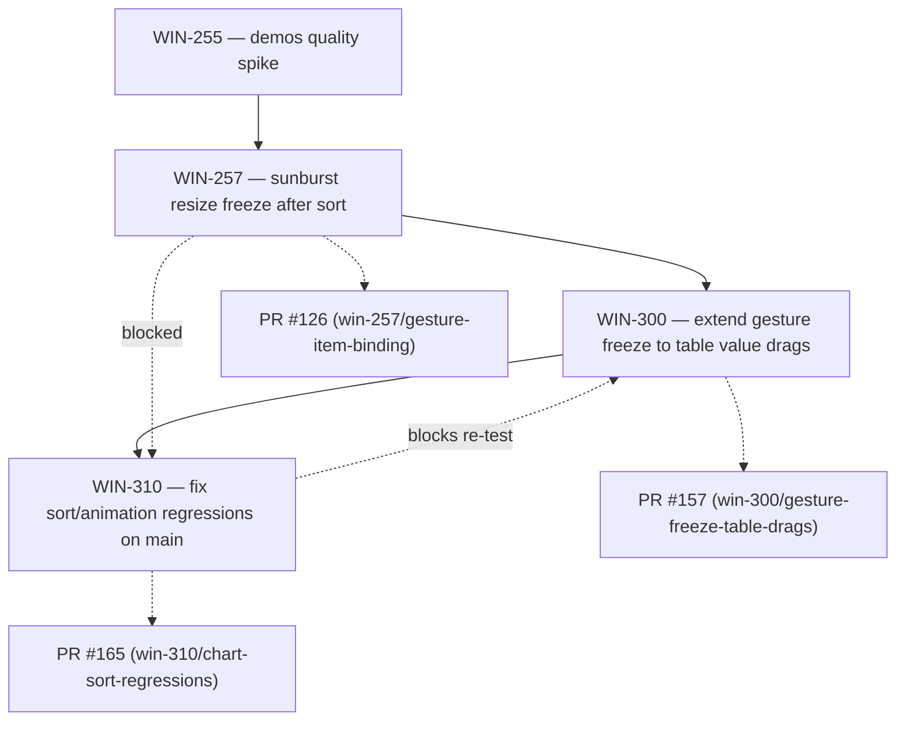
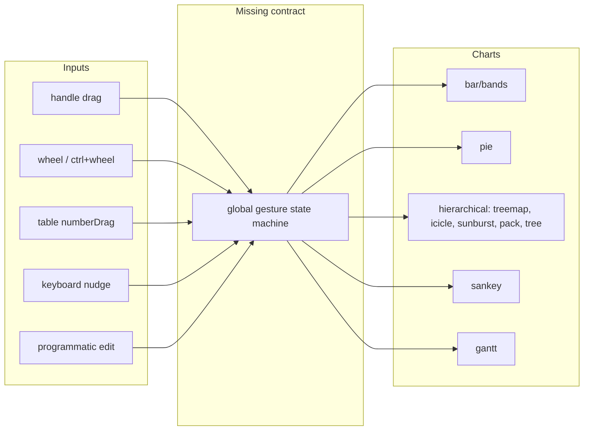
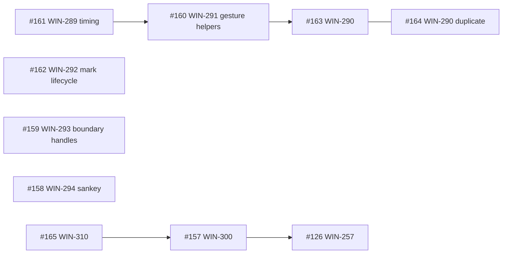
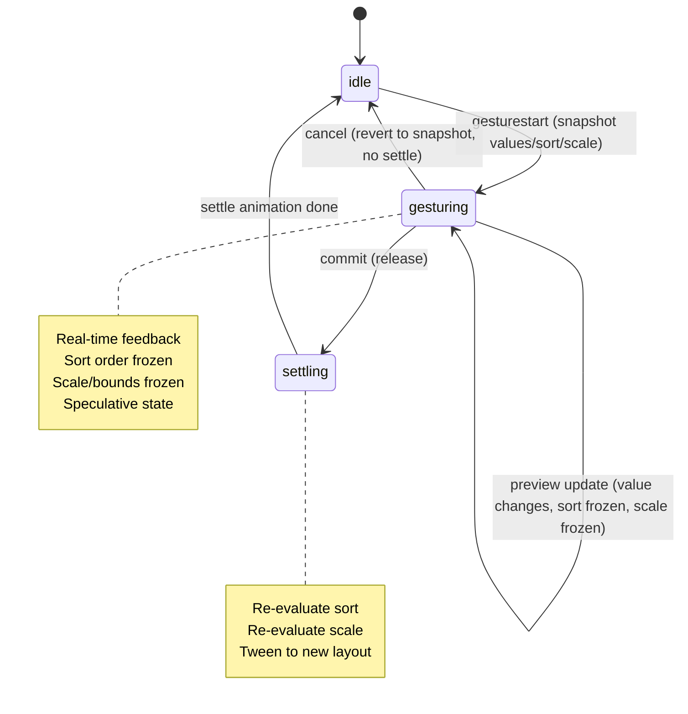

# Gesture / Transition / Sort Lineage — whiteboard report

Status: snapshot of `WIN-310` and its immediate family.

---

## TL;DR

- `WIN-310` is not an isolated bug. It is the child of `WIN-300`, which is the child of `WIN-257`, which came out of the `WIN-255` demos-quality spike.
- The root cause is the same across all of them: every chart re-implements the gesture/transition/sort contract in its own file, so a fix for one chart rots or breaks the next.
- `WIN-310` is blocking `WIN-300` / PR #157. PR #165 is the latest attempt to fix it.
- A parallel refactor family (`WIN-288` → `WIN-289`–`WIN-294`) is trying to consolidate the duplication, but those PRs are open and not yet merged.
- The missing piece is a single global gesture state machine / transition contract (`WIN-315`). Without it, we are playing per-chart whack-a-mole.

---

## The lineage

### What each ticket is actually about

- **WIN-255** — demos quality spike. Flagged that changing sort on the demos page re-rendered instead of transitioning, and that a sunburst resize broke after a value sort.
- **WIN-257** — the first regression fix. Goal: keep the dragging handle bound to the same item while a sort could re-rank siblings. Introduced `gestureActive`/`frozenSortKey` in `sunburst.ts`, later ported to `icicle.ts`, `treemap.ts`, `pack.ts`.
- **WIN-300** — extend that same freeze behavior to table value drags, so cross-component edits (table → chart) are not second-class to in-chart handle/wheel gestures.
- **WIN-310** — while testing PR #157 against `main`, discovered that `main` itself already had sort/animation regressions (bar, pie, hierarchical charts, sort selector). Cannot evaluate PR #157 until `main` is clean.

---

## The "one machine" map

The point: every input is just a control surface producing a value-change intent. The chart-specific part should only be geometry. Right now the input contract is re-implemented per chart, which is why `table` drags behave differently from `handle` drags.

---

## Why `WIN-310` is so messy

From the comments and PR bodies, the sequence is:

1. `WIN-257` fixes sunburst by adding `gestureActive` + frozen sort key.
2. Agent tries to extend it to icicle and treemap, but the branch gets stale and merge conflicts accumulate.
3. `WIN-300` tries to add a global `globalGestureActive` cell for table drags, but the first implementation accidentally removes the local `GESTURE_ACTIVE_CLASS` when the global flag is false, breaking all gestures.
4. A fix uses separate `vf-gesture-active` and `vf-gesture-active-global` classes, but table-drag still jumps in some charts.
5. Winston tests `main` and finds regressions that appear to be pre-existing: bar sort-by-value does not animate on first release, pie chart handles/values are off, hierarchical sort selector has no effect.
6. `WIN-310` is created to fix those `main` regressions first.

The deeper issue: there is no shared model. The `WIN-288` maintainability audit already documented the duplication:

- `SORT_SEC = 0.35` copy-pasted in 8+ chart files.
- The same `seenSortBy` / `seenMeasureKey` snap-vs-tween gate in `sunburst`, `icicle`, `pack`, `treemap`, `bar-chart`, `pie-chart`, `radar-chart`, `concentric-arc`, `tree-chart`, `sankey`, `gantt`.
- The same `setGestureActive` / `gesturecommit` dispatch closure duplicated in `bar-chart`, `pie-chart`, `radar-chart`, `concentric-arc`, `gauge`, `gauge-segmented`, `gantt`.
- The same hierarchical mark lifecycle (`windowedMarks`, `withExitDelay`, `membershipCell`, `forEach`, `frozenGeom`) in `sunburst`, `icicle`, `pack`, `treemap`.
- Boundary-knob handle generation duplicated between `sunburst` and `icicle`.
- `sankey.ts` defines its own `GESTURE_ACTIVE_CLASS = "gesture-active"` (wrong class) and has hardcoded `0.12s` grip transitions.

Source: `wiki/cross-file-maintainability-audit.md`.

---

## Related ticket inventory

### Blocked

| Ticket | Title | Blocked by / waiting on |
|---|---|---|
| `WIN-310` | Fix chart sort/animation regressions on main | `main` must be clean before `WIN-300` / PR #157 re-test |
| `WIN-300` | Extend gesture freeze to table value drags | `WIN-310` (`metadata.blocked_reason: "Chart sort/animation regressions on main"`) |
| `WIN-257` | Regression: gesture loses item binding after sort-induced layout change | effectively blocked by `WIN-310` fallout / PR #126 is conflicting |

### In review

| Ticket | PR | Notes |
|---|---|---|
| `WIN-289` | #161 | Single source of truth for timing across `bireactive` and `d3` |
| `WIN-290` | #163 + #164 (duplicate) | Shared snap-vs-tween gate for structural value changes |
| `WIN-291` | #160 | Standardize `gesture-active` and `gesturecommit` dispatch |
| `WIN-292` | #162 | Shared hierarchical mark lifecycle (`windowedMarks`) |
| `WIN-293` | #159 | Shared boundary-knob handle generation and key stability |
| `WIN-294` | #158 | Clean up `sankey` gesture-active and inline transitions |

### Todo / unassigned design

| Ticket | What it needs |
|---|---|
| `WIN-315` | Design the global gesture state machine and transition contract. This is the architecture ticket that the `WIN-288` family and `WIN-310` both point to. |
| `WIN-316` | Handoff summarizing current state; lists `WIN-310`, `WIN-300`, `WIN-315`, `WIN-288` family, open PRs. |

---

## Open PRs and their state

| PR | Branch | Status | Notes |
|---|---|---|---|
| #165 | `win-310/chart-sort-regressions` | `MERGEABLE` / clean | Latest `WIN-310` fix. Touches `buildHierarchy`, `biTree`, `pie-chart`. |
| #157 | `win-300/gesture-freeze-table-drags` | `MERGEABLE` / clean | Adds `globalGestureActive` for cross-component table drags. Blocked on `WIN-310` verification. |
| #126 | `win-257/gesture-item-binding` | `CONFLICTING` | Smooth release transitions for hierarchical charts. Likely superseded by #157/#165. |
| #163 | `agent/macbook-claude-sonnet/...` | open | `WIN-290` snap-vs-tween gate. |
| #164 | `win-290/tween-gate-helper` | open | `WIN-290` same gate — duplicate of #163. One should be closed. |
| #161 | `win-289/single-source-timing` | open | `WIN-289` timing tokens. |
| #162 | `win-292/windowed-marks-helper` | open | `WIN-292` mark lifecycle. |
| #160 | `win-291/standardize-gesture-helpers` | open | `WIN-291` gesture helpers. |
| #159 | `win-293/boundary-handles` | open | `WIN-293` boundary handles. |
| #158 | `win-294/sankey-gesture-transitions` | open | `WIN-294` sankey cleanup. |

---

## The intended contract (from `wiki/interaction-principles.md`)

The relevant rules that are supposed to be invariant:

- **Rule 2** — scale stability during manipulation.
- **Rule 3** — real-time feedback.
- **Rule 5** — one gesture at a time.
- **Rule 6** — gestures are speculative until committed.
- **Rule 7** — derived reorders defer to commit.
- **Rule 10** — single source of truth for timing.
- **Rule 11** — transitions are interruptible.
- **Rule 15** — scale/bounds updates defer to commit.
- **Rule 16** — zoom-to-fit on commit.

---

## Recommended global state machine

`WIN-315` is the design ticket to write this down. `WIN-289`–`WIN-294` are the mechanical refactor steps. `WIN-310`/`WIN-300`/`WIN-257` are the bug fixes that keep proving the contract is missing.

---

## Recommendations

1. **Do not merge `WIN-300` / PR #157 until `WIN-310` is verified clean on `main`.** `WIN-310` was explicitly created to clear the baseline for `WIN-300`.

2. **Verify PR #165 in a browser, not just with Playwright.** PR #165 claims sort-by-value and animation are restored for bar, pie, and hierarchical charts. The `WIN-310` comment thread shows the first tested regression was not addressed. Manual demos-page testing is the gate.

3. **Close or resolve the duplicate `WIN-290` PRs (#163 and #164).** One is `agent/macbook-claude-sonnet/...`, the other is `win-290/tween-gate-helper`. They are the same work.

4. **Resolve PR #126 (WIN-257) or close it.** It is `CONFLICTING`. If PR #165/157 supersede it, close it and point the lineage to the new work.

5. **Finalize `WIN-315` before landing more of `WIN-289`–`WIN-294`.** The mechanical refactor is good, but it will not stop whack-a-mole without a single contract. The `WIN-288` family and `WIN-310` both need the same architecture.

6. **Treat `WIN-289`–`WIN-294` as one merge train, not independent PRs.** They touch the same contract files and will conflict if merged in random order. A suggested order:
   - `WIN-289` (#161) timing tokens first (low risk, mechanical).
   - `WIN-291` (#160) gesture helpers next (adds shared helpers).
   - `WIN-290` (#163 or #164) snap-vs-tween gate next (uses helpers + tokens).
   - `WIN-293` (#159) boundary handles and `WIN-292` (#162) mark lifecycle in parallel (both use the gate and helpers).
   - `WIN-294` (#158) sankey cleanup last.

7. **Run a single QA gate across all chart types and all input methods before merging any of these.** The matrix should be:
   - For each chart: `bar`, `bands`, `pie`, `treemap`, `icicle`, `sunburst`, `pack`, `tree`, `sankey`, `gantt`.
   - For each input: handle drag, wheel, table value drag, keyboard.
   - For each sort mode: `index`, `value`.
   - Check: real-time resize, no reorder during gesture, smooth animation on release, no handle/key instability, no cyclic computed errors.

---

## What I think we should do

- **Is PR #165 the full fix for `WIN-310`?** No. Nothing has been the full fix yet. PR #165 is the latest attempt; it needs live browser verification before it can be trusted as the baseline.
- **Should the `WIN-288` refactor PRs land before or after `WIN-315` design is finalized?** Finalize `WIN-315` first, then use the `WIN-288` PRs as the implementation train. If you want to move fast, the `WIN-289` (timing tokens) and `WIN-291` (gesture helpers) pieces are safe to land as mechanical prep, but the snap-vs-tween gate and mark lifecycle should follow the design.
- **What happens to `WIN-257` / PR #126?** Close PR #126. Its work has been absorbed into the `WIN-300`/`WIN-310` chain.
- **Does dynamic grouping (`WIN-295`) matter here?** No. It is a separate feature and should not block or distract from the gesture/transition cleanup.

---

*Generated from Multica + GitHub state. See `wiki/interaction-principles.md` and `wiki/cross-file-maintainability-audit.md` for the underlying principles and duplication inventory.*
