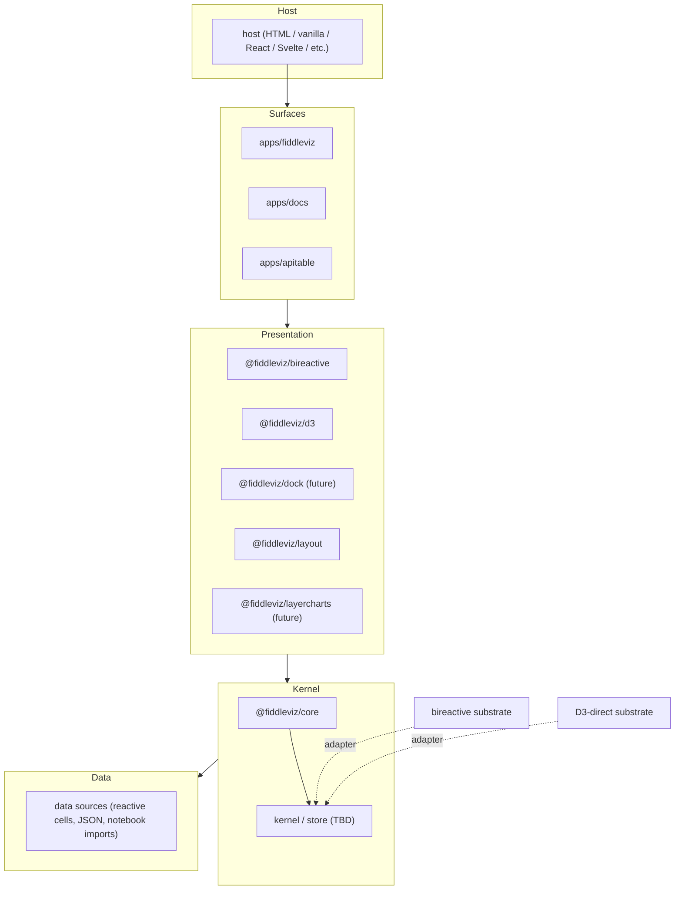
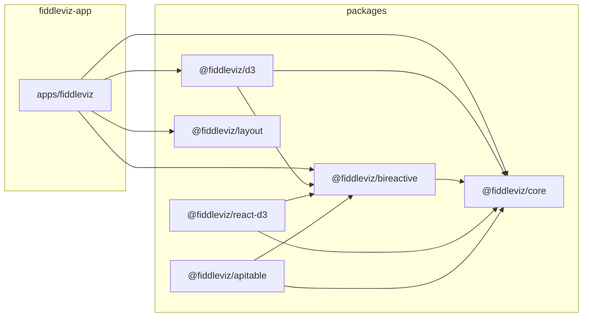
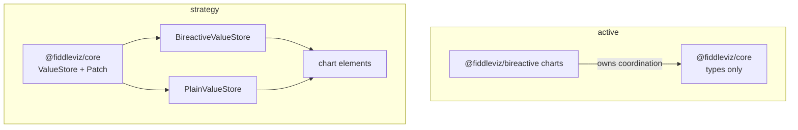
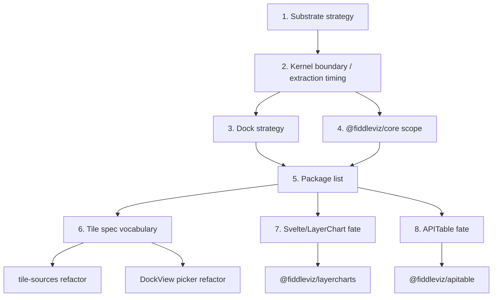
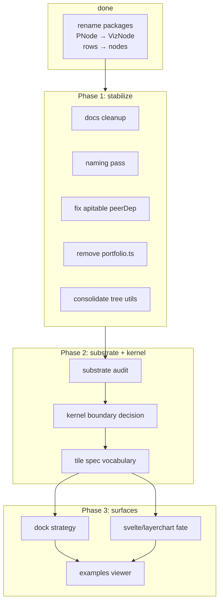
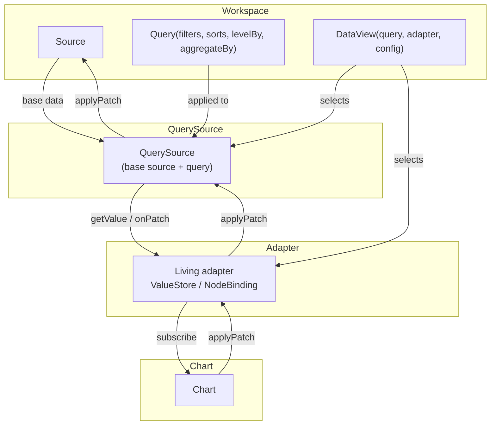

# reorg-whiteboard

Architecture whiteboard for the `fiddleviz` reorg. Outline / bullets / diagrams only. This is a living doc for iteration.

---

## 1. Target layers



Dependency rule: **down only**. Surfaces depend on presentation packages. Presentation packages depend on the kernel interface. Backends (bireactive, D3-direct) are injected by the host, not imported by presentation packages.

---

## 2. Current package graph



Notes:
- `@fiddleviz/d3` depends on `@fiddleviz/bireactive` because the tile-binder uses `bireactive` primitives.
- `@fiddleviz/react-d3` may be dead (zero consumers) — needs verification.

---

## 3. ValueStore strategy pattern

The substrate question is really: **what is the interface for holding node values and updating them?** Everything else is a strategy implementation.

### Generic types (no imports)

```ts
interface NodeLike {
  id: string
  parentId: string | null
  index?: number
  name: string
  color?: string
  measures: Record<string, number>
  dims?: Record<string, string>
}

interface PatchContext {
  // 'updateNow' = commit to the source
  // 'updatePending' = preview / drag / tentative, may be discarded
  // 'rejected' = the source rejected the pending update; roll back
  phase: 'updateNow' | 'updatePending' | 'rejected'
  // e.g. 'drag', 'keyboard', 'remote', 'undo'
  origin?: unknown
  // transaction id for batching / rollback
  transactionId?: string
  // Braid-like version metadata
  version?: string | string[]
  parents?: string[]
  // e.g. 'merge', 'replace', 'ot', 'crdt'
  mergeType?: string
}

// A Braid-aligned patch.
// `unit` is the patch type / content type (e.g. 'json', 'json-patch', 'text',
// 'ot-text-unicode', 'nodes').
// `range` is the path or range to write (empty string means the whole value).
// `content` is the new value or, for OT, the operation.
interface Patch {
  unit: string
  range: string
  content: unknown
  context: PatchContext
}

// Domain-specific examples for a NodeLike[] value store.
// `setNodes` is a patch with an empty range:
//   { unit: 'nodes', range: '', content: nodes, context: { phase: 'updateNow' } }
// `setMeasure` is a patch with a node path:
//   { unit: 'nodes', range: 'nodeId/key', content: 42, context: { phase: 'updateNow' } }

interface Source<T = NodeLike[]> {
  id: string
  // initial snapshot; may trigger load
  getValue(): Promise<T> | T
  // optional patch stream for live sources (TanStack DB, Braid, etc.)
  onPatch?(fn: (patch: Patch) => void): () => void
  // optional apply for mutable sources
  applyPatch?(patch: Patch): void
  // optional explicit load for CSV / remote
  load?(): Promise<void>
}

interface ValueStore<T> {
  // the source this view is bound to
  source: Source<T>
  // the current value (committed + pending)
  value: T
  getValue(): T
  // apply a Braid-aligned patch to the store value
  applyPatch(patch: Patch): void
  // subscribe to value changes
  subscribe(listener: (value: T) => void): () => void
  // batch coalescing
  batch?<R>(fn: () => R): R
}
```

A chart, tile, or layout component just consumes a `ValueStore`:

```ts
interface Chart<T> {
  mount(store: ValueStore<T>, container: HTMLElement): void
  dispose(): void
}
```

### Strategy implementations

For now, only two strategies matter:

| Strategy | What it is | How `applyPatch` works | How it notifies |
|---|---|---|---|
| `BireactiveValueStore` | Adapter. Holds a `bireactive` lens tree (internal). | `set`/`update` writes the leaf `Writable<Num>` or rebuilds the tree. | `subscribe` is `bireactive` `effect(...)`; children get fine-grained updates. |
| `PlainValueStore` | A `nanostores`-style single-value store. Holds `T` (often `NodeLike[]`). | `set` replaces the value; `update` mutates at `path` (e.g. `[nodeId, key]`). | `subscribe(listener)` fires after every patch with the new value. |

### D3-direct vs coarse store

`D3-direct` **is** the `PlainValueStore` strategy, just with the chart as the only consumer. The D3 chart subscribes and calls `update(value)` itself:

```ts
const store = new PlainValueStore(nodes)
const chart = new PackChart(container)

store.subscribe((value) => chart.update(value))
```

The coarse store (React/Svelte host) is the same `PlainValueStore`. There is no separate D3 strategy type — just a different consumer. The algebraic reduction is:

- **fine-grained**: `BireactiveValueStore` (cell graph)
- **coarse-grained**: `PlainValueStore` (single value / row array)

Other substrates (`Yjs`, `Svelte` runes, `Observable`) are out of scope for today.

### Where does the kernel live?

The kernel can be the thing that owns a `ValueStore` and decides how patches get applied:

```ts
interface Kernel<T> {
  store: ValueStore<T>
  // applies a patch, possibly after transforming it (e.g. conservation)
  dispatch(patch: Patch): void
  // read the current doc
  getValue(): T
  // observe changes
  subscribe(listener: (value: T) => void): () => void
}
```

Conservation can be a **patch transformer** before the patch reaches `store.applyPatch`:

```ts
function withConservation<T>(kernel: Kernel<T>): Kernel<T> {
  return {
    ...kernel,
    dispatch: (patch) => {
      const patches = expandConservation(patch, kernel.getValue())
      for (const p of patches) kernel.store.applyPatch(p)
      // single notification
    },
  }
}
```

`bireactive` does this internally with `Num.lens`. `PlainValueStore` needs the kernel to compute it.

### Patch vs value

The `Patch` type is the lingua franca. It is Braid-aligned: `unit`/`range`/`content`/`context`. Every write reduces to a patch:

- `setNodes(nodes)` → `{ unit: 'nodes', range: '', content: nodes, context }`
- `setMeasure(nodeId, key, value)` → `{ unit: 'nodes', range: 'nodeId/key', content: value, context }`
- `chart.update(nodes)` → `{ unit: 'nodes', range: '', content: nodes, context }` (the D3 chart receives a full-value patch)
- `bireactive` `Writable<Num>.value = ...` → `{ unit: 'nodes', range: 'nodeId/key', content: value, context }` at the source

A `range` of `''` means the whole value. Non-empty `range` is interpreted by the `unit` (e.g. `json` uses JSON paths, `nodes` uses `nodeId/key`).

This is the braid / Yjs doc API shape: a document with a stream of typed patches.

### What about matchina?

`matchina` is a state-machine utility, not a `ValueStore` strategy. It could wrap the kernel lifecycle (`idle` → `active` → `parked` → `disposed`) or wrap the patch dispatch, but it is not a substrate.

### Open question

Do we want the kernel to own the `ValueStore` instance, or does the surface pass a `ValueStore` into the chart? The former is one source of truth; the latter lets different tiles use different substrates in the same surface.

---

## 4. Kernel boundary

Two competing frames:

### A. Active plan (`reorg-2026-07.md`)
- Keep coordination inside `@fiddleviz/bireactive` for now.
- Extract a named kernel package only when a second surface (e.g. graph layout, dock) needs the interface.
- Path: lift existing code, not greenfield.

### B. Flexblox / matchina frame
- Build `@fiddleviz/core` as a substrate-agnostic kernel with `ValueStore` / `Patch` interfaces.
- Wire `@fiddleviz/bireactive` and `@fiddleviz/d3` as `ValueStore` strategies.
- Path: design then conform.



Decision needed: which frame? A first, then B later? Or B now with `ValueStore` as the abstraction?

---

## 5. Open decisions (blocking DAG)



### Top decisions

1. **Substrate strategy** — `BireactiveValueStore` first, `PlainValueStore` as first-class, or mixed? Is `ValueStore` the right abstraction?
2. **Kernel boundary** — keep coordination in `@fiddleviz/bireactive` or extract a `ValueStore`/`Patch` kernel to `@fiddleviz/core` now?
3. **Dock strategy** — adopt `dockview-core` or build fresh? Single-page or stacked pages?
4. **Core scope** — types/colors only, or `ValueStore` + `Patch` + conservation transformer?
5. **Package list** — which `@fiddleviz/*` packages exist? Do we need `@fiddleviz/dock`, `@fiddleviz/ui`, `@fiddleviz/layercharts`, `@fiddleviz/observable-runtime`?
6. **Tile spec vocabulary** — `measureKey`/`sortBy`/`xKey`/`yKey` vs `xField`/`valueField`/`sortDir`?
7. **Svelte/LayerChart fate** — keep alias, promote to package, or remove?
8. **APITable fate** — keep or drop?
9. **Package scope** — `@fiddleviz/*` vs `@fiddleviz/*` vs `@winstonfassett/*`?
10. **Test infrastructure** — Vitest for kernel/charts, Playwright for gestures? When?

---

## 6. Plan DAG (high-level)



This DAG is draft only. It depends on the substrate/kernel decision.

---

## 7. Data views / query layer

Long-term, a `fiddleviz` is a **workbook** of modules / pages / sections. The top-level view is an ordered list. A workspace declares **data sources** and **data views**. The viewer renders `views` and binds each to a data source.

### Core types

```ts
interface Filter {
  field: string
  op: 'eq' | 'neq' | 'in' | 'gt' | 'lt' | 'contains'
  value: unknown
}

interface Sort {
  field: string      // measure key, dim key, '_index', or '_value'
  dir: 'asc' | 'desc'
}

interface Dimension {
  field: string      // a dim key or measure key
}

interface Query {
  sourceId: string
  filters: Filter[]
  sorts: Sort[]

  // Structural grouping for hierarchical levels.
  // Raw nodes are preserved; synthetic group nodes may be added above them.
  levelBy?: Dimension[]

  // Destructive aggregation.
  // Raw nodes are collapsed into one aggregated node per dimension combination.
  aggregateBy?: Dimension[]

  // canonical cache key
  key(): string
}

// DataSource is any Source the workspace knows about.
interface DataSource extends Source<NodeLike[]> {}

// A QuerySource is a Source derived by applying a Query to a base Source.
interface QuerySource<T = NodeLike[]> extends Source<T> {
  baseSourceId: string
  query: Query
}

interface ViewConfig {
  kind: 'bar' | 'line' | 'pack' | 'table' | ...
  measureKey: string
  xField?: string
  sortDir?: 'asc' | 'desc'
  // chart-specific options
}

// DataView is a workspace-level declaration of a view.
interface DataView {
  id: string
  query: Query
  // adapter key selects the strategy (bireactive or plain)
  adapter: string
  config: ViewConfig
}

interface Workspace {
  dataSources: DataSource[]
  views: DataView[]
}

// Runtime object created by the viewer from a DataView + DataSource.
interface View<T = NodeLike[]> {
  spec: DataView
  source: Source<T>
  querySource: QuerySource<T>
  adapter: ValueStore<T> // the living adapter
  chart: Chart<T>
}
```

### Viewer flow



The viewer:

1. Resolves `view.query.sourceId` to a `Source`.
2. Creates a `QuerySource` from `Source + view.query`.
3. Picks the `Adapter` strategy by `view.adapter` (`bireactive` or `plain`).
4. Creates the `ValueStore` and connects it to the `QuerySource`.
5. The chart subscribes to `value` changes; user edits call `adapter.applyPatch`.
6. For `updateNow` patches, the `ValueStore` forwards to the `QuerySource`, which translates the patch back to the base `Source`.

The `DataView` is the workspace declaration. The runtime `View` is `{ spec, source, querySource, adapter, chart }`.

The same `Source` can support multiple `QuerySource`s and multiple adapters in parallel. Each adapter is keyed by `source.id + query.key() + adapter`.

### Sources

A `Source` is the data side. It can be static or live, local or remote. For now, the concrete sources are plain JS / CSV / Arquero / TanStack Query / TanStack DB. CRDT sources like `Yjs` or `Braid` are out of scope today.

```ts
interface ArraySource extends Source {
  type: 'array'
  nodes: NodeLike[]
}

interface CSVSource extends Source {
  type: 'csv'
  url: string
  load(): Promise<NodeLike[]>
}

interface ArqueroSource extends Source {
  type: 'arquero'
  table: unknown // arquero Table
  query(q: Query): NodeLike[]
}

interface TanStackDBSource extends Source {
  type: 'tanstack-db'
  collection: unknown // TanStack DB collection
  query(q: Query): NodeLike[]
}
```

The `Source` can be queried by the `Adapter` or can pre-apply the query itself (e.g. `ArqueroSource`). The key is the `Adapter` binds to the source and exposes a `ValueStore` to the chart.

### Adapters

An `Adapter` is a living strategy that connects a `Source` to a `Chart`. It is created with a `QuerySource` and knows how to update the source using patches.

```ts
interface AdapterFactory {
  key: string
  create<T = NodeLike[]>(querySource: QuerySource<T>): ValueStore<T>
}
```

The `ValueStore` is the public interface of the adapter (defined in section 3). The concrete adapter (e.g. `BireactiveValueStore`) keeps a reference to the `QuerySource` and forwards `updateNow` patches to `source.applyPatch`. Pending updates stay local.

The `Adapter` is the strategy. For today, the only `adapter` keys are `bireactive` and `plain`:

- `bireactive` — fine-grained cell graph. Use for multi-view sync, conservation, and charts that speak `bireactive`.
- `plain` — plain JS array. Use for D3, React, Svelte, or any chart that diffs the whole array.

`d3` and `svelte` are not distinct adapters; they are consumers of the `plain` adapter. `yjs` is a future source, not a today's adapter.

### Patch phase / event context

A `Patch` is Braid-aligned: `unit`, `range`, `content`, plus a `PatchContext`. The `context` carries the phase and optional Braid metadata (`version`, `parents`, `mergeType`).

- `phase: 'updatePending'` — preview / tentative / drag state; the `ValueStore` applies it locally but does not forward it to the `Source`.
- `phase: 'updateNow'` — commit the patch to the source / persistent state.
- `phase: 'rejected'` — the source rejected the pending update; the `ValueStore` rolls back the pending patch.

A chart can render `updatePending` patches as a preview (e.g. a dragged bar in a new position). The `ValueStore` applies `updatePending` to `value` immediately so the UI updates. It does not forward `updatePending` to the `Source`. When the user commits, the same patch is re-issued with `phase: 'updateNow'`. The `Source` may later emit `updateNow` or `rejected` patches with the same `transactionId` or `version`. The `ValueStore` reconciles: `updateNow` confirms the pending state, `rejected` rolls it back.

This means the `ValueStore` is the place where pending and committed states coexist. The `Source` is the authority for committed state.

### TanStack Query as the app reactivity layer

The app shell can use **TanStack Query** (or any `queryKey`/`queryFn` cache) for the data-view layer:

- `queryKey` = `querySource.baseSourceId + querySource.query.key() + adapter`.
- `queryFn` = `() => adapter.create(querySource).getValue()`.
- `useQuery(queryKey, queryFn)` returns the result.
- The `ValueStore` is a thin adapter that subscribes to the query result:

```ts
function createQueryValueStore<T = NodeLike[]>(querySource: QuerySource<T>, adapterKey: string): ValueStore<T> {
  const adapter = adapterRegistry.get(adapterKey)
  const store = adapter.create(querySource)

  // For static sources, the query result is a full-value patch
  querySource.getValue().then((value) => {
    store.applyPatch({
      unit: 'nodes',
      range: '',
      content: value,
      context: { phase: 'updateNow' },
    })
  })

  return store
}
```

### Bireactive query views

A `BireactiveAdapter` is keyed by `querySource.baseSourceId + querySource.query.key() + 'bireactive'`. It is ref-counted because multiple charts can share the same `BireactiveValueStore`:

```ts
interface BireactiveQuery<T = NodeLike[]> {
  key: string
  store: BireactiveValueStore<T>
  refCount: number
  addRef(): void
  release(): void  // disposes when refCount hits 0
}
```

The viewer caches `BireactiveQuery` instances. Multiple charts with the same `query + adapter` share the same `BireactiveValueStore`. When the last chart unmounts, the store is disposed. This gives cross-view sync for free because they share the same cell graph.

### Query result as a view

A `DataView` is the workspace declaration — **query + adapter + config**. At runtime, the viewer resolves it into a `View`:

```ts
interface View<T = NodeLike[]> {
  spec: DataView
  source: Source<T>
  querySource: QuerySource<T>
  adapter: ValueStore<T> // the living adapter
  chart: Chart<T>
}
```

The `Query` is applied to the `Source` to produce a `QuerySource`. The `Adapter` is selected by `adapter` key and creates the `ValueStore`. The `Chart` is the renderer. The `ValueStore` is the living adapter; it knows the `QuerySource` and can update the `Source` using patches.

Grouping and aggregation live in the `Query`:

- `levelBy` → structural grouping. Raw nodes are kept, but synthetic group nodes are added (e.g. group by `status` for a tree or pack). The view controls how many levels are visible.
- `aggregateBy` → destructive aggregation. Raw nodes are collapsed to one node per dimension combination (e.g. sum by `group`). The original rows are lost.

For simplicity, the same `sorts` apply to the output of `levelBy` / `aggregateBy` and to the final view. The view implementor decides how many levels to display and how to render them.

This replaces the current `measureKey` dance with: `Source` → `QuerySource` (`Query` applied) → `Adapter` → `ValueStore` → `Chart` (render with config).

### Query-to-ValueStore pipeline

```ts
async function runQuery<T extends NodeLike[]>(querySource: QuerySource<T>): Promise<T> {
  const nodes = await querySource.getValue()
  const query = querySource.query

  const filtered = applyFilters(nodes, query.filters)
  const sorted = applySorts(filtered, query.sorts)

  if (query.aggregateBy) {
    return aggregateBy(sorted, query.aggregateBy, query.sorts)
  }

  if (query.levelBy) {
    return levelBy(sorted, query.levelBy, query.sorts)
  }

  return sorted
}
```

Both `aggregateBy` and `levelBy` produce `NodeLike[]` trees, but the difference is whether the raw nodes are present under the synthetic groups.

### Updatable view model

A more recursive way to look at the same thing:

```ts
// UpdatableDataSource is the generic data side.
interface UpdatableDataSource<T = NodeLike[]> extends Source<T> {}

// UpdatableView is the runtime ValueStore produced by a query.
// Because it is a ValueStore, it can be wrapped as a Source for another query.
interface UpdatableView<T = NodeLike[]> extends ValueStore<T> {
  source: UpdatableDataSource<T>
  query: Query
}

// UpdatableViewQuery is the workspace declaration.
// It says: take a source (which may be another view or a ref to one), apply this query,
// and render with this adapter/config.
interface UpdatableViewQuery {
  id: string
  sourceId: string
  query: Query
  adapter: string
  config: ViewConfig
}
```

Mapping to current names:

- `Source`/`DataSource` → `UpdatableDataSource`
- `QuerySource` → `UpdatableView` (runtime)
- `DataView` → `UpdatableViewQuery` (spec)
- `ValueStore`/`Adapter` → `UpdatableView` is the result; the `Adapter` is the strategy that creates it

For today, the only `Adapter` strategies are `bireactive` (fine-grained cell graph) and `plain` (plain JS array). `d3` and `svelte` are consumers of the `plain` adapter.

The recursive bit: the `sourceId` of an `UpdatableViewQuery` can point to a base `UpdatableDataSource` *or* to another `UpdatableView` (or a ref to one via another `UpdatableViewQuery`). Views compose into a DAG.

---

## 8. Notes / scratch

- `@fiddleviz/d3` currently depends on `@fiddleviz/bireactive` because the tile-binder uses `bireactive` primitives. If we want a pure D3-direct substrate, the `PlainValueStore` + `D3Chart` consumer pattern removes the need for `bireactive` in the D3 path.
- `apps/fiddleviz` has `persistence/` and `store/` — these are host-level, not kernel-level. The kernel should be ephemeral.
- `matchina` is a typed state-machine library. It is not installed yet. It is a lifecycle utility, not a `ValueStore` strategy.
- The `bireactive` version in `package.json` is `^0.3.5` in root but `^0.3.4` in packages. Align.
- **TanStack DB** (beta) is a close conceptual match: `Collection` = `UpdatableDataSource`, `LiveQuery` result = `UpdatableView`, `LiveQuery` definition = `UpdatableViewQuery`, `queryOnce` = one-shot, `optimistic mutations`/`transaction` = `PatchContext` (`updatePending`/`updateNow`/`rejected`), `$synced`/`$origin` = `phase`/`origin`. It has `where`, `select`, `join`, `groupBy`, `aggregate`, `orderBy`, `limit`, `offset` in the query builder, and `d2ts` for incremental live updates. This may be a viable default substrate for the app layer.
- **Braid** is the patching metaprotocol. A Braid patch is `{ unit, range, content }` and an update carries `version`, `parents`, and `mergeType`. `unit` can be `json` (range is a JSON path), `json-patch` (standard JSON Patch ops), `text`, `ot-text-unicode` (OT ops), or `nodes` (our domain). The `Patch` type is aligned with this. We don't need a full Braid client today, but the `Source`/`ValueStore` API should map cleanly onto Braid updates.
- **Storage / serialization formats** are a separate concern from the `Source` interface. A `Source` can wrap row-store arrays, column-store records, `Map`/`Set` unique stores, a single JSON object/array, JSONL, CSV, localStorage, IndexedDB, filesystem, or SQLite. The `Source` normalizes to `NodeLike[]` for the query/adapter layer. The `Query` engine may prefer one format (e.g. Arquero expects tables; D3 expects arrays; TanStack DB uses collections), but that is an adapter concern.
